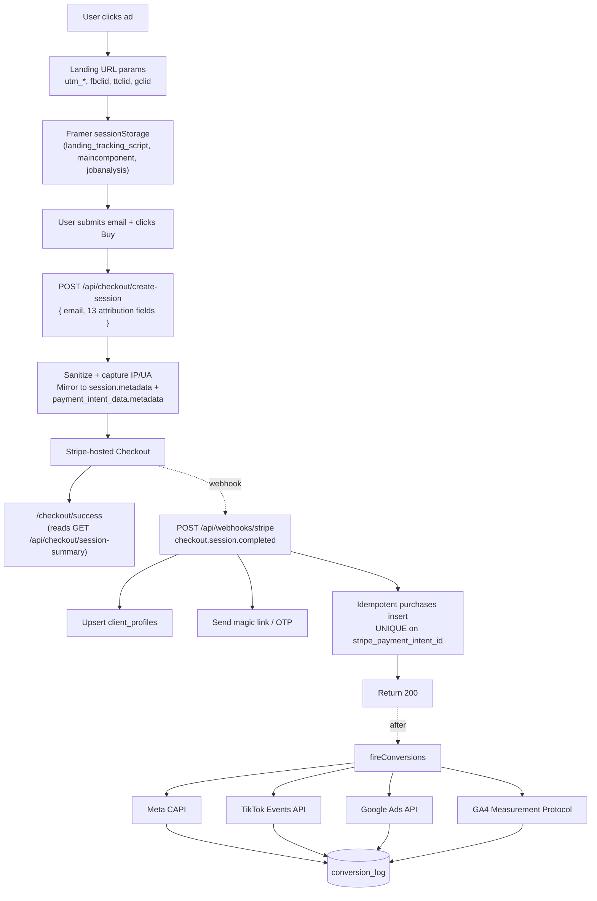
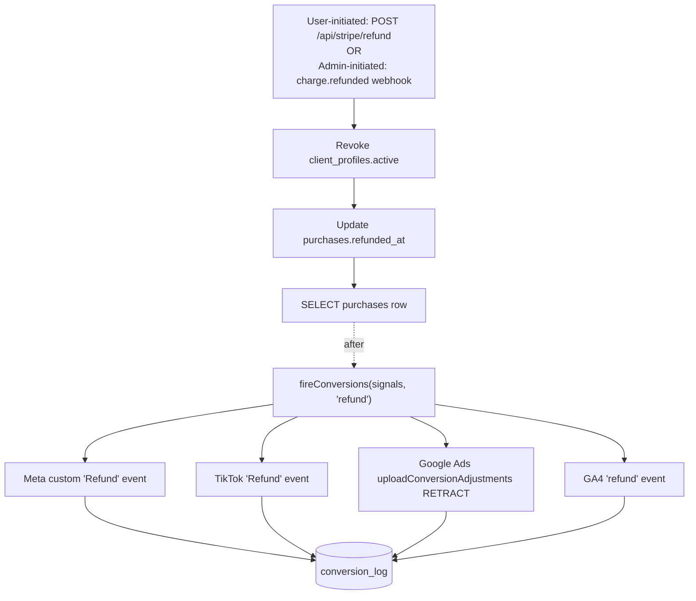

# Attribution Architecture

> **Companion doc:** `ATTRIBUTION_TESTING.md` — operator runbook (checklists, troubleshooting, health checks).
> This doc explains *why*. That one explains *did it work*.

## Overview

Server-side attribution and conversion tracking infrastructure added in the `feature/attribution-infrastructure` branch (Phases 1–6, April 2026). Captures marketing signals from the Framer landing site, persists them alongside every Stripe purchase, and fires server-to-server Conversion API events to Meta, TikTok, Google Ads, and GA4 for ad-platform optimization. No Meta Pixel / TikTok Pixel / gtag runs on the Framer site today — every conversion signal flows server-side. This dodges the ATT/ITP/adblock erosion of client-side pixels and makes every provider independently observable via the `conversion_log` table. Scope is the `$99 SIGNAL Full Access` one-time purchase; subscription billing, audience sync, and GA4 session attribution are explicit non-goals.

---

## End-to-end data flow

### Purchase path



### Refund path



Both refund entry points are idempotent; if both fire for the same refund, the duplicate `conversion_log` rows are benign because ad platforms dedup on `(event_id, event_name)`.

---

## Seven-layer breakdown

### 1. Ad click capture
When a user arrives at `wrnsignal.workforcereadynow.com` from a paid ad, URL parameters (`utm_source/medium/campaign/content/term`, `fbclid`, `ttclid`, `gclid`) are written to `sessionStorage` so they persist across intra-site navigation to `/signal/jobfit` or `/signal/job-analysis`. Three Framer code components handle this: `framer/landing_tracking_script.txt` (homepage tag), `framer/maincomponent.txt` (shared site-wide component, two write blocks — one for the custom `ref_*` mkt_session scheme and one for standard URL `utm_*` params), and `framer/jobanalysis.txt` (job analysis page). UTMs and click IDs are **last-touch** (write on every re-land); `landing_page` (= `window.location.pathname`) and `referrer` (= `document.referrer`) are **first-touch** (write-once, preserved across intra-site navigation).

### 2. Purchase initiation
The Framer landing page and job-analysis page expose purchase CTAs that POST to `/api/checkout/create-session`. Each call site defines a local `getAttributionSnapshot()` helper (`framer/landingpage.txt` line ~412, `framer/jobanalysis.txt` line ~278) that reads the 10 attribution fields from `sessionStorage` and 3 first-party pixel cookies (`_fbp`, `_fbc`, `_ttp`) via an inline `getCookie()` helper. All 13 fields spread into the fetch body alongside `email`. Cookies are `""` today because no pixels are installed; they will populate automatically if pixels are later added. Missing values default to `""`, never `undefined` or `null`, so the server-side sanitize logic treats missing and empty uniformly. Helpers are deliberately duplicated between the two files — Framer code components cannot share imports.

### 3. Checkout session creation
`app/api/checkout/create-session/route.ts` accepts 13 optional attribution fields plus `email` and `source`. Each string is sanitized (`String(v ?? "").slice(0, 500).trim()`) to stay under Stripe's 500-char metadata value cap. The route also captures server-observable request context: `client_ip` via the `x-forwarded-for` → `x-real-ip` → `cf-connecting-ip` chain, and `client_user_agent` from headers. These cannot be captured at webhook time because Stripe's webhook request originates from Stripe's server, not the customer's browser. Empty values are dropped before being sent to Stripe so the 50-key metadata budget stays uncluttered and the dashboard remains readable for support. The metadata object is mirrored to **both** `session.metadata` (24-hour lifespan) and `payment_intent_data.metadata` (permanent — what the webhook reads). When no metadata is set (pre-Phase-2 traffic posting only `{ email }`), both fields are omitted from the Stripe call for zero behavior change.

### 4. Payment processing
Stripe hosts the payment UI — opaque to us. On success, Stripe redirects to `/checkout/success` (web) or `/checkout/mobile-success` (mobile app via `session.metadata.source === "mobile"`) with `?session_id={CHECKOUT_SESSION_ID}` appended. The success page calls `GET /api/checkout/session-summary?session_id=X` to display the paid amount (important once Promotion Codes reduce the price below $99). That endpoint is public, IP-rate-limited (10 req/min via in-memory Map), and strictly returns only `{ amount_cents, currency, email }` — address, phone, name, and every other `customer_details` field Stripe populates are deliberately dropped. Security boundary is session-ID opacity; rate limit is a scraping speed-bump.

### 5. Webhook synchronous work
`app/api/webhooks/stripe/route.ts` verifies the Stripe signature then dispatches `checkout.session.completed` or `charge.refunded`. On purchase: resolves `email` + `payment_intent_id` + `charge_id` (existing), upserts `client_profiles` (existing), sends a magic link or mobile OTP email (existing), then performs an **idempotent** `purchases` insert via `insertOrFindPurchase()` — catches PG `23505` unique_violation and re-SELECTs the existing row so Stripe's at-least-once delivery never double-inserts. Returns `null` to skip CAPI fan-out in four cases: missing email, missing payment_intent, DB failure, or `amount_cents <= 0` (a zero-value conversion event would pollute ad-platform optimization). This synchronous work completes in ~500ms — what Stripe's retry mechanism sees.

### 6. Deferred CAPI fan-out
`after()` from `next/server` schedules `fireConversions()` post-response so webhook latency stays well under Stripe's 30-second timeout. `fireConversions()` in `app/api/_lib/conversions/index.ts` fans out to four providers (`meta.ts`, `tiktok.ts`, `googleAds.ts`, `ga4.ts`) via `Promise.allSettled` so one provider's failure cannot block the others. Each provider checks its required env vars first — missing → `{status: "skipped"}`. Each HTTP call is bounded by a 3-second timeout via `AbortController`. Every call returns a `ConversionResult` union of `{status: "success", http_status, response}` | `{status: "skipped", reason}` | `{status: "error", http_status?, error, response?}`.

### 7. Observability and refund
Every CAPI attempt writes one `conversion_log` row regardless of outcome — success, skipped, or error — via `logConversion()` in `index.ts`. This gives operators a queryable record of what succeeded, what skipped due to missing env vars, and what failed with what error body, without tailing Vercel function logs. The refund path (`/api/stripe/refund` user-triggered + `charge.refunded` webhook safety net) mirrors the purchase fan-out: both update `purchases.refunded_at` idempotently and both schedule refund CAPI via `after()`. `buildSignalsFromRow()` (exported from `_lib/conversions/index.ts`) is the single source of truth for constructing `PurchaseSignals`, used by both paths so ad platforms see identical attribution data.

---

## Design decisions worth preserving

- **Server-side CAPI only.** No client-side gtag / Meta Pixel / TikTok Pixel on Framer. Dodges ATT/ITP/adblock erosion. Tradeoff: match quality depends on server-captured fields (always hashed email; IP/UA/fbp/fbc/ttp when available).

- **GA4 random `client_id` per event.** Decision 2C tradeoff — GA4 is for reporting only, not ad optimization (Meta + TikTok + Google Ads are the primary signals). Session attribution in GA4 is intentionally broken because no user-session identifier exists server-side.

- **Meta custom `Refund` event.** Meta's Web CAPI has no standard Refund event, so `meta.ts` sends a custom event named `Refund`. Requires one-time setup in Meta Events Manager — see the pre-launch checklist in the testing doc.

- **fbc synthesis from fbclid.** When the `_fbc` cookie is empty (no Meta Pixel on Framer yet), `meta.ts` synthesizes `fb.1.<event_time_ms>.<fbclid>` per Meta's documented fallback. Real cookie wins when present, so the code auto-upgrades when the pixel is eventually installed.

- **`after()` deferral, not blocking await.** Webhook returns 200 in ~500ms; CAPI fan-out runs post-response. Requires Next.js 15+ (repo is on 16.1.1). The prior code comment claimed async behavior but actually blocked on `await` — that lie is now truth.

- **`Promise.allSettled` provider isolation.** Fan-out uses `Promise.allSettled` over the four providers, each wrapped in its own try/catch internally as a second defensive layer. One provider's HTTP 500 cannot cancel or block the others.

- **In-memory rate limiting on `/api/checkout/session-summary`.** Session-ID opacity is the real security boundary — session IDs are long opaque tokens the user already holds from the Stripe redirect URL. Rate limit is a scraping speed-bump. Each warm Vercel instance has its own bucket; effective global limit is `10 × warm_instances`. Opportunistic cleanup at 1000 entries prevents unbounded memory growth.

- **Google Ads OAuth refresh-per-call.** No token caching — stateless Vercel Functions cannot share tokens across invocations without a KV store. ~200ms overhead per purchase is acceptable.

- **`UNIQUE(stripe_payment_intent_id)` on `purchases`.** Webhook idempotency against Stripe's at-least-once delivery. The `INSERT ... ON CONFLICT DO NOTHING → re-SELECT` pattern returns the existing row's id so CAPI fan-out still has the correct signals even on retry.

- **First-touch vs last-touch asymmetry.** `landing_page` and `referrer` are first-touch (write-once) so intra-site navigation doesn't overwrite the original landing context. UTMs and click IDs are last-touch (conditional overwrite) so a user re-landing via a different ad gets fresh attribution. Matches D2C analytics best practice.

- **Dedup key == Stripe payment_intent_id.** Reused across every platform and across purchase + refund events. Meta/TikTok/Google dedup on `(event_id, event_name)` so `Purchase` and `Refund` don't collide. Google Ads matches refund adjustments to original conversions via `order_id` (also `payment_intent_id`). GA4 treats a `refund` event with matching `transaction_id` as an adjustment to the original `purchase`.

---

## Operational callouts

### Google Ads onboarding timing

Materially heavier setup than the other three platforms. Plan for a calendar week before live Google Ads data starts flowing:

1. **Developer token** — apply via Google Ads API Center. Approval takes 24-48 hours for basic access (enough for `uploadClickConversions` / `uploadConversionAdjustments`).
2. **OAuth credentials** — create a Web Application OAuth client in Google Cloud Console → APIs & Services → Credentials. Capture `client_id` + `client_secret`.
3. **Refresh token** — run the OAuth Playground flow once manually. Store the refresh token in Vercel env. Refresh tokens don't expire unless revoked.
4. **IDs** — `customer_id` from the Google Ads UI (format: no dashes); `conversion_action_id` from Tools → Conversions → (your action) → numeric ID at end of URL; `login_customer_id` only if the ad account is under an MCC manager account.

### Meta custom `Refund` event

Must be defined in Meta Events Manager **before** the first real refund fires. Before setup, refund events land in the CAPI endpoint successfully but don't appear in reports, and the first weeks of refund data are effectively lost. Events Manager → Data Sources → (your Pixel) → Custom Events → Create Event → Name: `Refund`.

### Month 6 review items (add to Q3/Q4 recurring calendar task)

1. **`conversion_log.response_payload` column size.** Large error response bodies inflate the `jsonb` column over time. If avg row size crosses ~4KB or max crosses ~64KB, add payload trimming in `logConversion()` (`_lib/conversions/index.ts`). Query in the testing doc § Monthly health check.

2. **`rateBuckets` Map size on `/api/checkout/session-summary`.** Opportunistic cleanup triggers at 1000 entries. If Vercel Insights shows function memory climbing on that route, lower the `PRUNE_THRESHOLD` or switch to KV-backed rate limiting.

3. **Google Ads API version currency.** Pinned at `v23` in `app/api/_lib/conversions/googleAds.ts` (released 2026-01-28; active window ~12 months). Check Google Ads API release notes around Oct-Dec 2026; bump the `API_VERSION` constant when v23 sunset is announced.

### Version bump cadence

- **Google Ads API** — new major version every ~4 months; each supported ~12 months. Pinned in `googleAds.ts`.
- **Meta Graph API** — new major version annually. Pinned in `meta.ts`.
- **TikTok Events API** — version pinned at `v1.3` in the URL path. Changes rare.

---

## Explicit non-goals

- **No client-side pixels on Framer.** Only Framer's built-in first-party analytics runs today.
- **No fingerprinting or cross-device identity resolution.** Match quality is based on hashed email + request context only.
- **No session attribution in GA4.** `client_id` is a random UUID per event (Decision 2C).
- **No audience sync / custom audiences to ad platforms.** Purchases are optimization signals, not seed lists for audience targeting.
- **No retry logic on failed CAPI calls.** One attempt per event; failures are logged to `conversion_log` and that is the end. If a platform is down for an hour, those events are permanently lost — acceptable for a non-critical optimization signal.
- **No subscription billing, partial refunds, disputes, or chargebacks.** Scope is strictly one-time $99 purchases and full refunds.
- **No guarantee of 100% event delivery.** Graceful degradation is explicit, logged, and observable — see `ATTRIBUTION_TESTING.md § Degradation scenarios`.
- **No client-side conversion fire on `/checkout/success`.** That page only displays the paid amount. Every CAPI event is server-side from the webhook.

---

## Schema reference

Authoritative source: `supabase/migrations/20260423_purchases_attribution.sql` and `supabase/migrations/20260423_conversion_log.sql`.

### `public.purchases`

```sql
CREATE TABLE public.purchases (
  id                        uuid        PRIMARY KEY DEFAULT gen_random_uuid(),
  client_profile_id         uuid        REFERENCES public.client_profiles(id) ON DELETE SET NULL,

  email                     text        NOT NULL,

  stripe_session_id         text        NOT NULL,
  stripe_payment_intent_id  text        NOT NULL UNIQUE,
  stripe_charge_id          text,

  amount_cents              integer     NOT NULL,
  currency                  text        NOT NULL DEFAULT 'usd',

  -- Attribution
  utm_source                text,
  utm_medium                text,
  utm_campaign              text,
  utm_content               text,
  utm_term                  text,
  landing_page              text,
  referrer                  text,

  -- Ad-platform click IDs
  fbclid                    text,
  ttclid                    text,
  gclid                     text,

  -- First-party pixel cookies
  fbp                       text,
  fbc                       text,
  ttp                       text,

  -- Request context
  client_ip                 text,
  client_user_agent         text,

  created_at                timestamptz NOT NULL DEFAULT now(),
  refunded_at               timestamptz
);
```

**Column notes:**
- `client_profile_id` — `ON DELETE SET NULL` preserves revenue history if a profile is deleted. Important for accounting and exit diligence.
- `amount_cents` — sourced from `session.amount_total`, so Promotion Code discounts are reflected accurately. Not hardcoded 99.
- `stripe_payment_intent_id` `UNIQUE` — webhook idempotency guard. Reused as the dedup `event_id` across every Conversion API.
- `client_ip` / `client_user_agent` — captured at checkout-session-create time, NOT at webhook time (Stripe's webhook request comes from Stripe's server).
- `fbp` / `fbc` / `ttp` — empty until Meta/TikTok pixels are installed on Framer. `meta.ts` synthesizes `fbc` from `fbclid` when empty.

### `public.conversion_log`

```sql
CREATE TABLE public.conversion_log (
  id               uuid        PRIMARY KEY DEFAULT gen_random_uuid(),
  purchase_id      uuid        NOT NULL REFERENCES public.purchases(id) ON DELETE CASCADE,

  platform         text        NOT NULL
                   CHECK (platform IN ('meta', 'tiktok', 'google_ads', 'ga4')),

  event_type       text        NOT NULL
                   CHECK (event_type IN ('purchase', 'refund')),

  event_id         text        NOT NULL,

  status           text        NOT NULL
                   CHECK (status IN ('success', 'skipped', 'error')),

  http_status      integer,
  response_payload jsonb,
  error_message    text,

  created_at       timestamptz NOT NULL DEFAULT now()
);
```

**Column notes:**
- `event_id` — always `stripe_payment_intent_id`. Reused across purchase and refund events for the same PaymentIntent; platforms dedup on `(event_id, event_name)` so `Purchase` and `Refund` never collide.
- `http_status` — `null` on `skipped` rows; populated on `success` and `error`.
- `response_payload` — parsed JSON when the response body was valid JSON, raw string fallback when not, `null` on `skipped` and some `error` rows. See Month 6 review for size monitoring.
- `error_message` — populated on `error` (the exception message) or `skipped` (the reason, e.g. "META_PIXEL_ID or META_CAPI_ACCESS_TOKEN not set").

Both tables have RLS enabled with no policies — service-role-only access, matching the pattern of other internal tables (see `20260422_analytics_foundation.sql`).

### Environment variables

13 variables across 4 provider groups, documented with source URLs inline in `.env.example`. Each provider module checks for its required vars and returns `{ status: "skipped" }` when any are missing, so the webhook ships safely before any platform is fully onboarded. Operational onboarding steps are above; runbook verification is in `ATTRIBUTION_TESTING.md § Pre-launch checklist`.
