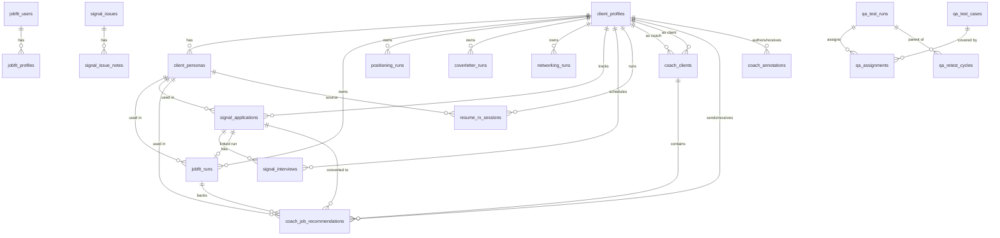

# Database Schema

## Overview

SIGNAL uses **Supabase Postgres** as its primary datastore. The database backs authentication (via Supabase Auth), user profiles and resume personas, deterministic JobFit scoring history, the four cached LLM run families (`jobfit_runs`, `positioning_runs`, `coverletter_runs`, `networking_runs`), a job tracker with interview records, the multi-stage Resume Rx rewrite sessions, a coach/client system, a free-tool trial track (`jobfit_users` + `jobfit_profiles`), internal QA tooling (`qa_*`), and analytics (`jobfit_page_views`, `signal_attribution`). API routes access the database through the Supabase service-role key (admin client), so Row Level Security is defined on a small subset of tables but is bypassed server-side — authorization is enforced in application code. The data-model philosophy is canonical profile text (`client_profiles.profile_text`) as the source of truth for scoring, fingerprint-hashed runs (`UNIQUE(client_profile_id, fingerprint_hash)`) for deterministic caching, and soft links (`ON DELETE SET NULL`) between runs, applications, and personas so historical runs survive upstream edits.

All documented columns, constraints, and indexes were verified against the live production schema (project `ejhnokcnahauvrcbcmic`) via `information_schema` / `pg_indexes` / `pg_policies` queries. Schema history in `supabase/migrations/` begins on 2026-04-03; anything predating that (foundational tables) was created before migrations were tracked here.

## Tables

### `client_profiles`
Paid SIGNAL user records. One row per user.

| Column | Type | Nullable | Default | Description |
|---|---|---|---|---|
| `id` | uuid | NO | `gen_random_uuid()` | Primary key. |
| `user_id` | uuid | YES | — | Supabase auth user ID. UNIQUE. |
| `email` | text | NO | — | User email. UNIQUE. |
| `name` | text | YES | — | Display name. |
| `job_type` | text | YES | — | "Full Time" / "Internship" / "Both". |
| `target_roles` | text | YES | — | Comma-separated target role titles. |
| `target_locations` | text | YES | — | Required locations. |
| `preferred_locations` | text | YES | — | Optional preferred locations. |
| `timeline` | text | YES | — | Start-date window (e.g., "Summer 2026"). |
| `resume_text` | text | YES | — | Raw resume text. |
| `profile_text` | text | NO | — | Canonical rebuilt text fed to the scoring engine. |
| `profile_structured` | jsonb | YES | `'{}'::jsonb` | Parallel structured representation. Shape defined only in app code. |
| `risk_overrides` | jsonb | YES | — | Per-profile risk-constraint overrides. [NEEDS CLARIFICATION] on shape. |
| `profile_version` | int | NO | 1 | Bumped on every PUT `/api/profile`. |
| `profile_complete` | boolean | NO | false | True when name, resume_text, target_roles, job_type, target_locations are all set. |
| `active` | boolean | NO | true | Gates magic-link sends in `/api/auth/send-link`. |
| `stripe_customer_id` | text | YES | — | Set by Stripe webhook on checkout completion. |
| `is_coach` | boolean | YES | false | Marks coach accounts. |
| `coach_org` | text | YES | — | Coach's organization label. |
| `created_at` | timestamptz | YES | `now()` | Creation timestamp. |
| `updated_at` | timestamptz | YES | `now()` | Last-updated timestamp. |

**Primary key:** `id`. **Unique:** `email`, `user_id`.
**Indexes:** `client_profiles_pkey`, `client_profiles_email_key` (unique), `client_profiles_user_id_key` (unique), `idx_client_profiles_email` (btree).

### `client_personas`
Per-profile resume variants (max 2 enforced by app logic).

| Column | Type | Nullable | Default | Description |
|---|---|---|---|---|
| `id` | uuid | NO | `gen_random_uuid()` | Primary key. |
| `profile_id` | uuid | NO | — | FK → `client_profiles(id)` ON DELETE CASCADE. |
| `name` | text | NO | `'My Resume'` | Persona label. |
| `resume_text` | text | NO | `''` | Resume body for this persona. |
| `is_default` | boolean | NO | false | Marks the user's default persona. |
| `display_order` | int | NO | 1 | Sort order in UI. |
| `persona_version` | int | NO | 1 | Bumped when persona text is edited. |
| `created_at` | timestamptz | NO | `now()` | Creation timestamp. |
| `updated_at` | timestamptz | NO | `now()` | Last-updated timestamp. |

**Primary key:** `id`. **Indexes:** `client_personas_pkey`, `idx_client_personas_profile_id` (btree).

### `jobfit_runs`
Deterministic JobFit scoring results. Cache keyed by `(client_profile_id, fingerprint_hash)`.

| Column | Type | Nullable | Default | Description |
|---|---|---|---|---|
| `id` | uuid | NO | `gen_random_uuid()` | Primary key. |
| `client_profile_id` | uuid | NO | — | FK → `client_profiles(id)`. No explicit ON DELETE rule captured. |
| `job_url` | text | YES | — | Source URL of the JD, if any. |
| `fingerprint_hash` | text | NO | — | SHA256 of normalized inputs; cache key. |
| `fingerprint_code` | text | NO | — | Short human-readable fingerprint. |
| `verdict` | text | NO | — | Decision string (Priority Apply / Apply / Review / Pass). No DB CHECK. |
| `result_json` | jsonb | NO | — | Full scoring output; does not contain raw jobText/profileText. |
| `persona_id` | uuid | YES | — | FK → `client_personas(id)` ON DELETE SET NULL. |
| `profile_version_at_run` | int | YES | — | Snapshot of `client_profiles.profile_version` at run time. |
| `persona_version_at_run` | int | YES | — | Snapshot of `client_personas.persona_version` at run time. |
| `application_id` | uuid | YES | — | FK → `signal_applications(id)` ON DELETE SET NULL. |
| `job_description` | text | YES | — | Raw JD text for deep-link restoration. |
| `sourced_by_coach_id` | uuid | YES | — | FK → `client_profiles(id)` when the run was sourced by a coach. |
| `created_at` | timestamptz | NO | `now()` | Run timestamp. |
| `updated_at` | timestamptz | NO | `now()` | Last-updated timestamp. |

**Primary key:** `id`. **Unique:** `(client_profile_id, fingerprint_hash)` via `jobfit_runs_profile_fingerprint_unique`.
**Indexes:** `jobfit_runs_pkey`, `jobfit_runs_profile_fingerprint_unique` (unique), `jobfit_runs_client_profile_id_idx` (btree).

### `positioning_runs`
Cached positioning-rewrite output. Same shape as the other run tables.

| Column | Type | Nullable | Default | Description |
|---|---|---|---|---|
| `id` | uuid | NO | `gen_random_uuid()` | Primary key. |
| `client_profile_id` | uuid | NO | — | FK → `client_profiles(id)` ON DELETE CASCADE. |
| `job_url` | text | YES | — | Source URL of the JD, if any. |
| `fingerprint_hash` | text | NO | — | Cache key. |
| `fingerprint_code` | text | NO | — | Short human-readable fingerprint. |
| `result_json` | jsonb | NO | — | Full output. |
| `created_at` | timestamptz | YES | `now()` | Run timestamp. |

**Primary key:** `id`. **Unique:** `(client_profile_id, fingerprint_hash)`.
**Indexes:** pkey, unique pair, `idx_positioning_runs_job_url`, `idx_positioning_runs_profile_created (profile, created_at DESC)`.

### `coverletter_runs`
Cached cover-letter output.

| Column | Type | Nullable | Default | Description |
|---|---|---|---|---|
| `id` | uuid | NO | `gen_random_uuid()` | Primary key. |
| `client_profile_id` | uuid | NO | — | FK → `client_profiles(id)` ON DELETE CASCADE. |
| `job_url` | text | YES | — | Source URL. |
| `fingerprint_hash` | text | NO | — | Cache key. |
| `fingerprint_code` | text | NO | — | Short fingerprint. |
| `result_json` | jsonb | NO | — | Full output. |
| `created_at` | timestamptz | NO | `now()` | Run timestamp. |
| `updated_at` | timestamptz | NO | `now()` | Last-updated timestamp. |

**Primary key:** `id`. **Unique:** `(client_profile_id, fingerprint_hash)`.
**Indexes:** pkey, unique pair, `idx_coverletter_runs_job_url`, `idx_coverletter_runs_profile_created`.

### `networking_runs`
Cached networking-outreach output.

| Column | Type | Nullable | Default | Description |
|---|---|---|---|---|
| `id` | uuid | NO | `gen_random_uuid()` | Primary key. |
| `client_profile_id` | uuid | NO | — | FK → `client_profiles(id)` ON DELETE CASCADE. |
| `job_url` | text | YES | — | Source URL. |
| `fingerprint_hash` | text | NO | — | Cache key. |
| `fingerprint_code` | text | NO | — | Short fingerprint. |
| `result_json` | jsonb | NO | — | Full output. |
| `created_at` | timestamptz | YES | `now()` | Run timestamp. |

**Primary key:** `id`. **Unique:** `(client_profile_id, fingerprint_hash)`.
**Indexes:** pkey, unique pair, `idx_networking_runs_job_url`, `idx_networking_runs_profile_created`.

### `signal_applications`
Job tracker entries.

| Column | Type | Nullable | Default | Description |
|---|---|---|---|---|
| `id` | uuid | NO | `gen_random_uuid()` | Primary key. |
| `profile_id` | uuid | NO | — | FK → `client_profiles(id)` ON DELETE CASCADE. |
| `persona_id` | uuid | YES | — | FK → `client_personas(id)` ON DELETE SET NULL. |
| `jobfit_run_id` | uuid | YES | — | FK → `jobfit_runs(id)` ON DELETE SET NULL. |
| `company_name` | text | NO | `''` | Company. |
| `job_title` | text | NO | `''` | Job title. |
| `location` | text | YES | `''` | Job location. |
| `date_posted` | date | YES | — | Posting date. |
| `job_url` | text | YES | `''` | Original listing URL. |
| `application_location` | text | YES | `''` | Where the user applied (Company Website, LinkedIn, etc.). |
| `application_status` | text | NO | `'saved'` | App-level values: saved, applied, interviewing, offer, rejected, withdrawn, coach_recommended. Live DB CHECK constraint was not captured in the snapshot and should be re-verified. |
| `applied_date` | date | YES | — | When the user applied. |
| `interest_level` | int | YES | 3 | App-level range 1–5. |
| `cover_letter_submitted` | boolean | YES | false | Whether a cover letter was submitted. |
| `referral` | boolean | YES | false | Whether this came via referral. |
| `notes` | text | YES | `''` | Free-form notes. |
| `signal_decision` | text | YES | `''` | Cached decision from JobFit. |
| `signal_score` | int | YES | — | Cached score 0–100. |
| `signal_run_at` | timestamptz | YES | — | When SIGNAL was last run. |
| `created_at` | timestamptz | NO | `now()` | Creation timestamp. |
| `updated_at` | timestamptz | NO | `now()` | Last-updated timestamp. |

**Primary key:** `id`. **Indexes:** pkey, `idx_signal_applications_profile_id`, `idx_signal_applications_status`.

### `signal_interviews`
Interview records linked to an application.

| Column | Type | Nullable | Default | Description |
|---|---|---|---|---|
| `id` | uuid | NO | `gen_random_uuid()` | Primary key. |
| `application_id` | uuid | NO | — | FK → `signal_applications(id)` ON DELETE CASCADE. |
| `profile_id` | uuid | NO | — | FK → `client_profiles(id)` ON DELETE CASCADE. |
| `company_name` | text | NO | `''` | Auto-populated from application. |
| `job_title` | text | NO | `''` | Auto-populated from application. |
| `interview_stage` | text | NO | `'phone'` | App-level values: hr_screening, phone, zoom, in_person, take_home, final_round, other. |
| `interviewer_names` | text | YES | `''` | Interviewer names. |
| `interview_date` | date | YES | — | Scheduled date. |
| `thank_you_sent` | boolean | YES | false | Whether a thank-you was sent. |
| `status` | text | NO | `'scheduled'` | App-level values: not_scheduled, scheduled, awaiting_feedback, offer_extended, rejected, ghosted. |
| `confidence_level` | int | YES | 3 | App-level range 1–5. |
| `notes` | text | YES | `''` | Free-form notes. |
| `created_at` | timestamptz | NO | `now()` | Creation timestamp. |
| `updated_at` | timestamptz | NO | `now()` | Last-updated timestamp. |

**Primary key:** `id`. **Indexes:** pkey, `idx_signal_interviews_application_id`, `idx_signal_interviews_profile_id`.

### `resume_rx_sessions`
Multi-stage resume rewrite sessions.

| Column | Type | Nullable | Default | Description |
|---|---|---|---|---|
| `id` | uuid | NO | `gen_random_uuid()` | Primary key. |
| `profile_id` | uuid | NO | — | FK → `client_profiles(id)` ON DELETE CASCADE. |
| `status` | text | NO | `'diagnosis'` | CHECK: diagnosis, education, architecture, qa, validation, complete. |
| `original_resume_text` | text | NO | — | Resume text to be rewritten. |
| `mode` | text | NO | — | Rewrite mode. Values defined only in app code. |
| `year_in_school` | text | NO | — | Candidate's year-in-school input. |
| `target_field` | text | NO | — | Target field for the rewrite. |
| `source_persona_id` | uuid | YES | — | FK → `client_personas(id)` ON DELETE SET NULL. |
| `diagnosis` | jsonb | YES | — | Stage 1 output. |
| `education_intake` | jsonb | YES | — | Stage 2 output. |
| `architecture` | jsonb | YES | — | Stage 3 output. |
| `qa_items` | jsonb | YES | `'[]'::jsonb` | Q&A-driven bullet rewrites. |
| `approved_bullets` | jsonb | YES | `'[]'::jsonb` | Approved bullet variants. |
| `validation_result` | jsonb | YES | — | Final validation output. |
| `coaching_summary` | text | YES | — | Free-form coaching summary. |
| `final_resume_text` | text | YES | — | Assembled final resume. |
| `pdf_url` | text | YES | — | Rendered PDF URL, if generated. |
| `created_at` | timestamptz | YES | `now()` | Creation timestamp. |
| `updated_at` | timestamptz | YES | `now()` | Last-updated timestamp. |

**Primary key:** `id`. RLS enabled (see RLS section).

### `coach_clients`
Join table linking coaches to their clients.

| Column | Type | Nullable | Default | Description |
|---|---|---|---|---|
| `id` | uuid | NO | `gen_random_uuid()` | Primary key. |
| `coach_profile_id` | uuid | NO | — | FK → `client_profiles(id)` ON DELETE CASCADE. |
| `client_profile_id` | uuid | YES | — | FK → `client_profiles(id)` ON DELETE CASCADE. Null until invite accepted. |
| `status` | text | NO | `'pending'` | CHECK: pending, active, paused, revoked. |
| `access_level` | text | NO | `'full'` | CHECK: view, annotate, full. |
| `invited_email` | text | NO | — | Email invited by the coach. |
| `invite_token` | uuid | YES | `gen_random_uuid()` | Invite link token. |
| `invited_at` | timestamptz | YES | `now()` | Invite timestamp. |
| `accepted_at` | timestamptz | YES | — | Acceptance timestamp. |
| `private_notes` | text | YES | — | Coach-only notes on this client. |

**Primary key:** `id`. **Unique:** `(coach_profile_id, client_profile_id)`. RLS enabled.

### `coach_job_recommendations`
Jobs sourced by coaches on behalf of clients.

| Column | Type | Nullable | Default | Description |
|---|---|---|---|---|
| `id` | uuid | NO | `gen_random_uuid()` | Primary key. |
| `coach_client_id` | uuid | NO | — | FK → `coach_clients(id)` ON DELETE CASCADE. |
| `coach_profile_id` | uuid | NO | — | FK → `client_profiles(id)`. |
| `client_profile_id` | uuid | NO | — | FK → `client_profiles(id)`. |
| `company_name` | text | NO | — | Company. |
| `job_title` | text | NO | — | Job title. |
| `job_description` | text | NO | — | Full JD text. |
| `job_url` | text | YES | — | Listing URL. |
| `signal_decision` | text | YES | — | Decision from JobFit run. |
| `signal_score` | int | YES | — | Score from JobFit run. |
| `jobfit_run_id` | uuid | YES | — | FK → `jobfit_runs(id)` ON DELETE SET NULL. |
| `persona_id` | uuid | YES | — | FK → `client_personas(id)` ON DELETE SET NULL. |
| `persona_name` | text | YES | — | Snapshot of persona name at recommendation time. |
| `priority` | text | NO | `'this_week'` | CHECK: urgent, this_week, when_ready, not_recommended. |
| `coaching_note` | text | YES | — | Coach's note to the client. |
| `recommended_action` | text | NO | `'apply'` | CHECK: apply, research_first, hold, skip. |
| `apply_by_date` | date | YES | — | Coach-suggested deadline. |
| `client_status` | text | YES | `'new'` | CHECK: new, interested, applying, applied, not_for_me, archived. |
| `client_viewed_at` | timestamptz | YES | — | When the client first viewed. |
| `client_responded_at` | timestamptz | YES | — | When the client last responded. |
| `notification_seen` | boolean | YES | false | Notification read state. |
| `application_id` | uuid | YES | — | FK → `signal_applications(id)` ON DELETE SET NULL. |
| `full_analysis` | jsonb | YES | — | Full JobFit analysis payload. |
| `created_at` | timestamptz | YES | `now()` | Creation timestamp. |
| `updated_at` | timestamptz | YES | `now()` | Last-updated timestamp. |

**Primary key:** `id`. RLS enabled.

### `coach_annotations`
Coach notes attached to client applications, runs, recommendations, or general.

| Column | Type | Nullable | Default | Description |
|---|---|---|---|---|
| `id` | uuid | NO | `gen_random_uuid()` | Primary key. |
| `coach_profile_id` | uuid | NO | — | FK → `client_profiles(id)`. |
| `client_profile_id` | uuid | NO | — | FK → `client_profiles(id)`. |
| `target_type` | text | NO | — | CHECK: application, jobfit_run, recommendation, general. |
| `target_id` | uuid | YES | — | Polymorphic reference to the target row. No DB-level FK. |
| `note` | text | NO | — | Annotation body. |
| `priority` | text | YES | — | CHECK: urgent, important, info, positive, NULL. |
| `visible_to_client` | boolean | YES | true | Whether the client can see this annotation. |
| `client_acknowledged` | boolean | YES | false | Whether the client acknowledged. |
| `client_acknowledged_at` | timestamptz | YES | — | Acknowledgement timestamp. |
| `created_at` | timestamptz | YES | `now()` | Creation timestamp. |
| `updated_at` | timestamptz | YES | `now()` | Last-updated timestamp. |

**Primary key:** `id`. RLS enabled.

### `signal_seats`
Legacy seat-based claim-token access flow.

| Column | Type | Nullable | Default | Description |
|---|---|---|---|---|
| `id` | uuid | NO | `gen_random_uuid()` | Primary key. |
| `purchaser_email` | text | NO | — | Email of the buyer. |
| `seat_email` | text | NO | — | Email the seat is assigned to. |
| `claim_token_hash` | text | NO | — | SHA256 hash of the raw claim token. |
| `intended_user_name` | text | NO | — | Recipient's name. |
| `intended_user_email` | text | NO | — | Recipient's email. |
| `status` | text | NO | `'unclaimed'` | Seat state. App values include unclaimed, created, sent, verified. [NEEDS CLARIFICATION] on full enum — no DB CHECK captured. |
| `expires_at` | timestamptz | NO | `now() + '7 days'` | Seat expiration. |
| `claimed_at` | timestamptz | YES | — | When the seat was claimed. |
| `claimed_user_id` | uuid | YES | — | Supabase auth user that claimed it. |
| `used_at` | timestamptz | YES | — | When the seat was first used. |
| `order_id` | text | YES | — | External order identifier. |
| `ghl_contact_id` | text | YES | — | GoHighLevel CRM contact ID. |
| `created_at` | timestamptz | NO | `now()` | Creation timestamp. |

**Primary key:** `id`. **Indexes (notable):**
- `idx_signal_seats_claim_token_hash` (unique).
- `idx_signal_seats_seat_email_unique` — unique on `seat_email` WHERE `seat_email IS NOT NULL`.
- `signal_seats_email_unique` — unique on `lower(intended_user_email)` WHERE `used_at IS NULL`.
- `signal_seats_one_active_per_email` — unique on `lower(seat_email)` WHERE `used_at IS NULL AND status IN ('created','sent','verified')`.
- `signal_seats_one_active_per_seat_email` — unique on `lower(seat_email)` WHERE `used_at IS NULL`.
- `idx_signal_seats_purchaser_email` (btree).
- `signal_seats_claim_hash_idx` and `signal_seats_claim_lookup` — duplicate btree indexes on `claim_token_hash` (cleanup candidates).

### `pending_profiles`
Pre-account placeholder profiles keyed by email. [NEEDS CLARIFICATION] on exact use — likely the pre-Stripe intake buffer.

| Column | Type | Nullable | Default | Description |
|---|---|---|---|---|
| `email` | text | NO | — | Primary key (email). |
| `profile_text` | text | NO | — | Profile text awaiting account creation. |
| `created_at` | timestamptz | NO | `now()` | Creation timestamp. |

**Primary key:** `email`.

### `user_profiles`
Older profile table, appears legacy. Has its own RLS policy tying to `auth.uid()`. Not referenced by recent API routes found in `/app/api`.

| Column | Type | Nullable | Default | Description |
|---|---|---|---|---|
| `user_id` | uuid | NO | — | Primary key. Supabase auth user ID. |
| `email` | text | NO | — | User email. |
| `profile_text` | text | NO | — | Profile text. |
| `created_at` | timestamptz | NO | `now()` | Creation timestamp. |
| `updated_at` | timestamptz | NO | `now()` | Last-updated timestamp. |

**Primary key:** `user_id`. **Indexes:** pkey, `user_profiles_email_idx`. [NEEDS CLARIFICATION] on whether this table is live or superseded by `client_profiles`.

### `jobfit_users` (trial, isolated)
Trial-flow user records. Used by `/api/jobfit-intake` and `/api/jobfit-run-trial`.

| Column | Type | Nullable | Default | Description |
|---|---|---|---|---|
| `id` | uuid | NO | `gen_random_uuid()` | Primary key. |
| `email` | text | NO | — | Trial user email. UNIQUE. |
| `credits_remaining` | int | NO | 3 | Remaining free runs. CHECK `>= 0`. |
| `name` | text | YES | — | Name. |
| `job_type` | text | YES | — | Job type. |
| `created_at` | timestamptz | NO | `now()` | Creation timestamp. |
| `updated_at` | timestamptz | NO | `now()` | Last-updated timestamp. |

**Primary key:** `id`. **Unique:** `email`.

### `jobfit_profiles` (trial, isolated)
Trial-flow profiles. Not connected to `client_profiles`.

| Column | Type | Nullable | Default | Description |
|---|---|---|---|---|
| `id` | uuid | NO | `gen_random_uuid()` | Primary key. |
| `user_id` | uuid | NO | — | FK → `jobfit_users(id)` ON DELETE CASCADE. UNIQUE. |
| `email` | text | NO | — | Trial user email. |
| `name` | text | YES | — | Name. |
| `job_type` | text | YES | — | Job type. |
| `target_roles` | text | YES | — | Target roles. |
| `target_locations` | text | YES | — | Target locations. |
| `timeline` | text | YES | — | Timeline. |
| `resume_text` | text | YES | — | Resume text. |
| `profile_text` | text | YES | — | Canonical profile text. |
| `created_at` | timestamptz | NO | `now()` | Creation timestamp. |
| `updated_at` | timestamptz | NO | `now()` | Last-updated timestamp. |

**Primary key:** `id`. **Unique:** `user_id`.

### `job_analysis_cache`
Cache for the free `/api/job-analysis` tool.

| Column | Type | Nullable | Default | Description |
|---|---|---|---|---|
| `id` | uuid | NO | `gen_random_uuid()` | Primary key. |
| `jd_hash` | text | NO | — | Hash of normalized JD text. |
| `result` | jsonb | NO | — | Cached analysis output. |
| `created_at` | timestamptz | YES | `now()` | Creation timestamp. |

**Primary key:** `id`. **Indexes:** pkey, `idx_jd_hash` (btree, not unique).

### `jobfit_page_views`
Analytics page-view events. RLS allows anon insert/select.

| Column | Type | Nullable | Default | Description |
|---|---|---|---|---|
| `id` | uuid | NO | `gen_random_uuid()` | Primary key. |
| `session_id` | text | YES | — | Client-side session id. |
| `page_path` | text | YES | — | Page path (truncated in snapshot; additional columns may exist — see Known Gaps). |
| `created_at` | timestamptz | NO | `now()` | Event timestamp. |

**Primary key:** `id`. **Indexes:** pkey, `jobfit_page_views_created_at_idx` (DESC), `jobfit_page_views_session_id_idx`, `jobfit_page_views_page_name_idx` — the `page_name` index implies a `page_name` column exists that was not returned in the column snapshot.

### `signal_attribution`
Marketing attribution / funnel tracking.

| Column | Type | Nullable | Default | Description |
|---|---|---|---|---|
| `id` | uuid | NO | `gen_random_uuid()` | Primary key. |
| `mkt_session_id` | text | YES | — | Marketing-site session id. UNIQUE. |
| `app_session_id` | text | YES | — | App session id. |
| `ref_source` | text | YES | — | UTM source. |
| `ref_medium` | text | YES | — | UTM medium. |
| `ref_campaign` | text | YES | — | UTM campaign. |
| `clicked_from` | text | YES | — | Originating page/button. |
| `user_email` | text | YES | — | Resolved email. |
| `intake_started_at` | timestamptz | YES | — | When intake began. |
| `intake_completed_at` | timestamptz | YES | — | When intake finished. |
| `jobfit_run_at` | timestamptz | YES | — | First JobFit run. |
| `purchased_at` | timestamptz | YES | — | Purchase timestamp. |
| `created_at` | timestamptz | YES | `now()` | Creation timestamp. |

**Primary key:** `id`. **Unique:** `mkt_session_id`.

### `signal_issues`
Internal issue tracker for SIGNAL scoring anomalies.

| Column | Type | Nullable | Default | Description |
|---|---|---|---|---|
| `id` | bigint | NO | — | Primary key. No default captured — [NEEDS CLARIFICATION] on whether a sequence is attached. |
| `concern` | text | NO | — | Short concern description. |
| `company` | text | YES | — | Company associated with the issue. |
| `role` | text | YES | — | Role associated. |
| `profile` | text | YES | — | Profile identifier or label. |
| `score` | text | YES | — | Observed score. |
| `category` | text | YES | `'scoring'` | Issue category. |
| `severity` | text | YES | `'P2'` | Severity. |
| `profile_json` | text | YES | — | Captured profile snapshot (text). |
| `job_desc` | text | YES | — | Captured JD. |
| `output_json` | text | YES | — | Captured output. |
| `root_cause` | text | YES | — | Root-cause analysis. |
| `claude_analysis` | jsonb | YES | — | Claude-generated analysis. |
| `resolved` | boolean | YES | false | Whether resolved. |
| `status` | text | NO | `'open'` | Open/fixed/verified status. |
| `notes` | text | YES | — | Free-form notes. |
| `fixed_at` | timestamptz | YES | — | When fixed. |
| `verified_at` | timestamptz | YES | — | When verified. |
| `tester` | text | YES | — | Tester name. |
| `test_account` | text | YES | — | Test account used. |
| `created_at` | timestamptz | YES | `now()` | Creation timestamp. |

**Primary key:** `id`. RLS has `allow all` policy.

### `signal_issue_notes`
Comments/activity on `signal_issues`.

| Column | Type | Nullable | Default | Description |
|---|---|---|---|---|
| `id` | int | NO | `nextval('signal_issue_notes_id_seq')` | Primary key. |
| `issue_id` | int | NO | — | FK → `signal_issues(id)` ON DELETE CASCADE. |
| `author` | text | YES | — | Author name. |
| `note_type` | text | YES | `'comment'` | Note type. |
| `body` | text | NO | — | Note body. |
| `created_at` | timestamptz | YES | `now()` | Creation timestamp. |

**Primary key:** `id`.

### QA tracking tables

Internal QA suite. All have anonymous `allow all` RLS (`anon_all`) on the test-facing tables.

**`qa_test_cases`**

| Column | Type | Nullable | Default | Description |
|---|---|---|---|---|
| `id` | int | NO | sequence | Primary key. |
| `surface` | text | NO | — | Area under test. |
| `priority` | text | NO | `'P2'` | Test priority. |
| `title` | text | NO | — | Case title. |
| `description` | text | YES | — | Details. |
| `steps` | text | YES | — | Repro steps. |
| `expected_result` | text | YES | — | Expected result. |
| `active` | boolean | YES | true | Whether the case is live. |
| `test_type` | text | YES | `'UI'` | Test type. |
| `platform` | text | YES | `'Web'` | Platform. |
| `created_at` | timestamptz | YES | `now()` | Creation timestamp. |

**`qa_test_runs`**

| Column | Type | Nullable | Default | Description |
|---|---|---|---|---|
| `id` | int | NO | sequence | Primary key. |
| `name` | text | NO | — | Run name. |
| `created_by` | text | YES | — | Creator. |
| `testers` | text | YES | — | Assigned testers. |
| `status` | text | YES | `'active'` | Run status. |
| `case_count` | int | YES | 0 | Number of cases. |
| `platform` | text | YES | `'all'` | Platform. |
| `created_at` | timestamptz | YES | `now()` | Creation timestamp. |
| `completed_at` | timestamptz | YES | — | Completion timestamp. |

**`qa_assignments`** — case assignments within a run.

| Column | Type | Nullable | Default | Description |
|---|---|---|---|---|
| `id` | int | NO | sequence | Primary key. |
| `run_id` | int | NO | — | FK → `qa_test_runs(id)` ON DELETE CASCADE. |
| `case_id` | int | NO | — | FK → `qa_test_cases(id)` ON DELETE CASCADE. |
| `status` | text | YES | `'untested'` | Test status. |
| `tester` | text | YES | — | Tester. |
| `assigned_to` | text | YES | — | Assignee. |
| `notes` | text | YES | — | Notes. |
| `issue_id` | int | YES | — | Linked issue. |
| `fix_description` | text | YES | — | Fix description. |
| `fix_deployed_at` | timestamptz | YES | — | When fix deployed. |
| `tested_at` | timestamptz | YES | — | Tested timestamp. |
| `created_at` | timestamptz | YES | `now()` | Creation timestamp. |

**`qa_issues`** — issues surfaced during QA runs.

| Column | Type | Nullable | Default | Description |
|---|---|---|---|---|
| `id` | int | NO | sequence | Primary key. |
| `test_case_id` | int | YES | — | FK → `qa_test_cases(id)`. |
| `test_run_id` | int | YES | — | FK → `qa_test_runs(id)`. |
| `surface` | text | YES | — | Surface. |
| `title` | text | YES | — | Issue title. |
| `description` | text | YES | — | Description. |
| `severity` | text | YES | `'P2'` | Severity. |
| `status` | text | YES | `'open'` | Status. |
| `tester` | text | YES | — | Tester. |
| `platform` | text | YES | `'Web'` | Platform. |
| `origin` | text | YES | `'test_run'` | How the issue was created. |
| `url` | text | YES | — | Related URL. |
| `created_at` | timestamptz | YES | `now()` | Creation timestamp. |

**`qa_assignment_history`** — audit trail for `qa_assignments` status changes. Bigint IDs referencing `qa_test_cases(id)` and `qa_test_runs(id)` both ON DELETE CASCADE (type mismatch vs. the int IDs on those tables — [NEEDS CLARIFICATION]).

**`qa_retest_cycles`** — bulk retest cycles. CHECK on `status IN ('open','complete')`. FK `parent_run_id` → `qa_test_runs(id)` ON DELETE CASCADE. Stores a `case_ids bigint[]` array.

### `client_profiles_backfill_snapshot_20260308`
One-time backup table (taken 2026-03-08) of `id`, `user_id`, `email`, `profile_text`, `resume_text`, `profile_structured`, `updated_at`. No PK, no constraints. Safe to drop once no longer needed — [NEEDS CLARIFICATION] on retention intent.

## Row Level Security (RLS)

RLS is enabled on a minority of tables. Because API routes use the service-role key, these policies only affect direct client-side queries.

| Table | Policy Name | Operation | Rule |
|---|---|---|---|
| `coach_clients` | `coaches_see_own_clients` | ALL | Caller's profile must match either `coach_profile_id` or `client_profile_id`. |
| `coach_job_recommendations` | `coaches_and_clients_see_recommendations` | ALL | Caller's profile must match either `coach_profile_id` or `client_profile_id`. |
| `coach_annotations` | `coach_annotation_access` | ALL | Caller is the coach, OR caller is the client AND `visible_to_client = true`. |
| `resume_rx_sessions` | `users_own_rx_sessions` | ALL | `profile_id` must match the caller's profile. |
| `jobfit_page_views` | `allow anon insert page views` | INSERT | Any role may insert. |
| `jobfit_page_views` | `allow authenticated insert page views` | INSERT | Any authenticated role may insert. |
| `jobfit_page_views` | `allow anon read` | SELECT | Any role may read. |
| `signal_issues` | `allow all` | ALL | No restriction. |
| `qa_assignments` | `anon_all` | ALL | No restriction. |
| `qa_issues` | `anon_all` | ALL | No restriction. |
| `qa_test_cases` | `anon_all` | ALL | No restriction. |
| `qa_test_runs` | `anon_all` | ALL | No restriction. |
| `user_profiles` | `user can read own profile` | SELECT | `auth.uid() = user_id`. |

Tables without RLS (or with RLS disabled) include `client_profiles`, `client_personas`, `jobfit_runs`, `signal_applications`, `signal_interviews`, all of the `_runs` tables, `signal_seats`, `jobfit_users`, `jobfit_profiles`, `job_analysis_cache`, `pending_profiles`, `signal_attribution`, `signal_issue_notes`, `qa_assignment_history`, and `qa_retest_cycles`. Server-side access via the service role is unaffected.

## Relationships

## Migrations

Only tracked in-repo from 2026-04-03 onward. Pre-existing tables (`client_profiles`, `jobfit_runs`, `signal_seats`, `jobfit_users`, `jobfit_profiles`, `job_analysis_cache`, `jobfit_page_views`, `positioning_runs`, `coverletter_runs`, `networking_runs`, `pending_profiles`, `user_profiles`, `signal_attribution`, `signal_issues`, `signal_issue_notes`, all `qa_*`, `client_profiles_backfill_snapshot_20260308`) were created directly in the Supabase console before migration tracking began and are not represented in `supabase/migrations/`.

| Date | File | Description |
|---|---|---|
| 2026-02-06 | `20260206165724_remote_schema.sql` | Empty placeholder (0 bytes). |
| 2026-02-06 | `20260206190000_prod_schema.sql` | Empty placeholder (0 bytes). |
| 2026-04-03 | `20260403_dashboard_personas.sql` | Added `profile_version` to `client_profiles`; created `client_personas`; added `persona_id`, `profile_version_at_run`, `persona_version_at_run` to `jobfit_runs`; seeded one default persona per existing profile. |
| 2026-04-03 | `20260403_job_tracker.sql` | Created `signal_applications` and `signal_interviews`; added `application_id` to `jobfit_runs`. |
| 2026-04-10 | `20260410_jobfit_runs_add_job_description.sql` | Added `job_description` to `jobfit_runs`. |
| 2026-04-11 | `20260411_client_profiles_auth_fields.sql` | Added `profile_complete` and `stripe_customer_id` to `client_profiles`; backfilled `profile_complete`. |
| 2026-04-12 | `20260412_resume_rx_sessions.sql` | Created `resume_rx_sessions` with RLS policy. |
| 2026-04-13 | `20260413_coach_client_system.sql` | Added `is_coach`, `coach_org` to `client_profiles`; created `coach_clients`, `coach_job_recommendations`, `coach_annotations` with RLS; extended `signal_applications.application_status` CHECK to include `coach_recommended`. |
| 2026-04-13 | `20260413_coach_full_analysis.sql` | Added `full_analysis` JSONB to `coach_job_recommendations`; added `sourced_by_coach_id` FK to `jobfit_runs`. |

A root-level `prod_schema.sql` and `supabase/migrations_backup/20260206144423_remote_schema.sql` are both 0 bytes.

## Known Gaps / [NEEDS CLARIFICATION]

1. **Pre-migration schema is not captured as SQL.** The 22+ tables created before 2026-04-03 exist only in the live database — there is no committed DDL. Recommended fix: run `supabase db dump --schema public --schema-only > supabase/migrations/20260101000000_baseline.sql` to produce a baseline migration.
2. **`jobfit_page_views` full column set.** An index exists on `page_name`, implying such a column exists, but it did not appear in the snapshot (possibly truncated). Columns beyond `id, session_id, page_path, created_at` are not verified here.
3. **`signal_issues.id` has no default.** Type is `bigint` but the snapshot shows no `nextval` default. Either IDs are supplied by the app or a default should be attached.
4. **`signal_seats.status` has no DB CHECK constraint.** App code uses `unclaimed`, `created`, `sent`, `verified`, and `used_at IS NULL` as the "active" predicate. Adding an explicit CHECK would make this enforceable.
5. **`jobfit_runs.client_profile_id` delete rule** was not captured in the FK snapshot (some referenced constraints returned `NO ACTION` where CASCADE was expected). Worth re-verifying against the live DB.
6. **`qa_assignment_history` has bigint FKs** into `qa_test_cases(id)` and `qa_test_runs(id)`, which are `integer`. This is a type mismatch and likely a bug.
7. **`user_profiles`** appears to be a legacy table superseded by `client_profiles`. Confirm and drop if unused.
8. **`pending_profiles`** intent is unclear from code inspection; confirm whether this is the pre-Stripe intake buffer or a deprecated flow.
9. **`client_profiles_backfill_snapshot_20260308`** is a one-off snapshot; drop once you're confident the backfill is stable.
10. **`resume_rx_sessions.mode` allowed values** are not DB-constrained; valid modes live only in app code.
11. **`signal_applications.application_status` CHECK** was added in migration `20260413_coach_client_system.sql` but did not appear in the live CHECK-constraint snapshot. Confirm it is actually in place.
12. **Duplicate indexes on `signal_seats.claim_token_hash`** (`signal_seats_claim_hash_idx`, `signal_seats_claim_lookup`, plus the unique `idx_signal_seats_claim_token_hash`) — likely safe to drop the two non-unique ones.
