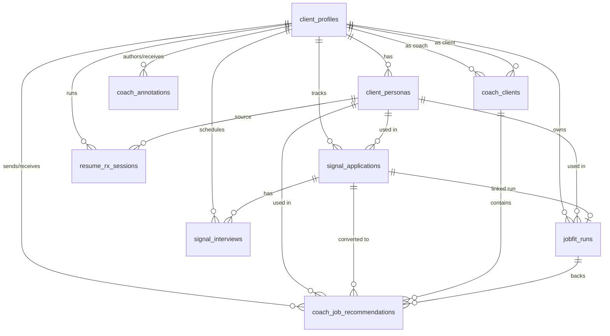

# Database Schema

## Overview

SIGNAL uses **Supabase Postgres** as its primary datastore. The database backs authentication (via Supabase Auth), user profiles and resume personas, deterministic JobFit scoring history, a job tracker with interview records, the multi-stage Resume Rx rewrite sessions, and the coach/client system. API routes access the database through the Supabase service-role key (admin client), so Row Level Security policies exist but are bypassed server-side — authorization is enforced in application code. The data-model philosophy is canonical profile text (`client_profiles.profile_text`) as the source of truth for scoring, fingerprint-hashed runs for deterministic caching of expensive scoring work, and soft links (`ON DELETE SET NULL`) between runs, applications, and personas so historical runs survive upstream edits.

## Tables

> The foundational tables `client_profiles`, `jobfit_runs`, `signal_seats`, `jobfit_users`, `jobfit_profiles`, `job_analysis_cache`, and `jobfit_page_views` were created before the migrations that exist in `supabase/migrations/`. The `20260206*_remote_schema.sql` files in that folder are empty (0 bytes), so the original CREATE TABLE statements are not available in this repo. Columns documented below for those tables are derived from application code references and from ALTER TABLE migrations that extend them. See **Known Gaps** for details.

### `client_profiles`
Paid SIGNAL user records. One row per user; scoring engine reads `profile_text`.

| Column | Type | Nullable | Default | Description |
|---|---|---|---|---|
| `id` | uuid | NO | [NEEDS CLARIFICATION] | Primary key. |
| `user_id` | uuid | [NEEDS CLARIFICATION] | — | Supabase auth user ID. |
| `email` | text | [NEEDS CLARIFICATION] | — | User email (lowercased on write). |
| `name` | text | YES | — | Display name. |
| `job_type` | text | YES | — | "Full Time" / "Internship" / "Both". |
| `target_roles` | text | YES | — | Comma-separated target role titles. |
| `target_locations` | text | YES | — | Required locations. |
| `preferred_locations` | text | YES | — | Optional preferred locations. |
| `timeline` | text | YES | — | Start-date window (e.g., "Summer 2026"). |
| `resume_text` | text | YES | — | Raw resume text. |
| `profile_text` | text | YES | — | Canonical rebuilt text fed to the scoring engine. |
| `profile_structured` | jsonb | YES | — | Parallel structured representation. [NEEDS CLARIFICATION] on exact shape. |
| `profile_version` | int | NO | 1 | Bumped on every PUT `/api/profile` (added 2026-04-03). |
| `profile_complete` | boolean | NO | false | True when name, resume_text, target_roles, job_type, target_locations are all set (added 2026-04-11). |
| `stripe_customer_id` | text | YES | — | Set by Stripe webhook on checkout completion (added 2026-04-11). |
| `is_coach` | boolean | YES | false | Marks coach accounts (added 2026-04-13). |
| `coach_org` | text | YES | — | Coach's organization label (added 2026-04-13). |
| `active` | [NEEDS CLARIFICATION] | [NEEDS CLARIFICATION] | [NEEDS CLARIFICATION] | Referenced by `/api/auth/send-link` to gate magic-link sends. |
| `seat_id` | [NEEDS CLARIFICATION] | [NEEDS CLARIFICATION] | — | Referenced in profile PUT handler as a stripped-from-update field. |
| `updated_at` | timestamptz | [NEEDS CLARIFICATION] | — | Last-updated timestamp (written explicitly by API routes). |

**Primary key:** `id`. **Uniqueness:** `user_id` and `email` are treated as unique by app code (lookup-by-then-fallback pattern). [NEEDS CLARIFICATION] on actual UNIQUE constraints at DB level.

### `client_personas`
Per-profile resume variants (max 2 enforced by app logic). Added 2026-04-03.

| Column | Type | Nullable | Default | Description |
|---|---|---|---|---|
| `id` | uuid | NO | `gen_random_uuid()` | Primary key. |
| `profile_id` | uuid | NO | — | FK → `client_profiles(id)` ON DELETE CASCADE. |
| `name` | text | NO | `'My Resume'` | Persona label. |
| `resume_text` | text | NO | `''` | Resume body for this persona. |
| `is_default` | boolean | NO | false | Marks the user's default persona. |
| `display_order` | int | NO | 1 | Sort order in UI. |
| `persona_version` | int | NO | 1 | Bumped when persona text is edited. |
| `created_at` | timestamptz | NO | `now()` | Creation timestamp. |
| `updated_at` | timestamptz | NO | `now()` | Last-updated timestamp. |

**Indexes:** `idx_client_personas_profile_id` on `(profile_id)`.

### `jobfit_runs`
Deterministic JobFit scoring results. One row per `(client_profile_id, fingerprint_hash)` cache hit.

| Column | Type | Nullable | Default | Description |
|---|---|---|---|---|
| `id` | uuid | [NEEDS CLARIFICATION] | [NEEDS CLARIFICATION] | Primary key. |
| `client_profile_id` | uuid | [NEEDS CLARIFICATION] | — | FK → `client_profiles(id)`. |
| `job_url` | text | [NEEDS CLARIFICATION] | — | Source URL of the JD, if any. |
| `fingerprint_hash` | text | [NEEDS CLARIFICATION] | — | SHA256 of normalized inputs; cache key. |
| `fingerprint_code` | text | [NEEDS CLARIFICATION] | — | Short human-readable fingerprint. |
| `verdict` | text | [NEEDS CLARIFICATION] | — | Decision string (Priority Apply / Apply / Review / Pass). |
| `result_json` | jsonb | [NEEDS CLARIFICATION] | — | Full scoring output; does NOT contain raw jobText/profileText. |
| `persona_id` | uuid | YES | — | FK → `client_personas(id)` ON DELETE SET NULL (added 2026-04-03). |
| `profile_version_at_run` | int | YES | — | Snapshot of `client_profiles.profile_version` at run time (added 2026-04-03). |
| `persona_version_at_run` | int | YES | — | Snapshot of `client_personas.persona_version` at run time (added 2026-04-03). |
| `application_id` | uuid | YES | — | FK → `signal_applications(id)` ON DELETE SET NULL (added 2026-04-03). |
| `job_description` | text | YES | NULL | Raw JD text for deep-link restoration (added 2026-04-10). |
| `sourced_by_coach_id` | uuid | YES | — | FK → `client_profiles(id)` when the run was sourced by a coach (added 2026-04-13). |
| `created_at` | timestamptz | [NEEDS CLARIFICATION] | — | Run timestamp. |

**Uniqueness:** App uses `onConflict: "client_profile_id,fingerprint_hash"` upsert, implying a UNIQUE constraint on that pair. [NEEDS CLARIFICATION] on exact DDL.

### `signal_applications`
Job tracker entries. One row per tracked application. Added 2026-04-03.

| Column | Type | Nullable | Default | Description |
|---|---|---|---|---|
| `id` | uuid | NO | `gen_random_uuid()` | Primary key. |
| `profile_id` | uuid | NO | — | FK → `client_profiles(id)` ON DELETE CASCADE. |
| `persona_id` | uuid | YES | — | FK → `client_personas(id)` ON DELETE SET NULL. |
| `jobfit_run_id` | uuid | YES | — | FK → `jobfit_runs(id)` ON DELETE SET NULL. |
| `company_name` | text | NO | `''` | Company. |
| `job_title` | text | NO | `''` | Job title. |
| `location` | text | YES | `''` | Job location. |
| `date_posted` | date | YES | — | Posting date. |
| `job_url` | text | YES | `''` | Original listing URL. |
| `application_location` | text | YES | `''` | Where the user applied (Company Website, LinkedIn, etc.). |
| `application_status` | text | NO | `'saved'` | CHECK: saved, applied, interviewing, offer, rejected, withdrawn, coach_recommended (last value added 2026-04-13). |
| `applied_date` | date | YES | — | When the user applied. |
| `interest_level` | int | YES | 3 | CHECK: 1–5. |
| `cover_letter_submitted` | boolean | YES | false | Whether a cover letter was submitted. |
| `referral` | boolean | YES | false | Whether this came via referral. |
| `notes` | text | YES | `''` | Free-form notes. |
| `signal_decision` | text | YES | `''` | Cached decision from JobFit. |
| `signal_score` | int | YES | — | Cached score 0–100. |
| `signal_run_at` | timestamptz | YES | — | When SIGNAL was last run. |
| `created_at` | timestamptz | NO | `now()` | Creation timestamp. |
| `updated_at` | timestamptz | NO | `now()` | Last-updated timestamp. |

**Indexes:** `idx_signal_applications_profile_id` on `(profile_id)`; `idx_signal_applications_status` on `(application_status)`.

### `signal_interviews`
Interview records linked to an application. Added 2026-04-03.

| Column | Type | Nullable | Default | Description |
|---|---|---|---|---|
| `id` | uuid | NO | `gen_random_uuid()` | Primary key. |
| `application_id` | uuid | NO | — | FK → `signal_applications(id)` ON DELETE CASCADE. |
| `profile_id` | uuid | NO | — | FK → `client_profiles(id)` ON DELETE CASCADE. |
| `company_name` | text | NO | `''` | Auto-populated from application. |
| `job_title` | text | NO | `''` | Auto-populated from application. |
| `interview_stage` | text | NO | `'phone'` | CHECK: hr_screening, phone, zoom, in_person, take_home, final_round, other. |
| `interviewer_names` | text | YES | `''` | Interviewer names. |
| `interview_date` | date | YES | — | Scheduled date. |
| `thank_you_sent` | boolean | YES | false | Whether a thank-you was sent. |
| `status` | text | NO | `'scheduled'` | CHECK: not_scheduled, scheduled, awaiting_feedback, offer_extended, rejected, ghosted. |
| `confidence_level` | int | YES | 3 | CHECK: 1–5. |
| `notes` | text | YES | `''` | Free-form notes. |
| `created_at` | timestamptz | NO | `now()` | Creation timestamp. |
| `updated_at` | timestamptz | NO | `now()` | Last-updated timestamp. |

**Indexes:** `idx_signal_interviews_application_id` on `(application_id)`; `idx_signal_interviews_profile_id` on `(profile_id)`.

### `resume_rx_sessions`
Multi-stage resume rewrite sessions. Added 2026-04-12.

| Column | Type | Nullable | Default | Description |
|---|---|---|---|---|
| `id` | uuid | NO | `gen_random_uuid()` | Primary key. |
| `profile_id` | uuid | NO | — | FK → `client_profiles(id)` ON DELETE CASCADE. |
| `status` | text | NO | `'diagnosis'` | CHECK: diagnosis, education, architecture, qa, validation, complete. |
| `original_resume_text` | text | NO | — | Resume text to be rewritten. |
| `mode` | text | NO | — | Rewrite mode. [NEEDS CLARIFICATION] on allowed values. |
| `year_in_school` | text | NO | — | Candidate's year-in-school input. |
| `target_field` | text | NO | — | Target field for the rewrite. |
| `source_persona_id` | uuid | YES | — | FK → `client_personas(id)` ON DELETE SET NULL. |
| `diagnosis` | jsonb | YES | — | Stage 1 diagnosis output. |
| `education_intake` | jsonb | YES | — | Stage 2 education section output. |
| `architecture` | jsonb | YES | — | Stage 3 section architecture. |
| `qa_items` | jsonb | YES | `'[]'::jsonb` | Q&A-driven bullet rewrites. |
| `approved_bullets` | jsonb | YES | `'[]'::jsonb` | Approved bullet variants. |
| `validation_result` | jsonb | YES | — | Final validation output. |
| `coaching_summary` | text | YES | — | Free-form coaching summary. |
| `final_resume_text` | text | YES | — | Assembled final resume. |
| `pdf_url` | text | YES | — | Rendered PDF URL, if generated. |
| `created_at` | timestamptz | YES | `now()` | Creation timestamp. |
| `updated_at` | timestamptz | YES | `now()` | Last-updated timestamp. |

### `coach_clients`
Join table linking coaches to their clients. Added 2026-04-13.

| Column | Type | Nullable | Default | Description |
|---|---|---|---|---|
| `id` | uuid | NO | `gen_random_uuid()` | Primary key. |
| `coach_profile_id` | uuid | NO | — | FK → `client_profiles(id)` ON DELETE CASCADE. |
| `client_profile_id` | uuid | YES | — | FK → `client_profiles(id)` ON DELETE CASCADE. Null until the invite is accepted. |
| `status` | text | NO | `'pending'` | CHECK: pending, active, paused, revoked. |
| `access_level` | text | NO | `'full'` | CHECK: view, annotate, full. |
| `invited_email` | text | NO | — | Email invited by the coach. |
| `invite_token` | uuid | YES | `gen_random_uuid()` | Invite link token. |
| `invited_at` | timestamptz | YES | `now()` | Invite creation timestamp. |
| `accepted_at` | timestamptz | YES | — | Invite acceptance timestamp. |
| `private_notes` | text | YES | — | Coach-only notes on this client. |

**Uniqueness:** UNIQUE (`coach_profile_id`, `client_profile_id`).

### `coach_job_recommendations`
Jobs sourced by coaches on behalf of clients. Added 2026-04-13.

| Column | Type | Nullable | Default | Description |
|---|---|---|---|---|
| `id` | uuid | NO | `gen_random_uuid()` | Primary key. |
| `coach_client_id` | uuid | NO | — | FK → `coach_clients(id)` ON DELETE CASCADE. |
| `coach_profile_id` | uuid | NO | — | FK → `client_profiles(id)`. |
| `client_profile_id` | uuid | NO | — | FK → `client_profiles(id)`. |
| `company_name` | text | NO | — | Company. |
| `job_title` | text | NO | — | Job title. |
| `job_description` | text | NO | — | Full JD text. |
| `job_url` | text | YES | — | Listing URL. |
| `signal_decision` | text | YES | — | Decision from JobFit run. |
| `signal_score` | int | YES | — | Score from JobFit run. |
| `jobfit_run_id` | uuid | YES | — | FK → `jobfit_runs(id)` ON DELETE SET NULL. |
| `persona_id` | uuid | YES | — | FK → `client_personas(id)` ON DELETE SET NULL. |
| `persona_name` | text | YES | — | Snapshot of persona name at recommendation time. |
| `priority` | text | NO | `'this_week'` | CHECK: urgent, this_week, when_ready, not_recommended. |
| `coaching_note` | text | YES | — | Coach's note to the client. |
| `recommended_action` | text | NO | `'apply'` | CHECK: apply, research_first, hold, skip. |
| `apply_by_date` | date | YES | — | Coach-suggested deadline. |
| `client_status` | text | YES | `'new'` | CHECK: new, interested, applying, applied, not_for_me, archived. |
| `client_viewed_at` | timestamptz | YES | — | When the client first viewed the recommendation. |
| `client_responded_at` | timestamptz | YES | — | When the client last responded. |
| `notification_seen` | boolean | YES | false | Notification read state. |
| `application_id` | uuid | YES | — | FK → `signal_applications(id)` ON DELETE SET NULL. |
| `full_analysis` | jsonb | YES | — | Full JobFit analysis payload (added 2026-04-13 in second migration). |
| `created_at` | timestamptz | YES | `now()` | Creation timestamp. |
| `updated_at` | timestamptz | YES | `now()` | Last-updated timestamp. |

### `coach_annotations`
Coach notes attached to client applications, runs, recommendations, or general. Added 2026-04-13.

| Column | Type | Nullable | Default | Description |
|---|---|---|---|---|
| `id` | uuid | NO | `gen_random_uuid()` | Primary key. |
| `coach_profile_id` | uuid | NO | — | FK → `client_profiles(id)`. |
| `client_profile_id` | uuid | NO | — | FK → `client_profiles(id)`. |
| `target_type` | text | NO | — | CHECK: application, jobfit_run, recommendation, general. |
| `target_id` | uuid | YES | — | ID of the target row (not a DB-enforced FK; polymorphic). |
| `note` | text | NO | — | Annotation body. |
| `priority` | text | YES | — | CHECK: urgent, important, info, positive, NULL. |
| `visible_to_client` | boolean | YES | true | Whether the client can see this annotation. |
| `client_acknowledged` | boolean | YES | false | Whether the client acknowledged it. |
| `client_acknowledged_at` | timestamptz | YES | — | When the client acknowledged. |
| `created_at` | timestamptz | YES | `now()` | Creation timestamp. |
| `updated_at` | timestamptz | YES | `now()` | Last-updated timestamp. |

### `signal_seats`
Legacy seat-based claim-token access flow. Referenced by `/api/seat-create`, `/api/seat-verify`, `/api/send-magic-link`.

[NEEDS CLARIFICATION] — CREATE TABLE not present in visible migrations. Columns referenced in code include `claim_token_hash`, `status`, `expires_at`, and `id`, but full schema is not known from the files available.

### `jobfit_users` (trial, isolated)
Trial-flow user records. Referenced by `/api/jobfit-intake`, `/api/jobfit-run-trial`, `/api/jobfit-trial-lookup`.

[NEEDS CLARIFICATION] — CREATE TABLE not in visible migrations. Columns observed in code include `email` and `credits_remaining`.

### `jobfit_profiles` (trial, isolated)
Trial-flow profiles. Referenced by `/api/jobfit-intake`, `/api/jobfit-run-trial`. Not linked to `client_profiles`.

[NEEDS CLARIFICATION] — CREATE TABLE not in visible migrations.

### `job_analysis_cache`
Cache table for the free `/api/job-analysis` tool.

[NEEDS CLARIFICATION] — CREATE TABLE not in visible migrations.

### `jobfit_page_views`
Analytics/tracking inserts from `/api/track` and most run endpoints.

[NEEDS CLARIFICATION] — CREATE TABLE not in visible migrations. Used via INSERT only.

### Other run tables
`positioning_runs`, `coverletter_runs`, `networking_runs` — same cache pattern as `jobfit_runs` (referenced by `/api/runs/[id]`). [NEEDS CLARIFICATION] — CREATE TABLE not in visible migrations.

## Row Level Security (RLS)

RLS is defined only in migrations from 2026-04-12 onward. Earlier tables' RLS status is [NEEDS CLARIFICATION]. Because API routes use the service-role key, RLS is bypassed for server-side access; these policies only matter for direct client-side queries.

| Table | Policy Name | Operation | Rule |
|---|---|---|---|
| `resume_rx_sessions` | `users_own_rx_sessions` | FOR ALL | `profile_id = (SELECT id FROM client_profiles WHERE user_id = auth.uid())` — user may only access their own sessions. |
| `coach_clients` | `coaches_see_own_clients` | FOR ALL | Caller's profile must match either `coach_profile_id` or `client_profile_id`. |
| `coach_job_recommendations` | `coaches_and_clients_see_recommendations` | FOR ALL | Caller's profile must match either `coach_profile_id` or `client_profile_id`. |
| `coach_annotations` | `coach_annotation_access` | FOR ALL | Caller is the coach, OR caller is the client AND `visible_to_client = true`. |

## Relationships

## Migrations

| Date | File | Description |
|---|---|---|
| 2026-02-06 | `20260206165724_remote_schema.sql` | Empty (0 bytes). Foundational schema is not captured here. |
| 2026-02-06 | `20260206190000_prod_schema.sql` | Empty (0 bytes). Foundational schema is not captured here. |
| 2026-04-03 | `20260403_dashboard_personas.sql` | Added `profile_version` to `client_profiles`; created `client_personas`; added `persona_id`, `profile_version_at_run`, `persona_version_at_run` to `jobfit_runs`; seeded one default persona per existing profile. |
| 2026-04-03 | `20260403_job_tracker.sql` | Created `signal_applications` and `signal_interviews`; added `application_id` to `jobfit_runs`. |
| 2026-04-10 | `20260410_jobfit_runs_add_job_description.sql` | Added `job_description` column to `jobfit_runs` for deep-link restoration. |
| 2026-04-11 | `20260411_client_profiles_auth_fields.sql` | Added `profile_complete` and `stripe_customer_id` to `client_profiles`; backfilled `profile_complete=true` for rows with all required fields set. |
| 2026-04-12 | `20260412_resume_rx_sessions.sql` | Created `resume_rx_sessions` with RLS policy. |
| 2026-04-13 | `20260413_coach_client_system.sql` | Added `is_coach`, `coach_org` to `client_profiles`; created `coach_clients`, `coach_job_recommendations`, `coach_annotations` with RLS; extended `signal_applications.application_status` CHECK to include `coach_recommended`. |
| 2026-04-13 | `20260413_coach_full_analysis.sql` | Added `full_analysis` JSONB to `coach_job_recommendations`; added `sourced_by_coach_id` FK to `jobfit_runs`. |

A sibling file `supabase/migrations_backup/20260206144423_remote_schema.sql` exists but is also empty (0 bytes). A root-level `prod_schema.sql` is 0 bytes.

## Known Gaps / [NEEDS CLARIFICATION]

1. **Foundational CREATE TABLE statements missing.** The earliest migration files (`20260206165724_remote_schema.sql`, `20260206190000_prod_schema.sql`) and `prod_schema.sql` are all empty. The original schemas for `client_profiles`, `jobfit_runs`, `signal_seats`, `jobfit_users`, `jobfit_profiles`, `job_analysis_cache`, `jobfit_page_views`, `positioning_runs`, `coverletter_runs`, and `networking_runs` cannot be verified from this repo. To fix, export live schema via `supabase db pull` or `pg_dump --schema-only` against the prod project.
2. **Uniqueness and PK declarations** for those foundational tables (e.g., UNIQUE on `client_profiles.email` and `client_profiles.user_id`; UNIQUE on `(client_profile_id, fingerprint_hash)` in `jobfit_runs`) are inferred from app-code upsert patterns, not verified.
3. **`client_profiles.active`** and **`client_profiles.seat_id`** are referenced in app code but their column types, defaults, and nullability are unknown.
4. **`client_profiles.profile_structured`** shape is undocumented; it is written/read as opaque JSONB.
5. **RLS on foundational tables** (`client_profiles`, `client_personas`, `jobfit_runs`, `signal_applications`, `signal_interviews`) is not verifiable — policies are only defined for tables added 2026-04-12 and later.
6. **`resume_rx_sessions.mode`** allowed values are not constrained at the DB level; the set of valid modes is defined only in application code.
7. **Indexes** on foundational tables are unknown.
8. **`coach_annotations.target_id`** is polymorphic — no DB-level FK enforces that it matches a row of the type named in `target_type`.
