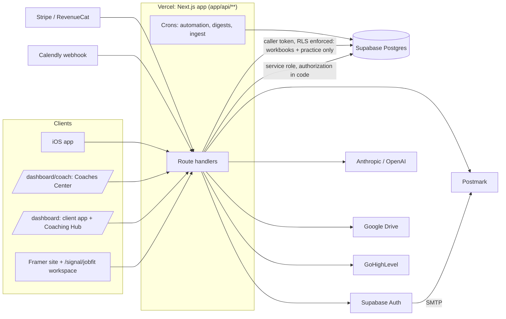

# SIGNAL: Current-State Architecture and Methodology Handoff

Prepared 2026-10-07 for a second AI development partner joining the SIGNAL project to help design and integrate the Workforce Ready Now (WRN) coaching methodology, starting with the Resume Workshop.

This is a **current-state audit**. It describes what exists. It does not design, refactor or propose a replacement for anything. Nothing in the application, database, migrations or existing documentation was changed to produce it.

## How to read this document

This main document is the summary and the map. The evidence is in five appendices, each of which cites file paths, tables and line numbers:

| Appendix | Covers |
|---|---|
| [A. Platform architecture](handoff/APPENDIX-A-PLATFORM-ARCHITECTURE.md) | Stack, repo map, deployment, integrations, Supabase usage, auth and roles, client/coach/admin experiences |
| [B. Client data architecture](handoff/APPENDIX-B-CLIENT-DATA-ARCHITECTURE.md) | Every relevant table: purpose, columns, relationships, writers, readers, access control; the unified-record question; provenance |
| [C. Interview workbooks](handoff/APPENDIX-C-INTERVIEW-WORKBOOKS.md) | The workbook and practice-round systems in depth, with the real section and prompt structure, and reusable patterns |
| [D. Methodologies and decisions](handoff/APPENDIX-D-METHODOLOGIES-AND-DECISIONS.md) | 20 methodologies in their own wording, the full package seed sheet, ~60 docs classified LOCKED / WORKING / OPEN / debt, 35 doc-vs-code contradictions |
| [E. Resume, entry points and data flow](handoff/APPENDIX-E-RESUME-ENTRY-POINTS-AND-DATA-FLOW.md) | Every resume capability, service independence and entitlements, traced data flows and reuse gaps |

### Status labels used throughout

| Label | Meaning |
|---|---|
| **BUILT AND FUNCTIONING** | Code exists and is wired end to end. Unless marked otherwise, verified from code, not from the live production database. |
| **BUILT BUT INCOMPLETE** | Code exists but part of the intended behaviour, a screen, or a safety layer is missing. |
| **DESIGNED OR DOCUMENTED, NOT IMPLEMENTED** | A spec, methodology or design exists in docs; no working code. |
| **PLANNED** | Named as future work (seed sheet, roadmap, docs) with no spec detailed enough to build from. |
| **UNKNOWN OR NOT VERIFIED** | Cannot be determined from the repository (usually: is it live in production?). |

### Limits of this audit

- **The live databases were not inspected.** The table inventory comes from the 152 files in `supabase/migrations/` and the code that reads and writes them. Migrations are applied to each database by hand, and dev and prod are known to drift (see section 2.6).
- **The two baseline migrations are empty files** (`20260206165724_remote_schema.sql` and `20260206190000_prod_schema.sql`, 0 bytes each, verified). Every table created before April 2026 is defined only in a gitignored schema dump, so its exact columns are inferred from code (Appendix B flags each case).
- **Production behaviour was not exercised**, apart from the specific checks listed in section 2.6.

---

## 1. Executive summary

1. **SIGNAL is two products in one codebase.** A job-seeker tool (JobFit scoring, Positioning, Cover Letter, Job Tracker, Networking tracker), and a **Coaches Center** that runs WRN's own coaching practice (prospects, SOW, packages and per-client plans, tasks, interview workbooks, practice rounds, History). Both are BUILT AND FUNCTIONING.
2. **There is no unified client record.** Data hangs off two different keys: `client_profiles.id` (the person with a login) and `coach_clients.id` (one coach's relationship with one person, or a prospect who has no login yet). Personas, JobFit runs, applications, networking and workbooks follow the person. Plans, SOWs, notes, documents and History follow the coach relationship.
3. **There is no structured store of experience.** No tables exist for work history, education history, projects, accomplishments, skills or evidence. Resumes are plain text. Skills are regex-extracted once. The closest thing to captured accomplishments is the interview workbook's STAR+E stories, which are stored per workbook field and read only by the workbook routes.
4. **The interview workbook system is the strongest design reference for a Resume Workshop.** Typed block schema, repo-held templates frozen per instance, per-field autosave with conflict detection and full answer history, coach-only content stripped in the database, draft-until-released coach feedback, two-way send log, and once-only completion. It is also the only module that enforces database row-level security with the caller's own login.
5. **Resume support is thin.** Upload and intake extract text. Positioning suggests bullet rewrites. Nothing edits, structures, versions, generates or approves a resume. The guided rebuild ("Resume Rx") was removed in August 2026; its table remains.
6. **Your SIGNAL DNA, Career Paths and Job Decoder are not implemented in this repo.** DNA is delivered outside SIGNAL (a separate Supabase project and hand-built report pages). Inside SIGNAL it exists only as deliverable, task, email and folder names. The Professional DNA methodology is a v0.8 draft that its own docs say must not be coded yet.
7. **Services can be combined but access is not per-service.** A client can hold several packages and gain single deliverables later, and no module requires DNA or a Resume Workshop first. But paid access is a single on/off flag (`client_profiles.active`), checked only at sign-in. Nothing restricts a service by what was purchased.
8. **Changing coaches is not supported as a transfer.** The person-keyed data follows the client; the relationship-keyed data (plan, SOW, notes, documents, workbooks, Drive folder) stays with the old relationship.
9. **Documentation is partly stale.** `docs/ARCHITECTURE.md` (May 2026) describes an earlier, seat-based student product and omits the Coaches Center. Appendix D lists 35 contradictions between documents and code. Treat code as the source of truth and the contradictions as open questions, not as settled.

---

## 2. Platform overview

Full detail: [Appendix A](handoff/APPENDIX-A-PLATFORM-ARCHITECTURE.md).

### 2.1 What SIGNAL is, and its relationship to WRN

Workforce Ready Now is Peri Ginsberg's career coaching business. SIGNAL is its software. It serves:

- **Job seekers directly:** paid or trial users who score postings against their profile (JobFit), rewrite positioning, generate cover letters, and track applications and networking. Entry is the Framer-hosted workspace at `/signal/jobfit` plus the `/dashboard` app.
- **WRN coaches and their clients:** the Coaches Center (`app/dashboard/coach/*`) runs the practice: prospect pipeline, Statement of Work and "Let's Go" acceptance, per-client plans built from a package library, a To-Do system with automation, interview workbooks, practice rounds, a shared document library, and a full History timeline. Coached clients see a **Coaching Hub** (`app/dashboard/coaching-hub`).

### 2.2 Stack

| Layer | Technology | Status |
|---|---|---|
| API and dashboard | Next.js 16 App Router (`app/api/**` about 200 routes, `app/dashboard/**`), TypeScript | BUILT AND FUNCTIONING |
| Marketing and job workspace | Framer (code in `framer/dev`, `framer/prod`) calling this API | BUILT AND FUNCTIONING |
| Database and auth | Supabase Postgres + Supabase Auth (magic link / OTP; passwords only in dev) | BUILT AND FUNCTIONING |
| Hosting | Vercel: project `wrnsignal-api` (prod, promoted from dev Preview builds) and `wrnsignal-api-staging` | BUILT AND FUNCTIONING |
| Scheduled jobs | 7 Vercel crons in `vercel.json` (automation every 30 min, overdue digest, ingest, lanes, staleness, write monitor), guarded by `CRON_SECRET` | BUILT |
| Email | Postmark: `signal-client` (client mail, shared layout and signature), `signal-internal` (coach alerts), default stream for auth mail sent by Supabase | BUILT AND FUNCTIONING |
| AI | Anthropic (Claude Haiku: JobFit bullets, resume PDF reading, evidence extraction) and OpenAI (`gpt-4.1-mini`: Positioning, Cover Letter) | BUILT AND FUNCTIONING |
| Integrations | Stripe, RevenueCat (iOS in-app purchase), Calendly webhook, GoHighLevel, Google Drive | BUILT (not all verified live) |
| Mobile | `signal-mobile/` Expo app, gitignored, TestFlight, calls the prod API | BUILT, not versioned in git |

### 2.3 Architecture diagram

### 2.4 How Supabase is used

- **Server-side, service role, almost everywhere.** About 172 route files use the service-role key, which bypasses row-level security. Authorization is enforced in code by a shared identity and scope layer: `lib/collab/identity.ts` (who the caller is), `lib/collab/scope.ts` (`resolveRequestScope`: whose board, with what access level), `lib/collab/delegation.ts` (delegate coaches). A test (`tests/identity/no-private-caller-lookups.test.ts`) forbids private copies of the caller lookup.
- **Exception: workbooks and practice rounds** run under the caller's own token (`lib/workbook/server.ts`, `lib/practice/server.ts` via `lib/supabase/caller.ts`), so their RLS policies are the real guard. The practice tables' policies compare a profile id to `auth.uid()` and likely never match; the routes' own checks still protect them (BUILT BUT INCOMPLETE as a backup layer).
- **Core tables have no RLS defined in any migration** (`client_profiles`, `client_personas`, `jobfit_runs`, `signal_applications`, plan tables). Many newer tables enable RLS with no policies, which blocks everything except the service role.
- **Database functions** carry a few all-or-nothing operations, for example `attach_package_to_engagement` (copies a package into a client's plan) and the workbook send and completion functions.

### 2.5 Authentication, authorization and roles

| Role | How it is determined | Status |
|---|---|---|
| Client / job seeker | A `client_profiles` row linked to the auth user; paid access is `client_profiles.active` | BUILT AND FUNCTIONING |
| Coached client | Also has an active `coach_clients` row (`getActiveCoachRelationship`, `app/api/_lib/coachedClient.ts`) | BUILT AND FUNCTIONING |
| Coach | `client_profiles.is_coach = true`. No app screen sets it; it is set in the database by hand | BUILT BUT INCOMPLETE |
| Delegate coach | `coach_delegates` row; acts for a principal coach (`coach_acting_ids()`) | BUILT; no management screen |
| Coach access levels | `coach_clients.access_level`: view / annotate / full. Reads need view, writes need full, annotate never writes | BUILT AND FUNCTIONING |
| Administrator | No admin role. Internal routes use shared secrets; the analytics dashboard uses a single shared password | DESIGNED, NOT IMPLEMENTED |

Sign-in is a magic link or 8-digit code (`app/api/auth/send-link`), with landing pages chosen by role. Account creation exists as three near-identical copies (create client, send invite, setup account), noted as technical debt.

### 2.6 Deployment and verification state as of 2026-10-07

These points were verified during the session that produced this document, not from the repository:

| Item | State |
|---|---|
| Production deployment | `wrnsignal-96g8kkpgw…`, built from dev commit `780bbd5b` (promoted 2026-10-07). Includes SOW send, Let's Go, welcome email templates, Networking share task, the client welcome screen redesign and Calendly session prep. |
| Not yet in production | Task details (`f67e24a9`) and its migration `20261015_task_details.sql` (applied to dev only). |
| Calendly session migration `20261014` | Reported applied to prod by Peri before the promote; not independently verified. The prod session mapping (`scripts/calendly-setup.ts --sessions`) was not confirmed saved. |
| SOW send in prod | Working: an SOW email was delivered from prod on 2026-10-07. |
| Supabase auth email templates | Replaced on 2026-10-07 in both projects with the light SIGNAL design (`docs/email/supabase-signin-email.html`). Supabase caches templates for several minutes after a save. |
| Migration drift | Migrations are applied by hand. Which of `20261008` through `20261015` are in prod beyond the above, and whether the lane tables and postings enrichment exist in prod, is UNKNOWN. |

---

## 3. Client data architecture

Full table-by-table inventory: [Appendix B](handoff/APPENDIX-B-CLIENT-DATA-ARCHITECTURE.md).

### 3.1 The two keys, and why there is no unified record

| Key | Represents | What hangs off it |
|---|---|---|
| `client_profiles.id` | A person with a login | Profile fields and resume text, `client_personas` (resume variants), `jobfit_runs`, `positioning_runs`, `coverletter_runs`, `signal_applications` (Job Tracker), networking board and contacts, lanes, workbooks, practice rounds, To-Do assignment |
| `coach_clients.id` | One coach's relationship with one person, or a prospect | Engagements (packages), plan deliverables and tasks, phases, SOW, consults, `coach_client_events` (History), shared documents, notes, networking campaign briefs, Drive workspace |

- **Prospects have no `client_profiles` row.** Their details live on `coach_clients` and are copied once into `client_profiles` at account setup, then never synced again (BUILT BUT INCOMPLETE).
- **Field name collisions:** for example `target_industries` is text on `coach_clients` but a JSON array on `client_profiles`.

### 3.2 What exists for each data category

| Category | Where it lives | Status |
|---|---|---|
| Client profile and preferences | `client_profiles` (profile text, `profile_structured`, targets, location, education scalars), `client_personas` | BUILT AND FUNCTIONING |
| Coach relationship | `coach_clients` (lifecycle, prospect status, access level, parent contact) | BUILT AND FUNCTIONING |
| Packages, services, plan | `coach_phases`, `coach_milestones` (library deliverables), `coach_milestone_activities` (library tasks), `coach_packages`, `coach_package_milestones`, `coach_client_engagements`, `coach_client_engagement_deliverables`, `coach_client_engagement_activities` (plan tasks with a state machine), `client_phase_status` | BUILT AND FUNCTIONING |
| Purchases and entitlements | `purchases`, `iap_purchases`; access is `client_profiles.active`. No per-feature entitlement; no coaching invoice table | BUILT AND FUNCTIONING (minimal) |
| Resumes and documents | Resume as plain text (`client_personas.resume_text`, fallback `client_profiles.resume_text`); original files not stored. Shared documents are links (`coach_client_documents`) to Google Drive | BUILT AND FUNCTIONING |
| Work history, education, projects, accomplishments, skills, evidence | **No structured tables.** Free text in resume and profile fields; skills regex-extracted into `profile_structured.tools`; JobFit evidence only inside `jobfit_runs.result_json`; STAR stories in `workbook_answers` | Not present as structured data |
| Coaching notes and sessions | At least seven note stores with different visibility rules (`coach_client_notes`, `coaching_notes`, `coach_client_activity_notes`, legacy and dormant tables). No session table; recaps are notes typed `session_recap` | BUILT, fragmented |
| Tasks | `coach_tasks` (To-Do), automation rules, timers, templates | BUILT AND FUNCTIONING |
| Job targets and applications | `signal_applications` (with status history), `coach_job_recommendations` (append-only client responses), lanes, ingested `postings` (global, not linked to clients) | BUILT; lanes and ingest BUILT BUT INCOMPLETE |
| Interview preparation | Workbook and practice tables (section 5) | BUILT AND FUNCTIONING |
| SIGNAL DNA findings, Career Paths | **No data structures.** Names only | Not implemented |

### 3.3 Provenance, history and verification

| Mechanism | Example | Status |
|---|---|---|
| Copy provenance | `source_package_id`, `source_milestone_id`, `source_activity_id` on plan rows | BUILT AND FUNCTIONING |
| Change history | `workbook_answer_history`, application status history, `coach_client_events` (History timeline) | BUILT AND FUNCTIONING |
| Version stamps | Profile and persona versions stamped on JobFit runs | BUILT AND FUNCTIONING |
| Authorship | Actor and role columns on events, comments and recommendations | BUILT AND FUNCTIONING |
| Prefill vs suggestion | Networking briefs keep `prefilled_fields` separate from `ai_suggestions` | BUILT AND FUNCTIONING |
| Profile change history | None: `client_profiles` and resume text are overwritten in place | Not present |
| Verification flag on client facts | None | Not present |

---

## 4. Existing coaching methodologies

Full inventory with each methodology's own stages and wording: [Appendix D](handoff/APPENDIX-D-METHODOLOGIES-AND-DECISIONS.md).

### 4.1 The engagement model (package library)

WRN's services are organized as **phases** (Know, Build, Prove, Search, Land), **13 deliverables**, **54 tasks** and **8 packages**, defined in `docs/WRN_SIGNAL_Package_Seed.xlsx` (data copy: `tests/package-seed/seed.ts`). Each task has an order, a type (coach or client), and as of 2026-10-07 a details/checklist field. Session deliverables follow a Book (client) -> Prepare (coach) -> Run (coach) pattern.

Status: library, packages, per-client plans and the plan-task state machine are BUILT AND FUNCTIONING. The sheet's cross-deliverable columns (Trigger, On done, Client email, Follow-up, Land cap) are mostly reference only: the plan advances only to the next task inside the same deliverable. Appendix D reproduces all 54 rows.

### 4.2 Methodology inventory

| Methodology | Status | Where | Can run independently? |
|---|---|---|---|
| Resume development | Thin. Upload, text intake, Positioning bullet rewrites. Resume Rx removed; Resume Audit has no code. Resume Workshop exists only as plan tasks | `app/api/resume-upload`, `app/api/profile-intake`, `app/api/positioning` | Yes (plan tasks) |
| Job search strategy | Plan deliverable "SIGNAL Setup and Job Search Strategy" (sessions, client brief); lanes and ingest partially built | Package library; `lib/lanes`, ingest routes | Yes |
| Networking | Campaign brief, task chain (builder then reviewer), networking plan document rendered from the builder's workbook and shared to the client; contact tracker with 11 stages and 24 message templates | `lib/networking-plan/*`, `lib/briefs/*`, `app/dashboard/network` | Yes |
| Interview preparation | Workbooks (Session 1 and 2 built, Session 3 planned) and practice rounds | Section 5 | Requires a coach relationship |
| Career exploration / Your SIGNAL DNA | Delivered outside SIGNAL; names only inside it. Professional DNA methodology v0.8 draft, 92 open decisions, code explicitly deferred | `docs/professional-dna/`, `docs/signal-dna-site-and-integration-options.md` | Not in SIGNAL |
| Career Paths | Not in this repo (planned as a later release) | Docs only | Not in SIGNAL |
| Job Decoder by SIGNAL | Not in this repo (external public site) | Docs only | Not in SIGNAL |
| JobFit scoring | BUILT AND FUNCTIONING; deterministic, with flag-gated LLM layers on the free path | `app/api/jobfit/*` | Yes |
| Positioning, Cover Letter | BUILT AND FUNCTIONING | `app/api/positioning`, `app/api/coverletter` | Yes (use JobFit if present) |
| Onboarding: SOW, Let's Go, welcome email, Drive workspace | BUILT AND FUNCTIONING (in prod as of 2026-10-07) | `lib/sow/*`, `lib/welcome/*` | Per client |
| Proof Project | Product view built; the offer itself undefined | `app/api/me/proof-project` | Yes |

### 4.3 Locked decisions a new partner must respect

From Appendix D, each with its source:

- JobFit receives no DNA input, and workbooks contain no DNA.
- DNA Stage 1 is blind and must be frozen before any other context is used.
- Tasks are open / done / cancelled only, and a task's assignee must be a coach.
- Every client email uses the shared signature layout. Notes are written by people; History is written by the system.
- The plan rules dated 2026-10-03 (approval activates the first task; finishing hands to the next; activation never releases a client task).
- The SOW wording, confirmed by Peri line by line.
- Positioning v2 is abandoned; the old networking function is retired.
- House style: no em dashes in SIGNAL prose, documents or UI copy.

---

## 5. Interactive interview workbooks

Full review, including every section and prompt: [Appendix C](handoff/APPENDIX-C-INTERVIEW-WORKBOOKS.md). This is the most important reference for a future Resume Workshop.

| Aspect | How it works | Status |
|---|---|---|
| Content | One JSON document per workbook in `workbooks.content`, frozen at creation (a new version means a new workbook) | BUILT AND FUNCTIONING |
| Templates | Session templates as JSON in `lib/workbook/templates/`, personalized only by name tokens. Per-client interview prep files written outside SIGNAL (examples in `docs/workbooks-v1/`) and loaded by `scripts/create-workbook.ts` | BUILT; no upload screen or in-app generation |
| Session 1 "Foundations" | Welcome, The WRN Three, Your Hook, Tell Me About Yourself, Walk Me Through Your Resume, Homework: Five Questions, Finish Up | BUILT |
| Session 2 "Telling Your Stories" | STAR+E, two live stories, an 8-story builder, a 15-trait list in 4 groups, 20 matching questions, a coverage panel | BUILT (prod UNKNOWN) |
| Session 3 | Referenced by the package seed; no template | PLANNED |
| Block types | 15, including `story`, `select` (options drawn from the client's own answers), `coverage`, and `coach_only` (removed in SQL before the client reads) | BUILT AND FUNCTIONING |
| Saving | One row per field in `workbook_answers`, autosave after 700 ms, conflict detection across devices, every change logged to `workbook_answer_history` | BUILT; history has no viewer |
| Feedback | Coach comments, suggested edits and coach answers stay drafts until "Send back" releases them together; clients can ask questions | BUILT AND FUNCTIONING |
| Handoffs | `workbook_sends` log; each send creates a task for the other side and a Coaching Hub item that clears when opened | BUILT AND FUNCTIONING |
| Completion | "Mark homework complete" fires once (enforced in the database); logs History, auto-sends the Session 1 practice round, raises a coach task | BUILT AND FUNCTIONING |
| Access | Full-access coaches and delegates see everything; coaches never write client answers | BUILT AND FUNCTIONING |
| Reuse of client data | Names only, plus an optional link to a scheduled interview. No resume, JobFit or applications. No AI | By design (DNA excluded by spec) |
| Practice rounds | Separate tables, private video bucket with signed links, 90-second answers, 1 to 6 questions from the Session 2 bank, written feedback released by the coach | BUILT (prod UNKNOWN); coach video reply not built |

---

## 6. Service entry points and independence

Detail: [Appendix E](handoff/APPENDIX-E-RESUME-ENTRY-POINTS-AND-DATA-FLOW.md).

| Requirement | Current support | Status |
|---|---|---|
| Enter at any service | No module requires DNA, a Resume Workshop or any other service first. Positioning and Cover Letter use JobFit results only if present | BUILT AND FUNCTIONING |
| Buy services in combinations | A client can hold several engagements; packages are bundles of library deliverables | BUILT AND FUNCTIONING |
| Add services later | `addDeliverableFromLibrary` (`lib/plan/service.ts`) adds a single deliverable, but only into an existing engagement; there is no a-la-carte package type | BUILT BUT INCOMPLETE |
| Reuse existing information | All job-seeker tools read the same profile and personas | BUILT AND FUNCTIONING |
| Collect only missing information | `profile_complete` is one flag; no per-service "what is missing" logic | Not present |
| Restrict access by purchase | Access is all-or-nothing (`client_profiles.active`), checked only at sign-in; service routes do not check it. Coached features check for an active coach relationship | BUILT BUT INCOMPLETE |
| Continuity when changing coaches | No transfer. Person-keyed data follows the client; plan, SOW, notes, documents, workbooks and Drive folder stay with the old relationship | UNKNOWN as policy; not implemented as a feature |

---

## 7. Data flow and reuse

Traced flows (Appendix E has the full traces with file references):

| Flow | What happens | Reusable elsewhere? |
|---|---|---|
| Client describes an accomplishment in an interview workbook | Saved as free text in `workbook_answers` for that workbook field; every edit logged with author in `workbook_answer_history` | Only by the workbook routes. Not structured as evidence, tied to the coach relationship, no "source" beyond the field |
| Resume and profile into JobFit and Positioning | Plain text read per run; extracted signals and evidence stored inside each run's JSON; profile and persona version stamped on the run | Within the job-seeker tools only |
| Positioning suggestions | Stored in `positioning_runs`; never written back to the resume | No |
| JobFit run into the Job Tracker | Applications created from runs (three code paths create applications) | Yes, within tracker |
| Networking campaign brief into the networking plan | Brief prefills from profile; the plan document is rendered from the builder's workbook, not from the brief's content | Partially |
| Coach notes | Visibility depends on which of the note stores is used | Fragmented |
| Plan task details | Copied from library at attach; client-task details shown to the client once released | BUILT on dev (not in prod yet) |
| SOW | Drafts overwritten in place; sends and acceptance logged | Within SOW only |

Shared building blocks that support reuse: the identity and scope layer (`lib/collab/*`), the plan service (`lib/plan/service.ts`), task and automation services (`lib/tasks/*`, `lib/automation/*`), History logging (`lib/prospects/history.ts`), the email senders (`lib/email/*`), and the Drive workspace (`lib/sow/workspace.ts`).

Duplication to be aware of: two persona resolvers, three copies of the professional-experience parser, three application-creation paths, three account-creation paths, and AI calls split across providers with most bypassing the shared `invokeClaude` wrapper.

---

## 8. Current resume capabilities

| Capability | Status | Location |
|---|---|---|
| Resume upload (PDF via Claude Haiku, Word via mammoth, text) | BUILT AND FUNCTIONING; returns text only, file not kept | `app/api/resume-upload/route.ts` |
| Profile intake from resume | BUILT AND FUNCTIONING; writes profile text, `profile_structured`, `resume_text`, default persona | `app/api/profile-intake/route.ts` |
| Resume variants | BUILT AND FUNCTIONING; up to 10 personas, integer version only, old text not recoverable | `client_personas` |
| Resume analysis for job fit | BUILT AND FUNCTIONING; regex extractor plus Haiku evidence extractor | `app/api/jobfit/extract.ts`, `llmResumeExtractor.ts` |
| Bullet rewrites | BUILT AND FUNCTIONING (Positioning, `gpt-4.1-mini`) | `app/api/positioning` |
| Cover letter generation | BUILT AND FUNCTIONING (`gpt-4.1-mini`) | `app/api/coverletter` |
| Guided resume rebuild (Resume Rx) | Removed 2026-08-27; `resume_rx_sessions` table and stage design remain | Appendix E |
| Resume critique | Placeholder, never called | `resumeCritiqueEvaluator.ts` |
| Resume Workshop, Draft resume, Approve final resume | Plan tasks only (now with details text) | Package library |
| Drive "Resume" folder | Created per client; no Google Docs generated | `lib/sow/workspace.ts` |
| Editing, structure, templates, DOCX/PDF generation, ATS checks, review/approval flow | Not present | |
| Accomplishment capture | Only workbook STAR+E stories (interview context) | Appendix C |

---

## 9. Integration readiness for a coach-led Resume Workshop

This section maps the stated goals for a Resume Workshop to what exists. It does not design the workshop.

| Goal | Reusable today | Genuine gap |
|---|---|---|
| Guide a coach through a structured, conversational experience review | Workbook block schema, live-session vs homework sections, coach-only blocks, coach guides, template test gate | No resume-specific template; templates are repo files, not editable in the app |
| Capture organization context, contribution, scope, accomplishments, outcomes, reactions | Workbook `story` and `select` blocks, per-field answers with history | No structured experience or accomplishment tables; answers are free text keyed to template fields |
| Support targeted resume and career discovery engagements | Packages and plan deliverables can represent either; plan task details describe the work | No link between a workshop and DNA (which is outside SIGNAL by design and decision) |
| Store reusable client evidence in Supabase | Answer history, authorship, provenance columns as patterns | Evidence is tied to a workbook and a coach relationship, not to the person; no cross-module read path |
| Keep client-reported facts separate from coach observations | Coach comments vs client answers; coach-only blocks; coaches cannot write client answers | No field-level "who said this / interpretation vs fact" model outside workbooks; no verification flag |
| Support later job search, Career Paths and interview services, with authorization | Scope layer, coach relationship gate, delegates | No per-service entitlement; Career Paths not in SIGNAL |
| Avoid requiring unrelated services | No module has hard prerequisites | Access is all-or-nothing rather than per-service |

---

## 10. Known gaps, contradictions and open questions

### 10.1 Most important gaps

1. No unified client record; two keys and a one-time prospect-to-profile copy.
2. No structured, person-level store for experience, accomplishments, skills or evidence.
3. Resume text is unstructured and unversioned.
4. No per-service entitlement; `active` checked only at sign-in.
5. No coach-change transfer.
6. Notes are spread across seven or more stores.
7. RLS is not the real guard outside workbooks and practice rounds; core tables have none defined in migrations.
8. Base schema exists only in a gitignored dump.

### 10.2 Contradictions flagged, not resolved

Selected from the 35 in Appendix D and the notes in Appendices A to C:

- JobFit thresholds: the spec says 70/40 with three labels; `decision.ts` uses 96/75/60 with four.
- `CLAUDE.md` is out of date on several counts (file sizes, regression case count, "no LLM in paid scoring").
- `docs/ARCHITECTURE.md` calls itself locked but describes an earlier product; `docs/README.md` points to a file that does not exist.
- `DEVELOPMENT.md` says prod deploys from `main`; actual practice and `deploy-to-prod.ps1` promote a dev build.
- Sources disagree on which database preview and staging builds use.
- The networking FRD says SIGNAL never sends email or shares the folder; the code does both.
- The tracker brief locks "coaches never change the pipeline"; full-access coaches can.
- Workbook copy still promises a VideoAsk and a coach video reply; Session 1 now auto-sends a SIGNAL practice round, and video reply is not built.
- DNA: three different assessment instruments described; report length (10 vs 6 sections) and where paths are set (report vs Decode session) conflict.
- `COLOR-SYSTEM.md` hexes differ from the theme files.

### 10.3 Open questions for Peri

1. Should the resume become structured, versioned data in SIGNAL, or stay in Drive with only approved text saved to a persona?
2. Should accomplishments and evidence move to a person-level store with source and author, usable by resume, interview and job search?
3. Should `resume_rx_sessions` and its stage design be revived, migrated or dropped?
4. Is per-service access wanted, and should it come from approved engagements or from Stripe/IAP products?
5. What should happen to relationship-keyed data when a client changes coaches?
6. Which DNA instrument is canonical, and what is the DNA report's structure?
7. Are the seed sheet's cross-deliverable "On done" chains intended to be built?
8. Should stale docs be updated or marked historical?
9. Which migrations are applied in prod (from `20261008` on), and do the lane tables exist there?

---

## 11. Handoff recommendations

### 11.1 Preserve

- The workbook system's mechanisms (block schema, frozen instances, per-field answers with history, coach-only stripping, draft-until-released feedback, send log, once-only completion, RLS under the caller's token).
- The package library, per-client plan and plan-task state machine, including task details.
- The identity and scope layer and delegate model.
- History (`coach_client_events`) as the single system-written timeline.
- The email layout and signature conventions and the Postmark stream split.

### 11.2 Clarify before building

- The unified-record question and which key a Resume Workshop's data hangs off.
- Fact vs interpretation: where client-reported facts and coach observations live, and who may edit each.
- Entitlement model.
- DNA's relationship to resume work (currently excluded from workbooks and JobFit by locked decisions).
- Production schema state.

### 11.3 Missing capabilities

- A person-level experience and evidence store with provenance and history.
- Structured, versioned resume content and any document generation.
- An in-app template editor or upload path for workbook-style content.
- Per-service access control.
- A viewer for answer history.

### 11.4 Decisions to make before integrating the Resume Workshop

1. Build it on the workbook engine, or as a separate module that reuses its patterns.
2. Where captured experience lives (workbook answers, a new person-level store, or both) and how other modules read it.
3. How to represent fact vs coach interpretation, and authorship and verification.
4. Whether its output is a resume document, structured data, or both, and where the approved version is kept.
5. How it is purchased and gated, independently of DNA and other services.

### 11.5 Review next

| Area | Files |
|---|---|
| Workbook engine | `lib/workbook/server.ts`, `lib/workbook/templates/`, `app/dashboard/workbooks/*`, workbook migrations (Appendix C index) |
| Identity and access | `lib/collab/identity.ts`, `lib/collab/scope.ts`, `lib/collab/delegation.ts`, `app/api/_lib/coachedClient.ts` |
| Plan and library | `lib/plan/service.ts`, `lib/plan/model.ts`, `lib/plan/todo.ts`, `supabase/migrations/20261005_plan_tasks.sql`, `20261015_task_details.sql` |
| Profile and resume | `app/api/profile-intake/route.ts`, `app/api/resume-upload/route.ts`, `client_personas` usage, `app/api/jobfit/extract.ts` |
| Methodology sources | `docs/WRN_SIGNAL_Package_Seed.xlsx`, `tests/package-seed/seed.ts`, `docs/professional-dna/`, `docs/workbooks-v1/` |
| Project conventions | `CLAUDE.md`, `docs/` index in Appendix D |

---

## 12. File and code reference index

Each appendix ends with its own index. The most-referenced locations:

| Path | What it is |
|---|---|
| `app/api/**` | All API routes (about 200) |
| `app/dashboard/coach/**` | Coaches Center |
| `app/dashboard/coaching-hub/page.tsx` | Client Coaching Hub |
| `app/dashboard/welcome/page.tsx` | Client first-run welcome |
| `app/dashboard/workbooks/**` | Workbook screens |
| `app/dashboard/layout.tsx` | Navigation, roles, light and dark grounds |
| `lib/collab/*` | Identity, scope, delegation |
| `lib/plan/*` | Plan service, model, To-Do sync |
| `lib/phases/*` | Client phases |
| `lib/tasks/*`, `lib/automation/*` | To-Do and automation engine |
| `lib/workbook/*`, `lib/practice/*` | Workbook and practice engines |
| `lib/sow/*`, `lib/welcome/*` | SOW, Let's Go, welcome email, Drive workspace |
| `lib/networking-plan/*`, `lib/briefs/*` | Networking plan and campaign briefs |
| `lib/calendly/webhook.ts` | Calendly bookings (consults and coaching sessions) |
| `lib/email/*` | Postmark senders, layout and signature |
| `app/api/jobfit/*` | JobFit scoring engine |
| `supabase/migrations/*` | 152 migrations (two empty baselines) |
| `docs/WRN_SIGNAL_Package_Seed.xlsx`, `tests/package-seed/*` | Package library source and import, details backfill |
| `docs/professional-dna/` | Professional DNA methodology drafts |
| `CLAUDE.md` | Project instructions and known architectural debt |
