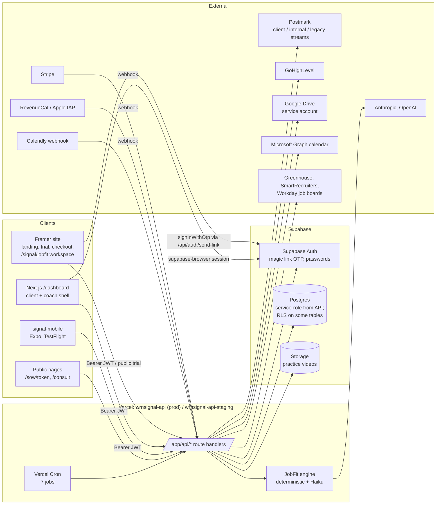

# Appendix A: Platform Overview and Architecture

Audit date: 2026-10-07. Branch inspected: `dev` (HEAD `f67e24a9`). Read-only audit of the repository at `C:\Users\perig\wrnsignal-api`.

**What this appendix can and cannot tell you.** Everything here comes from the files in the repo, the git log, and (where marked) the maintainer's working notes. The live Supabase databases, the Vercel dashboards, Postmark, Calendly, GoHighLevel, Stripe, RevenueCat and Google Drive were NOT inspected. "Built and wired (not verified live)" means code exists end to end in the repo; it does not mean it is deployed or working in production. Prod schema state in particular is known to drift from the migration folder (see section 9).

Status labels used throughout:

| Label | Meaning |
|---|---|
| BUILT AND FUNCTIONING | Code exists and is wired end to end. Used with "(not verified live)" because production was not inspected. |
| BUILT BUT INCOMPLETE | Code exists but a piece is missing, unwired, dormant, or half-built. |
| DESIGNED OR DOCUMENTED NOT IMPLEMENTED | A spec or doc exists; no application code. |
| PLANNED | Mentioned as future work only. |
| UNKNOWN OR NOT VERIFIED | Cannot be determined from the repo. |

---

## 1. What SIGNAL is, and how WRN relates to it

**Workforce Ready Now (WRN)** is the career coaching business run by Peri Ginsberg. **SIGNAL** is WRN's software platform. It has grown from a single product into two overlapping products sharing one codebase and one database:

1. **SIGNAL for job seekers (D2C).** A job-fit evaluation tool. A user pastes a job description and gets a deterministic decision (Priority Apply / Apply / Review / Pass) with WHY and RISK evidence, plus Positioning (resume tailoring guidance), Cover Letter, and Networking outputs, a Job Tracker, and a Network Tracker. Sold via a free trial (one run) and paid access (Stripe on web, Apple IAP via RevenueCat on mobile). Older docs describe the target audience as college students (`docs/ARCHITECTURE.md` section 1).
2. **SIGNAL Coaches Center (B2B / internal practice tooling).** The operating system for WRN's own coaching practice: client roster, prospects pipeline, SOW and Let's Go acceptance, packages/deliverables ("engagements"), phases and plan tasks, coach tasks with automation chains, workbooks, practice interview rounds, networking campaign briefs and plan PDFs, library documents, notes and history. Coached clients see a **Coaching Hub** in their dashboard.

The JobFit engine's deterministic logic is attributed in house messaging to Peri's hiring and executive search experience (memory: `feedback_signal_messaging_pillars.md`; tagline "Stop applying blind").

Related but separate:

| System | Where | Relationship to this repo |
|---|---|---|
| Framer marketing site + JobFit workspace | Framer projects (dev: `genuine-times-909123.framer.app`, prod: `wrnsignal.workforcereadynow.com`) | Front end for landing, trial, checkout, and the `/signal/jobfit` workspace. Source mirrored into `framer/dev/*.txt`, `framer/prod/*.txt`. Calls this repo's API. |
| SIGNAL mobile app | `signal-mobile/` (gitignored, untracked) | Expo / React Native app, calls prod API. TestFlight. |
| SIGNAL ANALYZE revenue dashboard | Separate repo `C:\Users\perig\wrn-signal-dashboard` (memory) | Not in this repo. Shared `DASHBOARD_PASSWORD` login. |
| SIGNAL PM tracker | Separate repo `C:\Users\perig\wrnsignal-pm`, own Supabase project (memory) | Roadmap and release scope. Not in this repo. |
| SIGNAL DNA assessment | Outside SIGNAL (live group session, hand-written report pages on a separate `wrn-client-portal` site) per `docs/signal-dna-site-and-integration-options.md` (untracked) | Not integrated. Methodology docs in `docs/professional-dna/` are explicitly DRAFT and "Nothing in this directory is implementable yet" (`docs/professional-dna/README.md`). |

---

## 2. Tech stack

| Layer | Technology | Evidence |
|---|---|---|
| Web app + API | Next.js 16.1.1 App Router, React 19.2.3, TypeScript 5 | `package.json` |
| Styling | Tailwind 4 (postcss) plus inline style tokens (`lib/theme/*`, `lib/dashboard-theme.ts`) | `package.json`, `app/dashboard/layout.tsx` |
| Database / auth / storage | Supabase (Postgres, Auth, Storage) via `@supabase/supabase-js` 2.90 | `package.json`, `supabase/migrations/` |
| Hosting | Vercel (Node runtime routes, Vercel Cron, `after()` background work) | `vercel.json`, `.vercel/project.json` (`projectName: wrnsignal-api`) |
| LLMs | Anthropic SDK (Haiku 4.5 for JobFit bullets/semantic gate; Sonnet and Opus model ids also referenced) and OpenAI SDK (used in `app/api/coverletter/route.ts`, `app/api/positioning/route.ts`, `app/api/jobfit/bulletGenerator.ts`) | grep of `claude-*` ids and `from "openai"` |
| Email | Postmark (`postmark` 4.x) | `lib/postmark.ts`, `lib/email/*` |
| Payments | Stripe 22 (web checkout + webhook + refunds); RevenueCat webhook for Apple IAP | `app/api/webhooks/stripe`, `app/api/checkout/*`, `app/api/stripe/refund`, `app/api/iap/revenuecat-webhook` |
| PDF / scraping | `puppeteer-core` + `@sparticuz/chromium` (networking plan PDF), `cheerio`, `mammoth` (docx), `read-excel-file`, `papaparse` | `lib/networking-plan/pdf.ts`, `package.json` |
| Tests | Vitest + Testing Library (components), tsx script suites (engine), JobFit regression harness | `package.json` scripts, `scripts/run-tsx-tests.mjs`, `tests/` |
| CI | GitHub Actions `CI`: tsc, vitest, tsx engine tests, JobFit regression; Node 24; no secrets | `.github/workflows/ci.yml` |
| Mobile | Expo 54, React Native 0.81, expo-router, `react-native-purchases` (RevenueCat), Supabase JS | `signal-mobile/package.json` |

There is **no Next.js middleware/proxy file** (`middleware.ts` / `proxy.ts` absent). All auth is per-route in API handlers and client-side in the dashboard layout.

---

## 3. Repository structure

| Path | What it is | Notes |
|---|---|---|
| `app/api/` | ~202 `route.ts` handlers (count via `find`) | The whole backend. Grouped below. |
| `app/api/_lib/` | Shared server helpers: `coachAuth.ts`, `meAuth.ts`, `authProfile.ts`, `coachedClient.ts`, `cors.ts`, `routeError.ts`, `jobfitEvaluator.ts`, `runSubject.ts`, conversions | `authProfile.ts` builds its admin client at module scope (older pattern). Also contains stray backup files (`jobfitEvaluator.corrupt-backup.ts`, `jobfitEvaluator.ts.bak-step9`). |
| `app/api/jobfit/` | JobFit engine (extract, scoring, decision, semantic gate, bullet renderer) and POST route | Covered in another appendix. |
| `app/api/_v4/`, `app/api/jobfit-v4-debug/`, `app/api/jobfit-engine/` | Alternate/experimental engine versions | `app/api/jobfit-engine/` has **251 tracked files including a committed `node_modules/`**. Status of these as live paths: UNKNOWN OR NOT VERIFIED. |
| `app/dashboard/` | Signed-in web app (client + coach) | Single client-side shell `app/dashboard/layout.tsx` (1,444 lines). |
| `app/sow/[token]`, `app/consult`, `app/checkout/*`, `app/feedback/*` | Public pages: SOW view/accept, consult booking form, checkout success, feedback | |
| `app/page.tsx` | **Unmodified create-next-app boilerplate** ("To get started, edit the page.tsx file") | The root URL of the API host shows Next.js template content. |
| `components/` | `feedback`, `icons`, `ui`, `workbook` | |
| `lib/` | Domain modules: `collab` (identity/scope/delegation), `tasks`, `automation`, `plan`, `phases`, `sow`, `prospects`, `workbook`, `practice`, `networking-plan`, `network-tracker`, `ghl`, `drive`, `calendly`, `email`, `ingest`, `jobs`, `jobfit`, `coach` (incl. `microsoftGraph.ts`), `theme`, `supabase/caller.ts`, `urls.ts` | |
| `supabase/migrations/` | 152 entries: SQL migrations from `20260206165724_remote_schema.sql` to `20261015_task_details.sql`, plus `_bundles/2026-08-prod-promotion.sql` | Applied by hand in the SQL editor, not via CLI (see section 9). `supabase/migrations_backup/` also exists. |
| `tests/` | ~40 subfolders by domain (`identity`, `coach-delegate`, `tasks`, `sow`, `calendly`, `ingest`, `jobfit-regression`, ...) | Many are tsx scripts, some hit live Supabase and are excluded from CI. |
| `scripts/` | 48 scripts: seeds (`seed-dev-fixture.ts`), `calendly-setup.ts`, verifiers (`verify-*.mjs`), lane runners, `run-tsx-tests.mjs` | |
| `framer/dev`, `framer/prod` | Text copies of 10 Framer code components each (`maincomponent.txt` 6,132 lines, `trialjobfit.txt`, `jobanalysis.txt`, `landingpage.txt`, `upgradepage.txt`, intake forms, banners, tracking) | Hand-mirrored; procedure in `MIRROR.md`. |
| `signal-mobile/` | Expo app | **Gitignored** (`.gitignore:17`). Not versioned in this repo. |
| `docs/` | Mixed-age docs: `ARCHITECTURE.md` (Feb/May 2026), `API.md`, `DATABASE.md`, JobFit specs, `Features/*` FRDs and runlog, `professional-dna/*`, `email/` (untracked), workbooks | Several are stale; see section 12. |
| Root | `DEVELOPMENT.md`, `MIRROR.md`, `CLAUDE.md`, `deploy-to-prod.ps1`, `vercel.json`, schema dumps (`prod_schema.sql`, `prod-schema-snapshot.sql`, `prod_public_schema.sql`), assorted debug/test output files | |

---

## 4. Architecture diagram

Plain-text summary: three front ends (Framer, Next.js dashboard, Expo app) all call one Next.js API on Vercel with a Supabase JWT as a Bearer token. The API uses the Supabase **service-role** key for almost everything and enforces authorization in TypeScript. External systems push in via three webhooks (Stripe, RevenueCat, Calendly) and Vercel Cron drives seven scheduled jobs.

---

## 5. Deployment and environments

### 5.1 Environment matrix

| Piece | Dev | Prod | Source |
|---|---|---|---|
| Git branch | `dev` (working branch) | `main` per DEVELOPMENT.md; in practice prod is promoted from dev deployments (see 5.3) | `DEVELOPMENT.md`, `deploy-to-prod.ps1` |
| Vercel project | `wrnsignal-api-staging` (`https://wrnsignal-api-staging.vercel.app`) | `wrnsignal-api` (`https://wrnsignal-api.vercel.app`) | `docs/API.md`, `MIRROR.md`, `.vercel/project.json` |
| Supabase | SIGNAL DEV `zydrqckpwidipwbhrfgd` | WRNSignal `ejhnokcnahauvrcbcmic` | `DEVELOPMENT.md`, `docs/signal-build-snapshot.md` |
| Framer | `genuine-times-909123.framer.app` | `wrnsignal.workforcereadynow.com` | `MIRROR.md`, `lib/urls.ts` |

`/api/version` (`app/api/version/route.ts`) reports `VERCEL_ENV`, `VERCEL_PROJECT_PRODUCTION_URL`, `git_sha`, `client_email_goes_live`, and JobFit version stamps. This is the intended way to check which build an environment runs. BUILT AND FUNCTIONING (not verified live).

### 5.2 Vercel Cron (`vercel.json`)

All cron routes check `Authorization: Bearer $CRON_SECRET`.

| Path | Schedule (UTC) | Purpose | Status |
|---|---|---|---|
| `/api/internal/monitor/artifact-writes` | `0 13 * * *` | Daily write monitor, alert email | BUILT AND FUNCTIONING (not verified live; memory says live in prod 2026-08-05) |
| `/api/internal/ingest/run-nightly/grnhse` | `0 3 * * *` | Greenhouse job-board ingest | BUILT AND FUNCTIONING (not verified live) |
| `/api/internal/ingest/run-nightly/smartrecruiters` | `30 4 * * *` | SmartRecruiters ingest | BUILT AND FUNCTIONING (not verified live) |
| `/api/internal/ingest/staleness` | `0 9 * * *` | Alerts if ingest is stale | BUILT AND FUNCTIONING (not verified live) |
| `/api/internal/lanes/run-due` | `0 9 * * *` | Runs due job-search lanes | BUILT AND FUNCTIONING (not verified live); prod lane schema state UNKNOWN (memory) |
| `/api/internal/automation/run` | `*/30 * * * *` | Sweeps unprocessed automation events (task chains, timers) | BUILT AND FUNCTIONING (not verified live) |
| `/api/internal/tasks/overdue-digest` | `0 11 * * *` | Overdue task digest email to coaches | BUILT AND FUNCTIONING (not verified live) |

Note: a `*/30` cron requires a Vercel plan that allows sub-daily crons; plan tier was not verified. Vercel crons run only on the production deployment of each project, so staging runs its own copies against dev only if the staging project's production deployment is current. UNKNOWN OR NOT VERIFIED.

Workday ingest code exists (`lib/ingest/workday.ts`) but has no cron entry. Postings enrichment (`lib/ingest/enrichPostings.ts`) is "not wired to any route or cron" per memory `project_prod_migration_queue.md`. BUILT BUT INCOMPLETE.

### 5.3 How code reaches production

- `deploy-to-prod.ps1`: refuses on modified tracked files, checks out and pulls `dev`, runs `tsc --noEmit`, pushes `dev`, **waits for the GitHub Actions `CI` run for that exact SHA to conclude success (fail-closed)**, then `npx vercel promote <latest dev deployment>`. BUILT AND FUNCTIONING (script reviewed, not executed).
- Memory notes (`feedback_deploy_strategy.md`, `feedback_promote_from_clean_worktree.md`, `feedback_name_deploy_target.md`) confirm prod is deployed by **`vercel promote`** of a dev-built deployment, never a `main` build, and that a promote drops `GIT_SHA` so prod `git_sha` may read null.
- Rollback: promote the previous good deployment in Vercel (DEVELOPMENT.md "Rolling back a code deploy"). Code only, never schema.

### 5.4 Environment variables (names only, from code)

Grouped by system; values were not read.

| System | Variables |
|---|---|
| Supabase | `SUPABASE_URL`, `SUPABASE_SERVICE_ROLE_KEY`, `SUPABASE_ANON_KEY`, `NEXT_PUBLIC_SUPABASE_URL`, `NEXT_PUBLIC_SUPABASE_ANON_KEY` |
| App URLs | `NEXT_PUBLIC_APP_URL`, `NEXT_PUBLIC_FRAMER_URL`, `APP_BASE_URL` (email sign-in links only), `INTAKE_REDIRECT_URL`, `SIGNAL_TRIAL_UPGRADE_URL`, `SIGNAL_ENTRY_MODE` |
| Postmark | `POSTMARK_API_KEY`, `POSTMARK_FROM_EMAIL`, `POSTMARK_MESSAGE_STREAM`, `POSTMARK_STREAM_CLIENT`, `POSTMARK_STREAM_INTERNAL`, `POSTMARK_FEEDBACK_FROM_EMAIL`, `SIGNAL_LIVE_EMAIL_HOST` |
| LLM | `ANTHROPIC_API_KEY`, `OPENAI_API_KEY`, `JOBFIT_BULLET_MODEL`, `JOBFIT_LLM_EXTRACTION`, `JOBFIT_DETECTORS`, `JOBFIT_LOGIC_VERSION`, `COHERENCE_TRIAL_ENABLED` |
| Payments | `STRIPE_SECRET_KEY`, `STRIPE_WEBHOOK_SECRET`, `NEXT_PUBLIC_STRIPE_PRICE_ID`, `REVENUECAT_WEBHOOK_AUTH` |
| Ad conversions | `META_PIXEL_ID`, `META_CAPI_ACCESS_TOKEN`, `META_TEST_EVENT_CODE`, `TIKTOK_*`, `GOOGLE_ADS_*`, `GA4_MEASUREMENT_ID`, `GA4_API_SECRET` |
| GoHighLevel | `GHL_API_KEY`, `GHL_LOCATION_ID`, `GHL_API_VERSION`, `GHL_WEBHOOK_SECRET`, `GHL_MAGIC_LINK_FIELD_ID`, `GHL_HOMEWORK_WEBHOOK_URL` |
| Google Drive | `GOOGLE_DRIVE_SA_EMAIL`, `GOOGLE_DRIVE_SA_PRIVATE_KEY`, `GOOGLE_DRIVE_SHARED_DRIVE_ID`, `GOOGLE_DRIVE_CLIENTS_ROOT_ID` |
| Calendly | `CALENDLY_WEBHOOK_SIGNING_KEY`, `CONSULT_CALENDLY_URL` |
| Microsoft calendar | `MICROSOFT_CLIENT_ID`, `MICROSOFT_CLIENT_SECRET`, `CALENDAR_BETA_PROFILE_IDS`, `COACH_TIMEZONE` |
| Ingest / monitoring | `INGEST_*`, `HEALTHCHECKS_PING_URL`, `MONITOR_ALERTS_ENABLED`, `SCRAPINGBEE_API_KEY`, `SERPAPI_KEY` (in `.env.local` only), `CHROME_PATH` |
| Internal gates | `CRON_SECRET`, `ANALYTICS_DASHBOARD_TOKEN`, `JOBFIT_TEST_KEY`, `NETWORKING_TEST_KEY`, `JOBFIT_INGEST_KEY`, `NEXT_PUBLIC_DEV_AUTH` |

`.env.example` lists only a subset (no Postmark, GHL, Drive, Calendly, RevenueCat, `CRON_SECRET`). DEVELOPMENT.md says to keep it in sync; it is not. Memory notes Vercel prod variables are marked Sensitive, so `vercel env pull` yields placeholders.

---

## 6. External integrations

| Integration | Where | What it does | Status |
|---|---|---|---|
| **Postmark: client stream** `signal-client` (env `POSTMARK_STREAM_CLIENT`) | `lib/email/send.ts` (`sendToClient`), `lib/postmark.ts` | Client-facing templated mail. Refuses templates that do not use the `signal-client` layout (WRN header + signature). Off production, redirects to `peri@workforcereadynow.com` with the intended recipient in the subject. | BUILT AND FUNCTIONING (not verified live) |
| **Postmark: internal stream** `signal-internal` (env `POSTMARK_STREAM_INTERNAL`) | `lib/email/send.ts`, `sendConsultBookedEmail.ts`, `sendLetsGoEmail.ts` | Coach/internal mail (task emails, consult booked, Let's Go). | BUILT AND FUNCTIONING (not verified live) |
| **Postmark: legacy stream** (env `POSTMARK_MESSAGE_STREAM`) | `sendClientInvite.ts`, `sendFeedbackNotification.ts`, `sendIngestAlert.ts`, `sendMonitorAlert.ts` | "The stream every pre-2026-09-26 sender uses". The stream's actual name (the brief calls it `signal-auth`/`outbound`) is not in the repo. | BUILT AND FUNCTIONING (not verified live); stream name UNKNOWN |
| Supabase Auth emails (magic link / OTP) | `signInWithOtp` in `app/api/auth/send-link`, `send-magic-link`, `coach/invite`, `iap/revenuecat-webhook`; `generateLink` in send-invite / seat-create | Sign-in emails are sent by Supabase's own mailer (SMTP config not in repo). Not covered by the non-prod redirect. | UNKNOWN OR NOT VERIFIED (SMTP provider) |
| Production gate for client mail | `isProduction()` in `lib/email/send.ts` | Requires `VERCEL_ENV=production` AND project host = `SIGNAL_LIVE_EMAIL_HOST` (default `wrnsignal-api.vercel.app`). Fixed 2026-09-28 after staging mailed a real client. | BUILT AND FUNCTIONING (not verified live) |
| **Calendly** | `app/api/webhooks/calendly/route.ts`, `lib/calendly/webhook.ts`, `scripts/calendly-setup.ts`, `tests/calendly/simulate.ts` | Signed `invitee.created` / `invitee.canceled` webhook. Creates prospect consults and (recent commits 946b298e, 780bbd5b) maps session bookings onto client plans. Prod-only registration. | BUILT AND FUNCTIONING (not verified live); session-mapping commits are on dev, prod status UNKNOWN |
| **Stripe** | `app/api/checkout/create-session`, `app/api/webhooks/stripe`, `app/api/stripe/refund`, `app/checkout/success` | One-time web checkout; webhook upserts `client_profiles`, sends sign-in link, inserts `purchases`, fans out ad conversions via `after()`. | BUILT AND FUNCTIONING (not verified live) |
| **RevenueCat / Apple IAP** | `app/api/iap/revenuecat-webhook`, `signal-mobile` (`react-native-purchases`) | Shared-secret webhook; purchase upsert + OTP; refund/cancel revoke; idempotent on `apple_transaction_id`. | BUILT AND FUNCTIONING (not verified live) |
| Ad conversion APIs | `app/api/_lib/conversions/*`, `app/api/conversions/event`, `app/api/track`, `app/api/track-landing` | Meta CAPI, TikTok, Google Ads, GA4; `conversion_log`, `landing_page_hits`. | BUILT AND FUNCTIONING (not verified live) |
| **GoHighLevel** | `lib/ghl/client.ts`, `contacts.ts`, `networkingPlanSync.ts`, `app/api/coach/coach-clients/[id]/ghl-contact`, `app/api/seat-create` | v2 API client with retry policy. Links a client to a GHL contact; networking-plan share requires it. `seat-create` writes a magic-link custom field. Prospects are NOT synced to GHL. | BUILT BUT INCOMPLETE (no prospect sync) |
| **Google Drive** | `lib/drive/client.ts`, `app/api/coach/coach-clients/[id]/drive-folder`, `lib/sow/*` | Service-account JWT over fetch; Shared Drive. Networking plan PDFs filed to client folder; Let's Go (4db4a4fe) creates a client workspace folder with subfolders and shares it (real share, not redirected off prod). | BUILT AND FUNCTIONING (not verified live) |
| Microsoft Graph calendar | `lib/coach/microsoftGraph.ts`, `app/api/coach/calendar/{connect,callback,today,disconnect}` | Coach "Today's schedule" card; beta-gated by `CALENDAR_BETA_PROFILE_IDS`. | BUILT BUT INCOMPLETE (beta allow-list) |
| Job boards | `lib/ingest/{greenhouse,smartrecruiters,workday}.ts`, `ingest_*` tables | Nightly posting ingest feeding lanes/sourcing. | Greenhouse/SmartRecruiters BUILT AND FUNCTIONING (not verified live); Workday BUILT BUT INCOMPLETE (no cron) |
| Anthropic / OpenAI | JobFit, positioning, cover letter, ingest extraction | LLM rendering and gated relevance. | BUILT AND FUNCTIONING (not verified live) |

---

## 7. How Supabase is used

### 7.1 Server access: service role first, RLS second

- **Almost every API route uses the service-role key** and therefore bypasses RLS. Roughly 172 of ~202 route files reference `SUPABASE_SERVICE_ROLE_KEY` or a `getSupabaseAdmin()` helper. `docs/API.md` states the same: "authorization is enforced in application code."
- `getSupabaseAdmin()` is **re-declared in many files** (`lib/collab/identity.ts`, `app/api/_lib/coachAuth.ts`, `app/api/_lib/meAuth.ts`, inline in many routes; `authProfile.ts` builds one at module load).
- **RLS-enforced exceptions:** `lib/supabase/caller.ts` `getCallerClient(req)` builds an anon-key client carrying the user's JWT, so RLS applies. Used by `lib/workbook/server.ts` and `lib/practice/server.ts` (workbook and practice-round routes). About 22 route files reach this path.
- Migrations enable RLS in 36 files and define about 52 policies. SQL helpers `current_profile_id()` and `coach_acting_ids()` (`20260923_coach_delegates.sql`) mirror the TypeScript access rules for those policies.
- `lib/collab/scope.ts` header states the residual risk plainly: the branded `SubjectId` narrows accidents but "cannot stop a route hand-writing `.eq("client_profile_id", someOtherString)`... Closing it needs RLS, which does not engage because every route uses the service-role client."

Status: authorization model BUILT AND FUNCTIONING (not verified live), with known structural weakness (service-role everywhere).

### 7.2 Authentication

| Mechanism | Where | Status |
|---|---|---|
| Magic link (OTP) gated by existing profile | `app/api/auth/send-link/route.ts`: 403 if no profile; redirects coach to `/dashboard/coach`, coached client to `/dashboard/coaching-hub`, `profile_complete` to `/dashboard/tracker`, else `/dashboard` | BUILT AND FUNCTIONING (not verified live) |
| Legacy seat-claim flow | `app/api/seat-create`, `seat-verify`, `send-magic-link` (hashed claim tokens in `signal_seats`) per `docs/ARCHITECTURE.md` section 3 | BUILT, current usage UNKNOWN OR NOT VERIFIED (`SIGNAL_ENTRY_MODE` dual / legacy_only / new_only) |
| Password sign-in | `app/dashboard/layout.tsx` `signInWithPassword()`, shown only when `NEXT_PUBLIC_DEV_AUTH=true` | BUILT, dev-only by design. Accounts created by `setup-account` / `create-client` via `auth.admin.createUser` can have passwords. |
| Coach-created accounts / invites | `app/api/coach/create-client`, `coach-clients/[id]/send-invite`, `coach-clients/[id]/setup-account`, `coach/clients/[clientId]/send-invite`, `coach/invite` | BUILT BUT INCOMPLETE: account creation exists in **three near-identical copies** (memory `project_account_creation_triplication.md`; `docs/signal-what-exists-today-2026-09-29.md` section 5). |
| Purchase-driven accounts | Stripe and RevenueCat webhooks create/confirm users then `signInWithOtp` | BUILT AND FUNCTIONING (not verified live) |
| Framer handoff | Framer passes the Supabase token to the dashboard (URL fragment); dashboard falls back to `sessionStorage.signal_handoff_token` (`app/dashboard/layout.tsx` ~line 770, `lib/signOut.ts`) | BUILT AND FUNCTIONING (not verified live) |

Browser sessions live in localStorage (`sb-<ref>-auth-token`); there is no `@supabase/ssr` and no server-side session cookie.

### 7.3 Identity resolution ("who is calling")

`lib/collab/identity.ts` is the canonical chain: Bearer JWT, `auth.getUser(token)`, then `client_profiles` by `user_id`, then **fallback by email** (claims only an unowned profile or one whose login no longer exists; otherwise `ForbiddenError` 403). `resolveCaller()` returns `{ profileId, isCoach }`. A test (`tests/identity/no-private-caller-lookups.test.ts`, present) is meant to forbid private copies. Status: BUILT AND FUNCTIONING (not verified live). Memory says round 1 of this consolidation is live in prod (2026-10-04), Groups C and D pending. Note `app/api/_lib/authProfile.ts` still carries its own `getBearerToken` / `getAuthedUser`.

### 7.4 Roles

| Role | How it is determined | Evidence |
|---|---|---|
| Client (D2C) | Any `client_profiles` row with `is_coach` not true | `lib/collab/identity.ts` `resolveCaller` |
| Coached client | Has a `coach_clients` row with `status='active'` (keyed on `status`, NOT `lifecycle_status`) | `app/api/_lib/coachedClient.ts` |
| Coach | `client_profiles.is_coach = true`. **No application path sets it**; only `scripts/seed-dev-fixture.ts` does. In prod it is set directly in the database. | grep `is_coach: true` |
| Delegate coach | Active row in `coach_delegates` (principal, delegate). Reaches principal's clients at principal's level; writes stamped with delegate's own id. Cannot add/remove coaches or remove clients. **No UI or API to create delegates**; DB only. | `lib/collab/delegation.ts`, `20260923_coach_delegates.sql`, memory `project_coach_delegates_live.md` |
| Admin / owner | **No such role in code.** Internal surfaces use shared secrets instead (`CRON_SECRET`, `ANALYTICS_DASHBOARD_TOKEN` for `/api/dashboard`, `JOBFIT_TEST_KEY`, `NETWORKING_TEST_KEY`). A coach UI string says a removed client "can be restored by an admin" (`app/dashboard/coach/clients/[clientId]/page.tsx` ~line 712), but there is no admin tooling. | grep `is_admin` returns nothing |

### 7.5 Coach-to-client access (`coach_clients`)

- One row per coach-client relationship: `status` (pending / active / paused / revoked), `access_level` (view / annotate / full), `lifecycle_status` (Prospect / Active / Inactive / Archived per the 2026-09-29 doc), plus `is_returning`, Drive folder, GHL contact, workspace folder (Let's Go).
- **Ladder** (`lib/collab/scope.ts`): read requires `view` (granted by view/annotate/full); write requires `full`. `annotate` never grants write. Only `status='active'` rows count.
- **Entry points:**
  - `resolveRequestScope(req, supabase, {require})`: reads `?client_profile_id=` itself, returns `{actorId, subjectId (branded), accessLevel, viaCoachId, actingAsDelegate, linkId}`; deny throws 403. Used by ~15 route files.
  - `resolveOwnerScope(req)`: owner-only.
  - `resolveCoach(req)` in `app/api/_lib/coachAuth.ts`: verifies `is_coach` and returns `coachProfileId` + `delegation`. ~39 route files.
  - `verifyCoachAccess()` in `lib/collab/access.ts`: older null-on-deny check. ~18 route files.
- **Multiple coaches per client** supported; API exists at `app/api/coach/clients/[clientId]/coaches` but no dashboard screen calls it (grep found no caller). BUILT BUT INCOMPLETE.
- Attribution helpers `createdBy()` / `editedBy()` / `authorRole()` stamp `created_by_role/id`. Migration `20261007_run_actor.sql` added these to positioning and cover letter runs.

---

## 8. Experiences by user type

### 8.1 Dashboard shell (`app/dashboard/layout.tsx`)

One client component renders the sign-in screen (magic link; dev-only password), resolves the session, calls `/api/profile` to learn `is_coach` and `coached`, and picks a nav:

| Nav | Groups and items |
|---|---|
| `D2C_NAV` (client) | MY ACCOUNT: Dashboard `/dashboard`, Job Tracker `/dashboard/tracker`, Networking `/dashboard/network`, My Profile `/dashboard/profile`; plus "Coaches Hub" `/dashboard/coaching-hub` inserted when coached; plus external "Work on a job" link to `${FRAMER_URL}/signal/jobfit` |
| `COACH_NAV` (coach) | COACHES CENTER: Dashboard, My Clients, My Prospects, Tasks, Practice. MY SETTINGS: Prospects, Services, Documents, Billing (disabled "Soon"). SUPPORT: Coaches Guide PDF (`/SIGNAL-Coach-Guide.pdf`), Feedback slide-in. ACCOUNT: Log out |

**Theming:** a light redesign is rolled out per route via `LIGHT_ROUTES` (network, tracker, profile, welcome, practice, `/dashboard` exact). The Coaches Center surface is switched by `COACH_SURFACE` in `lib/theme/coachSurface.ts`, currently `"light"`. Unconverted D2C routes keep the dark shell. BUILT BUT INCOMPLETE (redesign is incremental; memory `project_redesign_queue.md` lists deferred items).

### 8.2 Client (D2C and coached) surfaces

| Surface | Route | Status |
|---|---|---|
| Stateful home | `app/dashboard/page.tsx` (+ `dashboardState.ts`, `Nudges.tsx`) | BUILT AND FUNCTIONING (not verified live) |
| First-run welcome | `app/dashboard/welcome` (redesigned in 2ecb78a6) | BUILT AND FUNCTIONING on dev; prod UNKNOWN |
| Job Tracker | `app/dashboard/tracker`, `tracker/[applicationId]`, `tracker/interviews/[interviewId]`; API `app/api/applications`, `interviews`, `notes/applications` | BUILT AND FUNCTIONING (not verified live) |
| Networking (network tracker) | `app/dashboard/network`, `network/contacts`, `contacts/[contactId]`, `network/import`; `network/companies` is a redirect | BUILT AND FUNCTIONING (not verified live) |
| Profile and personas | `app/dashboard/profile`, `app/dashboard/personas`, `personas/[id]/edit` (up to 10 resume variants) | BUILT AND FUNCTIONING (not verified live) |
| Lanes (job search lanes) | `app/dashboard/lanes`, `lanes/[id]/edit`; API `app/api/lanes/*` | BUILT; prod schema state UNKNOWN (memory `project_lanes_not_in_prod.md`) |
| Coaching Hub (coached only) | `app/dashboard/coaching-hub` (741 lines), `coaching-hub/proof-project`; APIs under `app/api/me/*` (activities, documents, workbooks, practice-rounds, welcome, proof-project) | BUILT AND FUNCTIONING (not verified live) |
| Workbooks | `app/dashboard/workbooks/[workbookId]`, `summary` | BUILT AND FUNCTIONING (not verified live); RLS-backed |
| Practice rounds | `app/dashboard/practice/[roundId]` | BUILT; memory says migrations applied to prod 2026-09-29 |
| Coaching tools | `app/dashboard/coaching-tools` | Retired: permanent redirect to `/dashboard/coaching-hub` |
| JobFit / Positioning / Cover Letter workspace | **Framer** `/signal/jobfit` (`framer/*/maincomponent.txt`), calling `/api/jobfit`, `/api/positioning`, `/api/coverletter`, `/api/personas`, `/api/parse-job-text`, `/api/parse-job-url`, `/api/applications`, `/api/runs`, `/api/network/companies/link-application`, `/api/auth/send-link` | BUILT AND FUNCTIONING (not verified live). Three tools are tabs in one Framer page; the dashboard links to it as one external item. |
| Free trial | Framer `trialjobfit.txt` / `freetrialintake.txt` calling `/api/jobfit-run-trial` and `/api/jobfit-run-trial-open` | BUILT AND FUNCTIONING (not verified live) |
| Mobile app | `signal-mobile/app`: tabs `jobfit`, `positioning`, `coverletter`, `networking`, `tracker`, `profile`; trial, intake (3 steps), buy flow, login, `application/[id]` | BUILT, TestFlight only per `docs/signal-build-snapshot.md`; not versioned in git. Calls `https://wrnsignal-api.vercel.app` (prod) |

### 8.3 Coach surfaces (`app/dashboard/coach/*`)

| Surface | Route | Status |
|---|---|---|
| Coach Home | `coach/page.tsx`; API `app/api/coach/home` | BUILT AND FUNCTIONING (not verified live) |
| My Clients list and client record | `coach/clients`, `coach/clients/[clientId]` (2,198 lines) with tabs: Dashboard, Job Tracker, Source a Job, Lanes, Notes, Tasks, Profile & Personas, Engagements, Workbooks, Practice, Library, History | BUILT AND FUNCTIONING (not verified live) |
| Converted prospect without account | `coach/coach-clients/[id]` | BUILT AND FUNCTIONING (not verified live) |
| Prospects + pipeline + consult | `coach/prospects`, `prospects/[id]`, `prospects/[id]/consult`; API `app/api/coach/prospects`, `pipeline` | BUILT BUT INCOMPLETE (no backward stage move; memory `project_pipeline_followups.md`) |
| SOW send and public acceptance (Let's Go) | API `coach-clients/[id]/engagements/[engagement_id]/sow`, `sow/send`; public `app/sow/[token]`, `app/api/public/sow/[token]`, `/accept`; `lib/sow/*` | BUILT on dev (4ab2d09f, 4db4a4fe); prod promotion state UNKNOWN (memory says held to promote together) |
| Engagements, phases, plan tasks | API `coach-clients/[id]/engagements/*`, `phases`, `plan`, `plan/welcome`; `lib/plan`, `lib/phases` | BUILT (not verified live) |
| Tasks + automation | `coach/tasks`, `coach/required-actions`; API `app/api/coach/tasks`; `lib/tasks`, `lib/automation` | BUILT AND FUNCTIONING (not verified live) |
| Practice | `coach/practice`, `practice/[roundId]`, `clients/[clientId]/practice` | BUILT (not verified live) |
| Settings | `coach/settings` (Prospects, Services, Documents); Billing disabled | Billing PLANNED |
| Recent applications | `coach/applications-recent` | BUILT (not verified live) |
| Calendar card | API `app/api/coach/calendar/*` | BUILT BUT INCOMPLETE (beta allow-list) |
| Delegate management | none | DESIGNED OR DOCUMENTED NOT IMPLEMENTED (DB-only setup) |
| Client co-coach management UI | API only (`clients/[clientId]/coaches`) | BUILT BUT INCOMPLETE |

### 8.4 Internal / admin surfaces

| Surface | Gate | Status |
|---|---|---|
| `/api/dashboard` (HTML analytics page) | `ANALYTICS_DASHBOARD_TOKEN` via `?key=` or Bearer; 404 when unset; header notes "the page's data loader is paused" | BUILT BUT INCOMPLETE |
| `/api/internal/*` crons | `CRON_SECRET` | see 5.2 |
| `/api/reel`, `/api/canary`, `/api/ping`, `/api/version` | public | utility; `/api/reel` not inspected |
| SIGNAL ANALYZE revenue dashboard | separate repo, shared password | outside this repo |

---

## 9. Database migrations and drift

- Migrations are **applied by hand in the Supabase SQL Editor (or psql), dev first, then prod**. `supabase db push` is not used: dev's migration tracker was never seeded (memory `project_dev_migration_tracker_drift.md`), and DEVELOPMENT.md lists CLI migrations under "Things we should set up but haven't yet".
- Consequently, **the migration folder is not a reliable statement of prod schema.** Known history (memory `project_prod_migration_queue.md`, `project_prod_migration_drift_2026_05_26.md`, `project_lanes_not_in_prod.md`):
  - Prod was 5 migrations behind on 2026-05-26 (caused Coaches Dashboard 500s).
  - Commit `5aa29cd5` wrote columns prod's `ingest_runs` lacked; the nightly ingest failed silently for a day.
  - As of the memory note, still dev-only: `20260919_postings_enrichment.sql`, `20260919_postings_function_trading.sql`, `20260920_fingerprint_location_count.sql` (must precede any Workday board in prod).
  - Lane tables' prod state is genuinely unknown (contradictory probes).
  - Plan work `20261004/05/06` reported applied to prod 2026-10-04 (user-reported). `20261008_sow_text` and `20261010_coach_sow_settings` reported applied; `20261011`, `20261012_lets_go`, `20261013_welcome_templates`, `20261014_calendly_sessions`, `20261015_task_details` have no recorded prod application. UNKNOWN OR NOT VERIFIED.
- The 2026-09-29 doc lists `jobfit_feedback` and `positioning_feedback` as dev-only by design (`lib/devOnly.ts` fence; `docs/signal-build-snapshot.md`).
- Root-level `prod_schema.sql`, `prod-schema-snapshot.sql`, `prod_public_schema.sql` are point-in-time dumps of unknown date; do not treat as current.

Recommendation for the incoming partner: before relying on any table or column in prod, probe the exact artifact (memory `feedback_migration_probe_artifact.md`).

---

## 10. Module / workspace organization

The codebase is organized by **domain module in `lib/`** with thin route handlers in `app/api/`, though older routes still carry inline logic and their own admin clients.

| Domain | Library | API prefix | UI |
|---|---|---|---|
| Identity / access | `lib/collab/*`, `app/api/_lib/{coachAuth,meAuth,coachedClient}.ts` | all | layout.tsx |
| JobFit / Positioning / Cover letter | `app/api/jobfit/*`, `app/api/_lib/jobfitEvaluator.ts`, `lib/jobfit`, `lib/ai`, `lib/coherence` | `/api/jobfit*`, `/api/positioning`, `/api/coverletter`, `/api/runs` | Framer `/signal/jobfit`, mobile |
| Job tracking | `lib/signalApplications.ts`, `app/_lib/applicationStatuses.ts` | `/api/applications`, `/api/interviews`, `/api/notes` | `/dashboard/tracker` |
| Networking | `lib/network-tracker`, `lib/networking`, `lib/networking-plan`, `lib/briefs` | `/api/network/*`, `/api/networking`, `/api/coach/briefs` | `/dashboard/network`, coach client tabs |
| Sourcing / lanes / ingest | `lib/ingest`, `lib/jobs`, `lib/lane*.ts`, `lib/hiringcafe.ts` | `/api/lanes/*`, `/api/internal/ingest/*`, `/api/internal/lanes/*` | `/dashboard/lanes`, coach Source/Lanes tabs |
| Coaching practice ops | `lib/prospects`, `lib/sow`, `lib/plan`, `lib/phases`, `lib/tasks`, `lib/automation`, `lib/calendly`, `lib/welcome` | `/api/coach/*`, `/api/public/*`, `/api/webhooks/calendly` | `/dashboard/coach/*`, `/sow/[token]`, `/consult` |
| Client coaching content | `lib/workbook`, `lib/practice`, `lib/notes`, `lib/profile` | `/api/me/*`, `/api/coach/clients/[clientId]/*` | `/dashboard/coaching-hub`, `/dashboard/workbooks`, `/dashboard/practice` |
| Commerce / attribution | `app/api/_lib/conversions` | `/api/checkout/*`, `/api/webhooks/stripe`, `/api/iap/*`, `/api/track*`, `/api/conversions/*` | Framer, mobile |
| Messaging | `lib/postmark.ts`, `lib/email/*`, `lib/ghl/*`, `lib/drive/*` | n/a | n/a |

Two parallel coach-client route trees exist: `app/api/coach/clients/[clientId]/*` (keyed by client profile id) and `app/api/coach/coach-clients/[id]/*` (keyed by `coach_clients.id`, the relationship). Which one a feature uses depends on whether it hangs off the person or the relationship.

---

## 11. Capability status summary

| Capability | Status |
|---|---|
| Next.js API on Vercel, Supabase backend, dev/prod split | BUILT AND FUNCTIONING (not verified live) |
| CI gate (tsc, vitest, engine tests, JobFit regression) + fail-closed promote script | BUILT AND FUNCTIONING (not verified live) |
| Magic-link auth with profile gate and role-based redirect | BUILT AND FUNCTIONING (not verified live) |
| Password auth | BUILT, dev-only (`NEXT_PUBLIC_DEV_AUTH`) |
| Single caller lookup with email-claim refusal | BUILT AND FUNCTIONING (not verified live); Groups C and D pending per memory |
| Branded subject scope + access ladder + delegation | BUILT AND FUNCTIONING (not verified live) |
| RLS as primary enforcement | BUILT BUT INCOMPLETE (only workbook/practice paths use caller JWT) |
| Admin role | DESIGNED OR DOCUMENTED NOT IMPLEMENTED (does not exist; secrets used instead) |
| Delegate setup UI | DESIGNED OR DOCUMENTED NOT IMPLEMENTED |
| Co-coach management UI | BUILT BUT INCOMPLETE (API only) |
| Coach role provisioning | BUILT BUT INCOMPLETE (manual DB flag) |
| Postmark client/internal streams with non-prod redirect | BUILT AND FUNCTIONING (not verified live) |
| Legacy-stream senders (invite) bypassing redirect | BUILT BUT INCOMPLETE (per 2026-09-29 doc; not re-verified) |
| Calendly consult + session webhook | BUILT AND FUNCTIONING (not verified live); session mapping dev-only status UNKNOWN |
| Stripe web checkout / refunds | BUILT AND FUNCTIONING (not verified live) |
| RevenueCat IAP | BUILT AND FUNCTIONING (not verified live) |
| GoHighLevel contact link + networking plan sync | BUILT AND FUNCTIONING (not verified live); prospect sync not built |
| Google Drive folders and sharing | BUILT AND FUNCTIONING (not verified live) |
| Microsoft calendar card | BUILT BUT INCOMPLETE (beta) |
| Nightly ingest (Greenhouse, SmartRecruiters) | BUILT AND FUNCTIONING (not verified live) |
| Workday ingest, postings enrichment | BUILT BUT INCOMPLETE (no cron/route) |
| Light theme redesign | BUILT BUT INCOMPLETE (per-route rollout) |
| Coach Billing settings | PLANNED |
| Professional DNA in SIGNAL | DESIGNED OR DOCUMENTED NOT IMPLEMENTED (draft methodology only) |
| Mobile app | BUILT (TestFlight), source not in git |
| Analytics events (Phase 2) | BUILT BUT INCOMPLETE (11 writers stubbed with `TODO(analytics-phase-2)` per memory; not re-verified) |
| Migrations via CLI, tagged releases, monitoring/alerting, seed.sql | PLANNED (DEVELOPMENT.md "haven't yet"); a dev fixture seed exists in `scripts/seed-dev-fixture.ts` |

---

## 12. Contradictions and stale documentation

1. **How prod is deployed.** `DEVELOPMENT.md` says merge `dev` to `main` via PR and Vercel auto-deploys `main`. `deploy-to-prod.ps1` and memory say prod is a `vercel promote` of a dev-built deployment and never a `main` build. Code and memory agree with each other; DEVELOPMENT.md (last updated April 2026) is stale.
2. **Which Supabase staging/preview uses.** `DEVELOPMENT.md` says Preview deployments point at SIGNAL DEV. Memory `project_vercel_preview_uses_prod_env.md` says `wrnsignal-api` preview-target builds use the **prod** `SUPABASE_URL`. `docs/signal-build-snapshot.md` and the 2026-09-29 doc say the separate `wrnsignal-api-staging` project uses dev. Plausible reconciliation: staging is its own project (dev-backed), while previews of the prod project are prod-backed. Not verifiable from the repo.
3. **`docs/ARCHITECTURE.md`** (last edited 2026-05-03) describes a college-student JobFit product with seat-based access and "magic link only"; it does not mention the Coaches Center, delegates, tasks, SOWs or the dashboard. `docs/README.md` references `SIGNAL_ARCHITECTURE.md`, which does not exist.
4. **Coach surface comment vs code.** `app/dashboard/coach/layout.tsx` comment says `COACH_SURFACE` "is "dark" today"; `lib/theme/coachSurface.ts:40` sets it to `"light"`.
5. **Layout header comments** in `app/dashboard/layout.tsx` (Sprint 3 note) mention "Back to SIGNAL" and "My Account" in the coach nav; the actual `COACH_NAV` removed them.
6. **`.env.example`** is missing many required variables despite DEVELOPMENT.md saying to keep it in sync.
7. **Postmark stream names.** The audit brief names `signal-auth/outbound`; the repo only knows `signal-client`, `signal-internal`, and an env-configured legacy stream (`POSTMARK_MESSAGE_STREAM`) whose value is not in source.
8. **Lane tables in prod**: two memory sources disagree (absent on 2026-08-18 vs migrations that required them applied 2026-08-27).
9. **`docs/signal-what-exists-today-2026-09-29.md`** (untracked) is the most accurate prose overview but predates phases/plan tasks, SOW, Let's Go, welcome templates and Calendly sessions (commits after 2026-10-03), and it lists six uncommitted fixes whose commit status was not re-verified here.
10. **Root `app/page.tsx`** is create-next-app boilerplate; anyone visiting the API host root sees template content.

---

## 13. Open questions for the incoming partner

- Which commit is live on `wrnsignal-api` prod right now, and which on `wrnsignal-api-staging`? (Check `/api/version` on both; prod `git_sha` may be null after a promote.)
- Which migrations after `20261010` are applied in prod?
- Is `app/api/jobfit-engine/` (with committed `node_modules`) or `app/api/_v4/` on any live path?
- Is the legacy seat flow (`seat-create` / `seat-verify` / `send-magic-link`, `SIGNAL_ENTRY_MODE`) still used by GoHighLevel purchases?
- Is Supabase Auth email sent through Postmark SMTP (and on which stream)?
- What Vercel plan tier hosts the `*/30` automation cron, and do staging crons run?

---

## 14. File reference index

| Topic | Files |
|---|---|
| Project docs | `CLAUDE.md`, `DEVELOPMENT.md`, `MIRROR.md`, `docs/ARCHITECTURE.md`, `docs/API.md`, `docs/DATABASE.md`, `docs/README.md`, `docs/signal-build-snapshot.md`, `docs/signal-what-exists-today-2026-09-29.md` (untracked), `docs/signal-dna-site-and-integration-options.md` (untracked), `docs/professional-dna/README.md` |
| Build / deploy | `package.json`, `vercel.json`, `.vercel/project.json`, `.github/workflows/ci.yml`, `deploy-to-prod.ps1`, `next.config.ts`, `vitest.config.ts`, `scripts/run-tsx-tests.mjs` |
| Environment URLs | `lib/urls.ts`, `app/api/version/route.ts`, `app/api/_lib/cors.ts` |
| Identity and access | `lib/collab/identity.ts`, `lib/collab/scope.ts`, `lib/collab/delegation.ts`, `lib/collab/access.ts`, `lib/collab/errors.ts`, `lib/collab/laneAccess.ts`, `app/api/_lib/coachAuth.ts`, `app/api/_lib/meAuth.ts`, `app/api/_lib/coachedClient.ts`, `app/api/_lib/authProfile.ts`, `app/api/_lib/routeError.ts`, `lib/supabase/caller.ts`, `lib/supabase-browser.ts`, `lib/signOut.ts`, `lib/devOnly.ts` |
| Auth routes | `app/api/auth/send-link/route.ts`, `app/api/auth/check-email-exists`, `app/api/auth/account-ready`, `app/api/send-magic-link/route.ts`, `app/api/seat-create/route.ts`, `app/api/seat-verify`, `app/api/coach/invite/route.ts`, `app/api/coach/create-client/route.ts`, `app/api/coach/coach-clients/[id]/send-invite/route.ts`, `app/api/coach/coach-clients/[id]/setup-account/route.ts`, `app/api/coach/clients/[clientId]/send-invite/route.ts`, `app/dashboard/accept-invite/page.tsx` |
| Key migrations (access) | `supabase/migrations/20260413_coach_client_system.sql`, `20260606_coached_client_slice1.sql`, `20260922_security_coach_clients_signal_interviews.sql`, `20260923_coach_delegates.sql`, `20261007_run_actor.sql` |
| Dashboard shell and nav | `app/dashboard/layout.tsx`, `app/dashboard/coach/layout.tsx`, `lib/theme/coachSurface.ts`, `lib/theme/surfaces.ts`, `lib/dashboard-theme.ts` |
| Client surfaces | `app/dashboard/page.tsx`, `app/dashboard/welcome`, `app/dashboard/tracker`, `app/dashboard/network`, `app/dashboard/profile`, `app/dashboard/personas`, `app/dashboard/lanes`, `app/dashboard/coaching-hub/page.tsx`, `app/dashboard/workbooks`, `app/dashboard/practice` |
| Coach surfaces | `app/dashboard/coach/page.tsx`, `coach/clients/[clientId]/page.tsx`, `coach/coach-clients/[id]/page.tsx`, `coach/prospects/*`, `coach/tasks`, `coach/required-actions`, `coach/practice`, `coach/settings/*`, `coach/applications-recent` |
| Public pages | `app/sow/[token]`, `app/sow/SowView.tsx`, `app/consult/page.tsx`, `app/checkout/*`, `app/feedback/*`, `app/page.tsx` |
| Internal / cron | `app/api/internal/automation/run`, `app/api/internal/ingest/run-nightly/[source]`, `app/api/internal/ingest/staleness`, `app/api/internal/lanes/run-due`, `app/api/internal/monitor/artifact-writes`, `app/api/internal/tasks/overdue-digest`, `app/api/dashboard/route.ts` |
| Email | `lib/postmark.ts`, `lib/email/send.ts`, `lib/email/sendClientInvite.ts`, `lib/email/sendTaskEmails.ts`, `lib/email/sendNetworkingPlanReady.ts`, `lib/email/sendPracticeRound.ts`, `lib/email/sendLetsGoEmail.ts`, `lib/email/sendConsultBookedEmail.ts`, `lib/email/signature.ts` |
| Webhooks / payments | `app/api/webhooks/calendly/route.ts`, `lib/calendly/webhook.ts`, `scripts/calendly-setup.ts`, `app/api/webhooks/stripe/route.ts`, `app/api/checkout/create-session/route.ts`, `app/api/stripe/refund`, `app/api/iap/revenuecat-webhook/route.ts`, `app/api/_lib/conversions/` |
| Other integrations | `lib/ghl/client.ts`, `lib/ghl/contacts.ts`, `lib/ghl/networkingPlanSync.ts`, `lib/drive/client.ts`, `lib/coach/microsoftGraph.ts`, `app/api/coach/calendar/*`, `lib/ingest/*` |
| Front ends outside Next | `framer/dev/*.txt`, `framer/prod/*.txt` (esp. `maincomponent.txt`), `signal-mobile/app/**` (untracked), `signal-mobile/package.json` |
| Maintainer memory (outside repo) | `C:\Users\perig\.claude\projects\C--Users-perig-wrnsignal-api\memory\` (`project_prod_migration_queue.md`, `project_coach_delegates_live.md`, `project_lanes_not_in_prod.md`, `project_sow_letsgo.md`, `project_plan_tasks_build.md`, `project_calendly_phase3_live.md`) |
