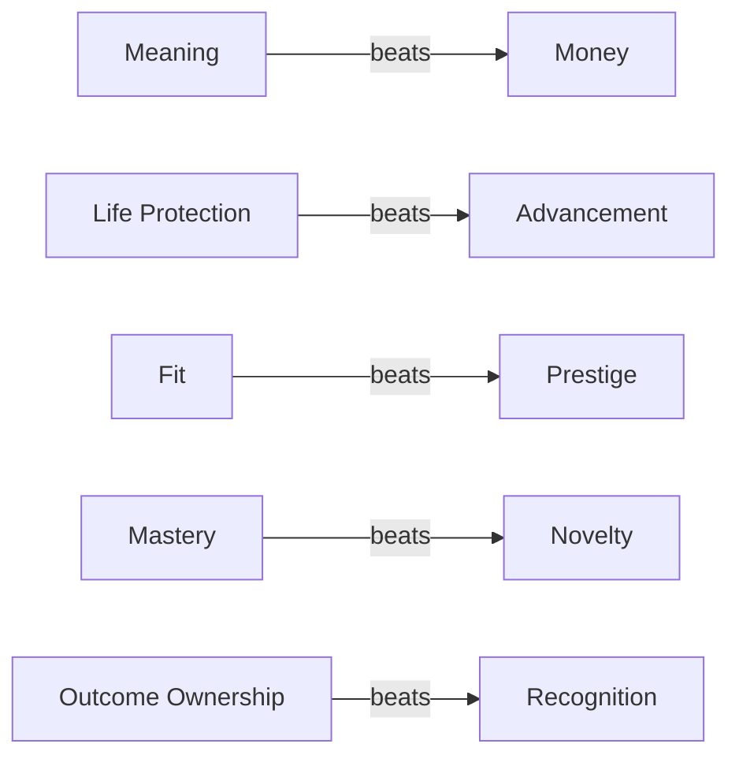
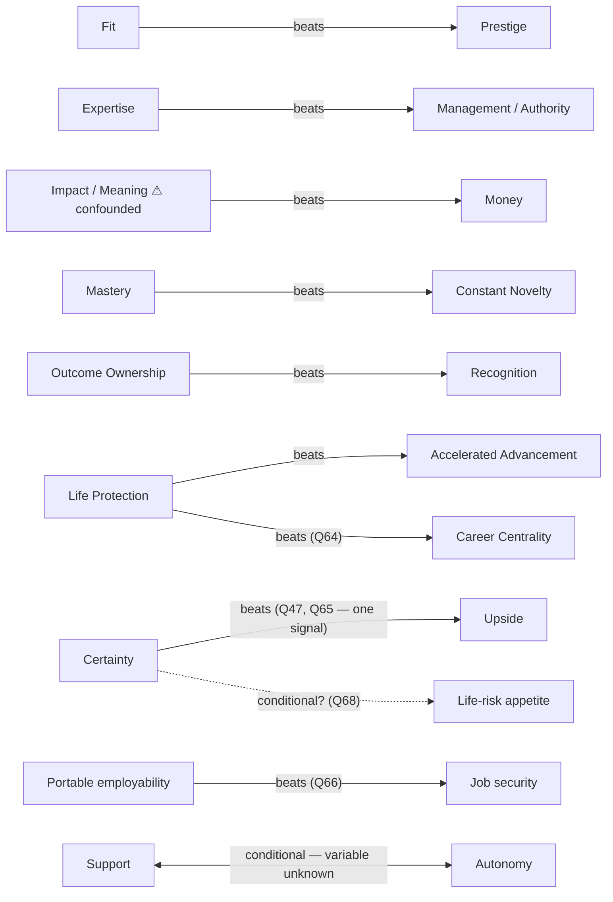

# 11 · Tradeoff model

**Status:** REVIEW
**Methodology version:** v0.8
**Owner:** Peri Ginsberg
**Last updated:** 2026-08-23

---

## Purpose

Define how Professional DNA interprets **forced tradeoffs between desirable outcomes**, and
how that evidence contributes to:

| Consumer | What it takes from here |
|---|---|
| [Needs / Strong Preferences / Flexibility](02-needs-preferences-flexibility.md) | The qualification pathway — see [§6](#6--connection-to-needs--preferences--flexibility) |
| [DECODED insights](06-decoded-insights.md) | Contributing evidence, one-directionally — see [§9](#9--decoded-boundary) |
| Career Trajectory (CNL R2) | What the client protects when a path forces a choice |
| Opportunity / Offer Evaluation (CNL R9) | The same, applied to a real offer |

**The Tradeoff Model must NOT collapse a person into a simple ranked-value list.** A ranked
list of values is the failure mode this document exists to prevent. It reads as insight, it
is easy to compute, and it is wrong.

---

## 1 · Core principle

> **Tradeoffs reveal what a person protects when they cannot have everything.**

Two consequences, both binding:

**A single tradeoff answer is not enough to define a Need.** One forced choice is one data
point under one scenario. It is not a trait.

**SIGNAL looks for repeated patterns across materially different tradeoffs**, supported
where possible by real-life evidence and clarifiers. "Materially different" is doing real
work in that sentence — see [§4 Consistency](#4--consistency).

This principle is the tradeoff-specific form of **P9** (contradictions trigger
clarification, not averaging) and **P12** (every statement traceable to its evidence). See
[00-methodology-principles.md](00-methodology-principles.md).

---

## 2 · The model

Each tradeoff response is **directional evidence between two constructs or outcomes**.

Written as `A > B` — read as *"in this scenario, A was protected over B"*, never as *"A
matters more than B."*

Examples of the form:

```
Life Protection   >  Advancement
Meaning           >  Money
Fit               >  Prestige
Mastery           >  Novelty
Outcome Ownership >  Recognition
```

### What a tradeoff record captures — conceptually

**This is a conceptual record, not a schema.** No implementation shape is designed here; see
[§10](#10--relationship-to-the-result-schema) for why, and what
[07-result-schema.md](07-result-schema.md) still has to decide.

| Field | Captures |
|---|---|
| **Participant A** | The construct or outcome on one side |
| **Participant B** | The construct or outcome on the other side |
| **Selected side** | Which was protected |
| **Question / evidence source** | Which item produced this, or which real-life evidence did |
| **Scenario context** | The situation the choice was posed in |
| **Stakes level** | low / moderate / high — see [§3](#3--stakes) |
| **Isolation** | Are the participants directly isolated, or confounded? — see [§2-participants](#2--participants) |
| **Confidence in interpretation** | How much this record should count |
| **Conditioning variable** | Any known variable the outcome depends on — see [§5](#5--conditionality) |

---

## Four tradeoff dimensions

Every tradeoff record is read along four dimensions. **Exact thresholds are OPEN in all
four.**

---

### 2 · PARTICIPANTS

*Which constructs or outcomes are truly being compared?*

> **Isolation rule.** A question can only contribute **strong** tradeoff evidence if the
> competing choices are sufficiently isolated.
>
> If a choice bundles several factors, mark it as **lower-confidence tradeoff evidence**, or
> rewrite it in Assessment v2.

**Worked comparison:**

| Weaker | Stronger | Why |
|---|---|---|
| `Money vs Autonomy + Manager Involvement` | `Money vs Freedom` | The first bundles at least two constructs on one side ([4.8 Freedom](01-construct-registry.md#48--freedom) and [1.1 Guidance / Development Support](01-construct-registry.md#11--guidance--development-support)). A win tells you the bundle beat Money — not which half did the work. |

A confounded tradeoff is **not discarded**. It is recorded with its confounding named, and
weighted lower. How much lower is [D-TM-04](OPEN-DECISIONS.md#d-tm-04).

#### Node vocabulary — an unresolved gap

The example tradeoffs above and in [§7](#7--worked-example--maleri) use node names that do
**not** all map onto the [construct registry](01-construct-registry.md). This matters,
because a graph whose nodes are half constructs and half loose outcomes cannot be reasoned
about consistently.

| Node used in examples | Registry construct | State |
|---|---|---|
| Life Protection | [5.1](01-construct-registry.md#51--life-protection) | ✅ maps |
| Meaning | [4.1](01-construct-registry.md#41--meaning) | ✅ maps |
| Money | [4.6](01-construct-registry.md#46--money) | ✅ maps |
| Prestige | [4.10](01-construct-registry.md#410--prestige) | ✅ maps |
| Mastery | [4.4](01-construct-registry.md#44--mastery) | ✅ maps |
| Outcome Ownership | [3.1](01-construct-registry.md#31--outcome-ownership) | ✅ maps |
| Recognition | [4.9](01-construct-registry.md#49--recognition) | ✅ maps |
| Impact | [4.2](01-construct-registry.md#42--impact) | ✅ maps |
| Management / Authority | [3.2 Formal Leadership](01-construct-registry.md#32--formal-leadership) | ✅ probably maps |
| Autonomy | [4.8 Freedom](01-construct-registry.md#48--freedom) | ✅ probably maps |
| Support | [1.1 Guidance / Development Support](01-construct-registry.md#11--guidance--development-support) | ✅ probably maps |
| Upside | [5.4 Upside / Risk](01-construct-registry.md#54--upside--risk) | ✅ probably maps |
| **Fit** | — | ❌ **no construct** |
| **Advancement** | — | ❌ no construct; candidates: 3.2, [4.5 Achievement](01-construct-registry.md#45--achievement), [5.5 Growth Need](01-construct-registry.md#55--growth-need) |
| **Novelty** | — | ❌ no construct; candidates: [1.6 Stimulation](01-construct-registry.md#16--stimulation), [1.3 Predictability / Change](01-construct-registry.md#13--predictability--change) |
| **Expertise** | — | ❌ no construct; candidates: 4.4, [6.1 Mastery vs Breadth](01-construct-registry.md#61--mastery-vs-breadth) |
| **Certainty** | — | ❌ no construct; candidates: [4.7 Security](01-construct-registry.md#47--security), [5.3 Stability](01-construct-registry.md#53--stability) |
| **Compensation upside** | — | ❌ **itself a bundled node** — Money × Upside/Risk. The isolation rule applies to nodes, not only to sides. |
| **Portable employability** | — | ❌ no construct; candidates: [4.4 Mastery](01-construct-registry.md#44--mastery), [4.8 Freedom](01-construct-registry.md#48--freedom) (portability as optionality). Added 2026-08-22 from Q66. |
| **Job security** | — | ❌ no construct; candidates: [4.7 Security](01-construct-registry.md#47--security), [5.3 Stability](01-construct-registry.md#53--stability). Added 2026-08-22 from Q66. Note it is **distinct from `Certainty`** — Q47/Q65 chose financial certainty while Q66 declined job security, so mapping both onto Security would erase a real difference. |

Whether a non-construct outcome is a legitimate graph node — and if so, how it relates to
the registry — is [D-TM-09](OPEN-DECISIONS.md#d-tm-09). It is the largest unresolved
question in this document, because it decides what the graph is a graph *of*.

---

### 3 · STAKES

*How meaningful is the sacrifice?*

A preference revealed when **both options are attractive and materially different** carries
more evidence than a superficial forced choice.

Working categories — **exact definitions OPEN**, [D-TM-01](OPEN-DECISIONS.md#d-tm-01):

| Level | Working sense |
|---|---|
| **low** | The sacrifice is small, hypothetical, or one option is not genuinely attractive |
| **moderate** | A real cost, but recoverable or bounded |
| **high** | A material, durable sacrifice the person would actually feel |

Stakes are a property of **the scenario**, not of the participants. The same pair at
different stakes is a different record.

Whether one very high-stakes result can outweigh several low-stakes wins is
[D-TM-07](OPEN-DECISIONS.md#d-tm-07).

---

### 4 · CONSISTENCY

*Does the same construct repeatedly win across different pairings and contexts?*

```
Life Protection > Advancement
Life Protection > Prestige
Life Protection > Compensation upside
```

**Repeated protection across different opponents is stronger evidence than winning the same
comparison twice.** Beating the same opponent three times is close to one data point
repeated; beating three different opponents is three.

This is why the model is a [graph](#tradeoff-graph) and not a tally.

Whether opponent diversity is formally required, and how many independent wins contribute to
Need-level evidence, are [D-TM-03](OPEN-DECISIONS.md#d-tm-03) and
[D-TM-02](OPEN-DECISIONS.md#d-tm-02).

---

### 5 · CONDITIONALITY

*Does the tradeoff outcome change based on a meaningful variable?*

Candidate conditioning variables:

`competence` · `familiarity` · `stakes` · `trust` · `financial floor` · `life stage` ·
`manager quality`

> **Conditionality is not averaged away. It becomes a conditional interpretation.**

A person who chooses Autonomy when competent and Support when not is not "moderate on
autonomy." That is the **P9** failure applied to tradeoffs: the midpoint is a number nobody
holds. The correct output is the condition, stated.

How a conditional tradeoff is represented — a single record with a condition, two records,
or something else — is [D-TM-05](OPEN-DECISIONS.md#d-tm-05).

---

## Tradeoff graph

The conceptual structure. Major constructs and outcomes are **nodes**; every meaningful
forced tradeoff creates a **directional edge**.



Read as: *in the scenarios tested, the source node was protected over the target node.*

> ### ⚠️ The graph is evidence, not a ranking
>
> **Do NOT simply total wins and declare a universal value ranking.**
>
> Four things the tally throws away:
>
> 1. **Context** — a win at low stakes is not a win at high stakes ([§3](#3--stakes)).
> 2. **Opponent strength** — beating a weak opponent is not beating a strong one.
> 3. **Repeated protection** — three wins over one opponent ≠ three wins over three
>    ([§4](#4--consistency)).
> 4. **Real-life evidence** — what the person has actually done, available only at Stage 2
>    ([09-context-boundary.md](09-context-boundary.md)).
>
> The graph is also **not required to be acyclic**. A cycle (`A > B`, `B > C`, `C > A`) is
> not a data error — it is a signal that the three edges were measured under different
> scenarios or conditions, and it should route to a clarifier rather than be resolved by
> arithmetic.

Whether edges carry numeric weights or only evidence categories is
[D-TM-06](OPEN-DECISIONS.md#d-tm-06).

---

## 6 · Connection to Needs / Preferences / Flexibility

The classification framework lives in
[02-needs-preferences-flexibility.md](02-needs-preferences-flexibility.md). This section
defines the **tradeoff-evidence pathway into it** — one pathway, not the only one.

**Working methodology. Numeric thresholds are NOT final.**

### NEED

A factor may qualify as a Need **only when all six hold**:

1. Directional evidence is **strongly consistent**.
2. The factor is **repeatedly protected across materially different tradeoffs**.
3. **Absence appears consequential** — losing it costs something real.
4. **Real-life evidence supports the interpretation** where available.
5. **No unresolved high-impact contradiction remains.**
6. **Confidence is sufficient** — [04](04-evidence-and-confidence.md) now defines this as
   internal state **C3**, reached across five dimensions (Coverage · Consistency ·
   Independence · Consequence · Resolution). Note that C3 **permits** a Need classification;
   it does not create one. The threshold for C3 itself is
   [D-EC-12](OPEN-DECISIONS.md#d-ec-12), still open — so this criterion remains unevaluable.

### STRONG PREFERENCE

Clearly preferred and meaningful, but **can be traded away for higher-priority outcomes**.

### FLEXIBLE / RANGE

Tradeoff choices **vary by context**, or the factor **repeatedly loses without evidence of
material consequence**.

### UNRESOLVED

Evidence is **sparse, conflicting, or dependent on a variable not yet understood**.

> **Note — this introduces a fourth state.**
> [02](02-needs-preferences-flexibility.md) currently defines **three** tiers. `UNRESOLVED`
> is new here. Whether it is a fourth tier, or the absence of a classification, is
> [D-NPF-08](OPEN-DECISIONS.md#d-npf-08) — deliberately not decided in this document, because
> it changes the shape of the framework in 02 rather than the tradeoff model.
>
> Naming also differs: 02 calls tier 3 "Flexibility"; this document says "Flexible / Range."
> Same [D-NPF-08](OPEN-DECISIONS.md#d-npf-08).

---

## 7 · Worked example — Maleri

> ### This is a WORKED EXAMPLE, not a locked canonical interpretation.
>
> It demonstrates **how repeated tradeoffs form a pattern**. It is not an approved reading of
> this person, it does not classify any factor as a Need, and it must not be cited as one.
>
> **Provenance.** Supplied by Peri in two parts, both 2026-08-22: first the six tradeoff
> outcomes in Table A rows 1–6, then the item-level evidence (Q47, Q61–Q72, Q82) that
> completed it. The **full item wording, the option sets, and the stakes levels are still not
> in this repository.** Consequences, applied throughout below:
>
> - Every `Stakes` cell remains `OPEN` — stakes is a property of the scenario
>   ([§3](#3--stakes)), and the scenarios were not supplied.
> - For Q61–Q72 the **selected option is known but the losing options are not.** Under
>   [§2 Participants](#2--participants) a directional edge needs *both* participants. Those
>   items therefore appear in **Table B as construct-level evidence, not as graph edges.**
>   That distinction is not pedantry — it is the difference between "X beat Y" and "X was
>   chosen from an unknown field."

### Table A — Directional edges *(both participants known)*

| # | Source | Protected | Over | Stakes | Isolation | Note |
|---|---|---|---|---|---|---|
| 1 | — | Fit | Prestige | OPEN | OPEN | `Fit` is not a registry construct — [D-TM-09](OPEN-DECISIONS.md#d-tm-09) |
| 2 | — | Expertise | Management / Authority | OPEN | OPEN | `Expertise` unmapped; opponent ≈ [3.2 Formal Leadership](01-construct-registry.md#32--formal-leadership) |
| 3 | — | Impact / Meaning | Money | OPEN | ⚠️ **confounded** | Two constructs ([4.2](01-construct-registry.md#42--impact), [4.1](01-construct-registry.md#41--meaning)) on one side. Lower-confidence per the isolation rule. |
| 4 | — | Mastery | Constant Novelty | OPEN | OPEN | `Novelty` unmapped |
| 5 | — | Outcome Ownership | Recognition | OPEN | OPEN | Both map cleanly — [3.1](01-construct-registry.md#31--outcome-ownership) over [4.9](01-construct-registry.md#49--recognition) |
| 6 | — | Life Protection | Accelerated Career Advancement | OPEN | OPEN | `Advancement` unmapped |
| 7 | **Q47** | **Certainty** | **Upside** | OPEN | clean | *"You know exactly what you'll earn for several years."* **Financial** certainty. `Certainty` unmapped — candidates [4.7 Security](01-construct-registry.md#47--security), [5.3 Stability](01-construct-registry.md#53--stability). |
| 8 | **Q65** | **Certainty** | **Upside** | OPEN | clean | Predictable $100K over a lower base with upside. ⚠️ **Same pair as row 7** — see the repeat note below. |
| 9 | **Q64** | **Life Protection** | **Career Centrality** | OPEN | clean | Wants both; life outside work wins *if forced*. Maps cleanly: [5.1](01-construct-registry.md#51--life-protection) over [5.2](01-construct-registry.md#52--career-centrality). |
| 10 | **Q66** | **Portable employability** | **Job security** | OPEN | clean | Portable skill security over job security. Both nodes unmapped — [D-TM-09](OPEN-DECISIONS.md#d-tm-09). |

> **⚠️ Rows 7 and 8 are one opponent, not two.** Both pit financial certainty against
> financial upside. Under [§4 Consistency](#4--consistency), *"beating the same opponent
> twice is closer to one data point repeated"* — so this is **one** certainty-over-upside
> signal observed twice, not two independent wins. A tally would score it 2. The model does
> not.

**Nine distinct edges across ten observations.** Life Protection is the only node with two
*different* opponents (Accelerated Advancement, Career Centrality) — and see the caveat on
material difference below.

### Table B — Construct-level evidence *(selected option known, field unknown)*

Not graph edges. Supporting evidence for a construct's reading.

| Source | Answer | Supports | Note |
|---|---|---|---|
| **Q61** | D — meaningful difference | [4.1 Meaning](01-construct-registry.md#41--meaning) | |
| **Q62** | D — meaningless work would bother her most | [4.1 Meaning](01-construct-registry.md#41--meaning) | ⭐ **Absence framing.** Phrased as what would *bother* her — evidence that the absence is consequential, which is Need criterion 3. Rare and valuable; most items measure presence. |
| **Q69** | A — direct visible human impact | [4.3 Impact Proximity](01-construct-registry.md#43--impact-proximity), [4.2 Impact](01-construct-registry.md#42--impact) | Specifically **proximal** impact. Bears directly on [D-CR-04](OPEN-DECISIONS.md#d-cr-04) — proximity behaving as its own axis here, not as an Impact modifier. |
| **Q70** | D — unexpected money means enjoying life more | [4.6 Money](01-construct-registry.md#46--money) *meaning axis* | See [money meaning](#money-meaning--q70--q82) below. |
| **Q71** | E — reputation: someone people can always count on | — | Node unmapped. Content is *reliability*, not standing. Informative as a **negative** on [4.10 Prestige](01-construct-registry.md#410--prestige) / [4.9 Recognition](01-construct-registry.md#49--recognition): the reputation she wants is not a prestige reputation. |
| **Q72** | D — most hates becoming accomplished but consumed by work | [5.1 Life Protection](01-construct-registry.md#51--life-protection) | ⭐ **Absence framing**, and it names a specific failure state — accomplishment *purchased with* life. Also a negative on [4.5 Achievement](01-construct-registry.md#45--achievement) as an unconditional good. |
| **Q68** | A — *"I played it too safe"* would feel worse | [5.4 Upside / Risk](01-construct-registry.md#54--upside--risk) | ⚠️ Regret-framed, and the **losing option was not supplied** — "worse" implies a comparison whose other side is unknown. Central to the [risk cluster](#the-risk--certainty-cluster--four-axes-not-one) below. |

### Table C — Invariance probes

Two items test whether a factor **survives the removal of something else**. That is neither a
forced choice nor an intensity rating — it probes the *absence* of a condition, which makes
it the natural instrument for [§5 Conditionality](#5--conditionality).

| Source | Probe | Result |
|---|---|---|
| **Q63** | Does Freedom survive financial comfort? | **C — yes.** Freedom over time and choices still matters when financially comfortable. Evidence that [4.8 Freedom](01-construct-registry.md#48--freedom) is **not merely instrumental to Money** — it holds when the money pressure is removed. |
| **Q67** | Does success survive invisibility? | **A — yes.** Success matters even if nobody knows the title, employer, salary or accomplishments. Four external markers removed at once, and the factor holds. Strong reinforcement of edges 1 and 5. |

> **Observation for [D-AA-02](OPEN-DECISIONS.md#d-aa-02), not a decision.** "Invariance probe"
> is not currently one of the candidate item types in
> [03-assessment-architecture.md](03-assessment-architecture.md). These two items suggest it
> may deserve to be one — it produces conditionality evidence no forced choice can. Recorded
> for Peri to accept or reject; it is not added to the item-type list here.

### Real-life / future evidence — Q82

> *"Live close to friends, financially comfortable enough to get the little things that I
> enjoy."* — described as a genuinely happy life at 30.

Supports [5.1 Life Protection](01-construct-registry.md#51--life-protection) (proximity to
people, outside work), and the money reading below. Note what it does **not** contain:
title, employer, income level, or achievement.

> **⚠️ This is an aspiration, not a corroboration.** Q82 was produced *inside* the
> assessment, so it is Stage 1 admissible by channel
> ([09-context-boundary.md](09-context-boundary.md)). But it describes a **projected future**,
> not lived experience. Need criterion 4 asks for *real-life evidence where available* —
> Stage 2 material such as a resume or coach notes. Q82 does **not** satisfy it. Treating a
> stated aspiration as real-life corroboration would quietly convert self-report into
> evidence of behaviour.

### Money meaning — Q70 + Q82

[Construct 4.6 Money](01-construct-registry.md#46--money) is specified as a **two-part**
measurement: importance, and *meaning* — one or more of `scoreboard · safety · freedom ·
enjoyment · providing for others`.

Q70 (unexpected money → enjoying life more) and Q82 (*"financially comfortable enough to get
the little things that I enjoy"*) both point at **enjoyment / comfort**, and neither points
at **scoreboard**. Edge 3 (Impact/Meaning over Money) and Q67 (success without visible
salary) are consistent with that.

This is the **first concrete instance of the meaning axis carrying real weight** — two
clients with identical Money *importance* and different meanings need different paths, and
here the meaning is legible while the importance is not.

It does **not** resolve [D-CR-09](OPEN-DECISIONS.md#d-cr-09), which asks how the axis is
*designed* — single- or multi-select, ranked, exhaustive, and whether it is asked at all when
importance is low. One person's answer is not an axis design.

### Conditional candidate — Support vs Autonomy

Recorded as a **candidate conditional**, not as an edge in either direction. It is the
reason this document has a [conditionality dimension](#5--conditionality).

The conditioning variable is **not known** — `competence` and `familiarity` are the obvious
candidates given edges 2 and 4, but that is an inference, not evidence. It is
[D-TM-05](OPEN-DECISIONS.md#d-tm-05) in miniature, and should route to a clarifier
([05-adaptive-clarifiers.md](05-adaptive-clarifiers.md)).

Averaging it into "moderate autonomy" would be exactly the failure [§5](#5--conditionality)
forbids. Note that Q63 makes this *more* interesting, not less: Freedom holds when money
pressure is removed, so any Support-over-Autonomy result is not a Freedom-is-weak result.

>  **Now backed by a locked definition.** [DL-009](DECISION-LOG.md#dl-009) locked
> [1.1 Guidance / Development Support](01-construct-registry.md#11--guidance--development-support)
> as **contextual / conditional** and as **orthogonal to autonomy**. The reading above is no
> longer an inference about two loosely-defined constructs — it follows from 1.1's canonical
> definition. **The conditioning variable is still unknown and deliberately unlocked**
> ([D-CR-13](OPEN-DECISIONS.md#d-cr-13)); competence and familiarity remain candidates, not
> findings.

### The risk / certainty cluster — four axes, not one

The newly supplied evidence touches risk four separate times, and **a single "risk tolerance"
node cannot hold them**:

| Axis | Evidence | Direction |
|---|---|---|
| **Financial certainty** | Q47, Q65 (one repeated signal) | Chose **certainty** over financial upside |
| **Job security** | Q66 | Did **not** choose job security |
| **Portable employability** | Q66 | Chose **portability** |
| **Willingness to take career / life risks** | Q68 | *"Played it too safe"* is the worse regret |

Collapsed onto one node this reads as a contradiction, and the tempting repair is to average:
two-for-certainty, one-against, therefore "moderately risk-averse." **That is precisely the
[P9](00-methodology-principles.md#p9--contradictions-trigger-clarification-not-averaging)
failure** — a midpoint nobody holds, produced by counting.

Held as four axes, nothing contradicts. She wants a predictable financial floor, does not
want to be held in place by an employer, wants skills she can carry, and does not want to
look back on a life lived too cautiously.

> **Candidate reading — a hypothesis for a clarifier to test, NOT a finding.**
> A stable financial floor and portable skills may be what *enable* the life risks Q68 says
> she does not want to forgo — certainty as a platform rather than as an end.
>
> **The alternative reading is equally live:** these four items simply measure different
> domains, there is no single risk orientation to find, and looking for one is the error.
>
> Both readings are consistent with the evidence supplied. Choosing between them requires a
> clarifier, and [§5](#5--conditionality) forbids resolving it by arithmetic. This is
> [D-TM-05](OPEN-DECISIONS.md#d-tm-05) again, at full scale.

**Do not read Q47 or Q65 as "Maleri is risk-averse."** Per the
[evidence rule](#evidence-rule): in those scenarios, financial certainty won. That is the
whole claim.

### The emerging pattern

Nine distinct edges, nine distinct opponents, two invariance probes, seven construct-level
items, one future projection, and two open conditionals:



**Reading, stated as a hypothesis:**

> When Maleri cannot have everything, she appears to protect **meaningful work, life outside
> work, fit, mastery and genuine ownership** more consistently than **prestige, formal
> authority or external recognition** — and she protects a **predictable financial floor**
> while declining **job security**, with money read as comfort and enjoyment rather than as a
> scoreboard.

The new evidence **strengthens the original reading without changing its direction.** Meaning
gains Q61, Q62 and Q69; Life Protection gains edge 9, Q72 and Q82; the low-external-standing
side gains Q67 and Q71. What is genuinely new is the certainty/risk cluster and the money
meaning — neither of which was visible before.

### Applying the Need pathway — and stopping short

Life Protection is the strongest candidate in the set. Walking it through the
[six conditions](#need) shows the pathway working *and* shows why it does not conclude:

| # | Condition | State |
|---|---|---|
| 1 | Directional evidence strongly consistent | ✅ Two edges, both won |
| 2 | Repeatedly protected across **materially different** tradeoffs | ⚠️ **Contested.** Its two opponents — Accelerated Advancement and Career Centrality — are both career-progression-flavoured. Whether that counts as *materially different* is exactly [D-TM-03](OPEN-DECISIONS.md#d-tm-03). |
| 3 | Absence appears consequential | ✅ Q72 — "accomplished but consumed by work" is what she most hates. This is the condition the new evidence supplies. |
| 4 | Real-life evidence supports it | ❌ **Not met.** Q82 is an aspiration produced inside the assessment, not Stage 2 corroboration. |
| 5 | No unresolved high-impact contradiction | ⚠️ The risk cluster is unresolved; whether it is *high-impact for Life Protection* is a judgement nobody has made. |
| 6 | Confidence sufficient | ❌ **Not met.** The confidence methodology is `OPEN` ([04](04-evidence-and-confidence.md), [D-EC-04](OPEN-DECISIONS.md#d-ec-04)). There is no threshold to be sufficient against. |

**Three of six conditions unmet or contested. Life Protection is NOT a Need.** It is a strong
candidate whose classification is blocked on open methodology, which is the correct outcome
and the point of the walkthrough.

**What this reading does and does not support:**

| ✅ Supported by the supplied evidence | ❌ Not supported |
|---|---|
| A visible pattern in what is protected, now with absence-consequence evidence on two factors | Any factor classified as a **Need** — see the walkthrough above |
| Nine distinct opponents beaten, not one repeatedly ([§4](#4--consistency)) | Any ranking *among* the protected side — nothing tested Mastery against Life Protection |
| Money read as **enjoyment / comfort**, not scoreboard | Any risk-tolerance trait label — the four axes have not been reconciled, and [§5](#5--conditionality) forbids reconciling them by counting |
| Two candidate conditionals worth clarifiers | Any DECODED insight — see [§9](#9--decoded-boundary) |
| A shape worth validating against real-life evidence at Stage 2 | Any stakes-weighted conclusion — every `Stakes` cell is still `OPEN` |

Note the **opponents are also informative**: Prestige, Formal Authority, Recognition, Career
Centrality and Job security each lost once. Under [§4](#4--consistency) those are five
separate low-confidence signals, not one strong one — exactly the pattern the tally-and-rank
approach would overstate.

---

## 8 · Assessment design rules

Constraints on how tradeoff items are written. These sit alongside
[03-assessment-architecture.md](03-assessment-architecture.md).

1. **Compare two genuinely attractive choices.** If one side is obviously worse, the answer
   measures nothing.
2. **Avoid obvious good-answer / bad-answer construction.** A question with a socially
   correct answer measures self-presentation, and per **P4** no side may read as the mature
   one.
3. **Avoid bundling more than one major construct per side** where possible. See the
   [isolation rule](#2--participants).
4. **Use multiple opponents** to test whether a construct is genuinely protected
   ([§4](#4--consistency)).
5. **Do not overuse tradeoffs.** Repeated forced choices create fatigue and **artificial
   certainty** — a person pressed for the twentieth time starts answering a pattern rather
   than a question. Ceiling is [D-TM-08](OPEN-DECISIONS.md#d-tm-08).
6. **Tradeoffs supplement baseline and real-life evidence; they do not replace them.**
7. **Route surprises and contradictions to an adaptive clarifier** rather than recording them
   flat. See [05-adaptive-clarifiers.md](05-adaptive-clarifiers.md); this adds a trigger
   candidate to [D-AC-01](OPEN-DECISIONS.md#d-ac-01).

---

## Evidence rule

> **A tradeoff result is evidence about priority under that scenario. It is not proof of a
> fixed trait.**

Choosing stability over upside once does **not** mean:

> ~~"This person is risk-averse."~~

It means:

> **"In this scenario, certainty won."**

Broader interpretation requires additional evidence — more opponents, higher stakes, a known
condition, or real-life corroboration at Stage 2.

This is the tradeoff-specific form of **P12**: the claim may not exceed what the evidence
carries. A trait statement built on one scenario is exactly the ungrounded statement that
gets **dropped, not softened**.

---

## 9 · DECODED boundary

Tradeoff patterns **may contribute to** [DECODED insights](06-decoded-insights.md). DECODED
language **may never become evidence for the tradeoff model itself.**

**The permitted direction, and the only permitted direction:**

```
responses → tradeoff evidence → construct interpretation → classification → DECODED
```

**Never:**

```
DECODED → tradeoff evidence
```

Why this is a hard rule and not a style preference: a decoded insight has **no evidence of
its own** — it inherits its inputs' evidence ([06](06-decoded-insights.md), **P10**).
Feeding it back in would let a construct's own reading become its own support, and the
circularity would be invisible in the output. It would look like corroboration.

---

## 10 · Relationship to the result schema

**No implementation schema is designed here.** [§2](#2--the-model) gives a *conceptual*
record because the methodology has to say what a tradeoff record contains before the schema
can hold it.

[07-result-schema.md](07-result-schema.md) lists a **Tradeoffs** field group blocked on this
document ([D-RS-05](OPEN-DECISIONS.md#d-rs-05)). This document unblocks it at the
**methodology** level only. Still open there:

- Whether individual tradeoff records persist into the frozen artifact, or only the
  classification they produced — [D-TM-11](OPEN-DECISIONS.md#d-tm-11).
- Whether edges carry weights — [D-TM-06](OPEN-DECISIONS.md#d-tm-06).
- How a conditional is represented — [D-TM-05](OPEN-DECISIONS.md#d-tm-05).

> ### ⚠️ Two senses of "tradeoff" — unresolved
>
> The R0 item `CNL R0 — Tradeoff model` in SIGNAL PM was written around a **different sense**
> of the word than this document uses. Both are real; they are not the same thing.
>
> | Sense | Meaning | Where it appears |
> |---|---|---|
> | **(a) Tradeoff as output** | "Your strength X carries cost Y" — stated as a pair, never as a deficiency (**P4**). Client-facing. | The PM item's acceptance criteria; [01](01-construct-registry.md) construct notes; [07](07-result-schema.md) Tradeoffs field group |
> | **(b) Tradeoff as evidence** | A forced choice reveals what is protected. Internal, feeds classification. | **This document** |
>
> This document covers **(b) fully and (a) not at all.** The PM acceptance criteria "every
> tradeoff is stated as a pair, never as a deficiency" and "tradeoff language is reusable by
> Career Trajectory (R2) and Offer Decision (R9)" are **(a)** and remain unaddressed.
>
> Whether one document covers both senses, or they split into two, is
> [D-TM-10](OPEN-DECISIONS.md#d-tm-10). Until it is decided, `CNL R0 — Tradeoff model` is
> **not** satisfied by this document.

---

## Open decisions

| ID | Question |
|---|---|
| [D-TM-01](OPEN-DECISIONS.md#d-tm-01) | What qualifies as low / moderate / high stakes? |
| [D-TM-02](OPEN-DECISIONS.md#d-tm-02) | How many independent tradeoff wins contribute to Need-level evidence? |
| [D-TM-03](OPEN-DECISIONS.md#d-tm-03) | Should opponent diversity matter formally? |
| [D-TM-04](OPEN-DECISIONS.md#d-tm-04) | How should confounded tradeoffs be weighted? |
| [D-TM-05](OPEN-DECISIONS.md#d-tm-05) | How should conditional tradeoffs be represented? |
| [D-TM-06](OPEN-DECISIONS.md#d-tm-06) | Numeric edge weights, or evidence categories only? |
| [D-TM-07](OPEN-DECISIONS.md#d-tm-07) | Can one very high-stakes tradeoff outweigh several low-stakes wins? |
| [D-TM-08](OPEN-DECISIONS.md#d-tm-08) | Maximum tradeoff questions in Assessment v2 before fatigue? |
| [D-TM-09](OPEN-DECISIONS.md#d-tm-09) | **Node vocabulary** — are non-construct outcomes legitimate graph nodes? |
| [D-TM-10](OPEN-DECISIONS.md#d-tm-10) | **Two senses of "tradeoff"** — one document or two? |
| [D-TM-11](OPEN-DECISIONS.md#d-tm-11) | Do individual tradeoff records persist into the frozen artifact? |
| ~~[D-TM-12](OPEN-DECISIONS.md#d-tm-12)~~ | ✅ **CLOSED 2026-08-22** — Peri supplied the missing worked-example evidence ([DL-003](DECISION-LOG.md#dl-003)). Missing-evidence gap only; no methodology decision, no threshold set. |
| [D-NPF-08](OPEN-DECISIONS.md#d-npf-08) | Is `UNRESOLVED` a fourth tier, or the absence of a classification? |

---

## Status of this document

**REVIEW.** The core principle, the four dimensions, the graph, the classification pathway,
the assessment design rules, the evidence rule and the DECODED boundary are as Peri specified
them. The node-vocabulary gap, the two-senses ambiguity and the graph-cycle note are added
from reading this against the existing registry and PM records.

**Worked example completed 2026-08-22** ([DL-003](DECISION-LOG.md#dl-003)) with the evidence
Peri supplied — Q47, Q61–Q72, Q82. That closed [D-TM-12](OPEN-DECISIONS.md#d-tm-12), which
existed **solely** because the evidence was missing. No methodology rule changed, no threshold
was set, and the example classifies nothing as a Need — the Need-pathway walkthrough stops at
three of six conditions unmet or contested, which is the correct outcome.

**Nothing here is LOCKED.** No threshold is set, no numeric rule is final, and the worked
example is an illustration of method, not an approved interpretation of a person.

Tracked in SIGNAL PM as `CNL R0 — Tradeoff model` — which this document does **not** satisfy,
per [D-TM-10](OPEN-DECISIONS.md#d-tm-10).
